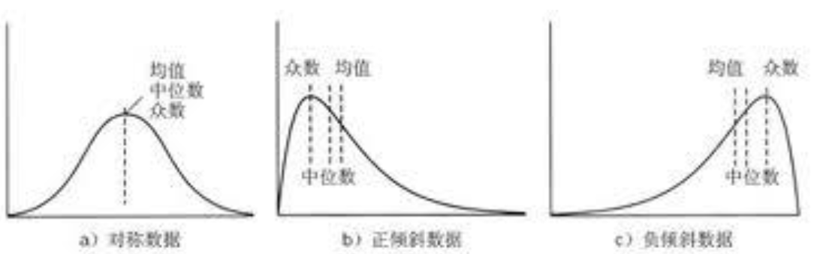

# 统计学

## 一、统计学的分类

### 1. 描述性统计学

使用特定的数字或者图表来提现数据的集中度和离散度, 例如考试的平局分, 最高分, 各分段的人数分布等

### 2. 推断统计学

根据样本数据推断总体数据特征。例：产品质量检查, 一般采用抽检, 根据所抽样本的质量合格率作为总体的质量合格率的一个估计


## 二、数据的集中趋势

- 是指任意一种数据向中心值靠拢的程度, 反应一组数据中心点的所在位置
- 会用统计量: 均值, 中位数, 众数来衡量数据集中趋势


### 1. 均值

- 算术平局数, 描述平局水平

### 2. 中位数

- 将数据按大小排列后, 位于正中间位置的数, 描述中等水平

```
例 1:
  一组数: 58,32,46,92,73,88,23

1. 先排序
  58,32,46,92,73,88,23

2. 找出处于中间位置的数: 58
  23,32,46,58,73,88,92


例 2:
  一组数: ：58,32,46,92,73,88,23,63   这一组数多了一个 63

1. 先排序
  23,32,46,58,63,73,88,92

2. 找出中位数: 58,63
  23,32,46,58,63,73,88,92

3. 若处于中间位置的数据有两个（也就是数据的总个数为偶数时）
  中位数为中间两个数的算术平均数：（58+63）/2=60.5  
  原数据中，四个数字比60.5小，四个数字比60.5大。

```

### 3. 众数

- 数据中出现最多的数(占的比例最大的数), 描述一般水平
- 一组数据中，可能会存在多个众数，也可能不存在众数
- 众数不仅适用于数值型数据，对于非数值型数据也同样适用

```
例 1:
  1 2 2 3 3 中的众数是2和3
  1 2 3 4 5 中没有众数

例 2:
  {苹果，苹果，香蕉，橙，橙，橙，桃}
  这一组数据，没有什么均值中位数可言，但是存在着众数——橙
```

### 4. 优缺点

| 类别 | 优点 | 缺点 |
| --- | --- | --- |
| 均值 | 充分利用所有数据，适用性强 | 容易受到极端值影响, 比如一组数 1,2,100 出来的均值会有问题 |
| 中位数 | 不受极端值影响 | 缺乏敏感性 |
| 众数 | 当数据具有明显的集中趋势时，代表性好；不受极端值影响 | 缺乏唯一性：可能有一个，可能有两个，可能一个都没有 |


### 5. 分析三个方法对数据集中趋势的影响



```
a 图中, 对称数据: 则均值、中位数、众数相差不大, 使用三种都可以提现数据的集中趋势

b 图中, 正倾斜数据: 众数 -> 中位数 -> 均值, 来表现数据集中趋势

c 图中, 负倾斜数据: 众数 -> 中位数 -> 均值, 来表现数据集中趋势
```


## 三、离散程度

### 1. 数据离散成都衡量

```
例如两组数据:
  A: 1 2 5 8 9
  B: 3 4 5 6 7

  两组数据的均值都是 5，但是可以看出 B 组的数据与 5 更加接近。
  但是有描述集中趋势的统计量不够, 需要有描述数据的离散程度的统计量, 如下图

  可以看出 A 的数据比 B 的数据更加离散
```


### 2. 极差

- (最大值 - 最小值) 来描述数据离散程度

```
A 的极差: 9 - 1 = 9
B 的极差: 7 - 3 = 4

可见 A 的极差比 B 的极差大
```

### 3. 极差存在的问题

```
比如用极差衡量离散程度:
  A: 1 2 5 8 9    9 - 1 = 8
  B: 1 4 5 6 9    9 - 1 = 8

  其实 A 是比 B 更加离散, 但是极差不能很好提现出来
```

### 4. 方差

- 在统计学上, 更常用的是使用方差, 来描述数据的离散程度, 即数据里中心越远越离散


```
a2 表示: 方差值

(Xi - u)2 : (表示每个值 - 中心值) 的平方, 用平方是为了保证得到的数据是一个正数
  比如一个数是 1, 中心数是 5, 距离就是 1 - 5 = -4

```
