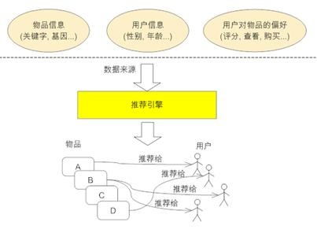
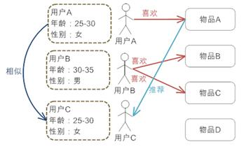
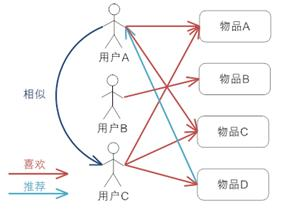

# 推荐系统

## 一、工作原理

### 1. `大概原理图`



### 2. `引擎所需要的输入的数据源`

- 要推荐物品或内容的元数据，例如关键字，基因描述等
- 用户的基本信息，例如性别，年龄等
- 用户对物品或者信息的偏好，根据应用本身的不同，可能包括用户对物品的评分，用户查看物品的记录，用户的购买记录等
 - 显式的用户反馈：

    ```
    这类是用户在网站上自然浏览或者使用网站以外，显式的提供反馈信息，例如用户对物品的评分，或者对物品的评论
    显式的用户反馈能准确的反应用户对物品的真实喜好，但需要用户付出额外的代价
    ```
 - 隐式的用户反馈：

    ```
    这类是用户在使用网站是产生的数据，隐式的反应了用户对物品的喜好，例如用户购买了某物品，用户查看了某物品的信息等等
    隐式的用户行为，通过一些分析和处理，也能反映用户的喜好，只是数据不是很精确，有些行为的分析存在较大的噪音
    ```


## 二、推荐引擎的分类

- 大众行为的推荐引擎
- 个性化推荐引擎

### 1. `大众行为的推荐引擎`

```
根据大众行为的推荐引擎
对每个用户都给出同样的推荐，这些推荐可以是静态的由系统管理员人工设定的，或者基于系统所有用户的反馈统计,计算出的当下比较流行的物品
```

### 2. `个性化推荐引擎`

```
对不同的用户，根据他们的口味和喜好给出更加精确的推荐
1. 系统需要了解需推荐内容和用户的特质
2. 或者基于社会化网络，通过找到与当前用户相同喜好的用户，实现推荐
```


## 三、推荐模型的分类

- 基于内容的过滤

- 协同过滤
  - UB-CF
  - IB-CF
  - MB-CF

- 矩阵分解

    ```
    1. 显示矩阵分解

    2. 隐式矩阵分解

    *. ALS 最小二乘法,是求解矩阵分解问题的最优方法. Spark 对显示和隐式的数据的处理组件背后使用的都是该算法
    ```

### 1. `基于物品和用户本身`

```
1. 这种推荐引擎将每个用户和每个物品都当作独立的实体，预测每个用户对于每个物品的喜好程度，这些信息往往是用一个二维矩阵描述的。
2. 由于用户感兴趣的物品远远小于总物品的数目，这样的模型导致大量的数据空置，即我们得到的二维矩阵往往是一个很大的稀疏矩阵.
3. 同时为了减小计算量，我们可以对物品和用户进行聚类，然后记录和计算一类用户对一类物品的喜好程度，但这样的模型又会在推荐的准确性上有损失
```

### 2. `基于关联规则的推荐（Rule-based Recommendation）`

```
1. 关联规则的挖掘已经是数据挖掘中的一个经典的问题,主要是挖掘一些数据的依赖关系。
2. 典型的场景就是“购物篮问题”，通过关联规则的挖掘，我们可以找到哪些物品经常被同时购买，或者用户购买了一些物品后通常会购买哪些其他的物品，当我们挖掘出这些关联规则之后，我们可以基于这些规则给用户进行推荐。
```

### 3. `基于模型的推荐（Model-based Recommendation）`

```
1. 这是一个典型的机器学习的问题，可以将已有的用户喜好信息作为训练样本，训练出一个预测用户喜好的模型，这样以后用户在进入系统，可以基于此模型计算推荐
2. 这种方法的问题在于如何将用户实时或者近期的喜好信息反馈给训练好的模型，从而提高推荐的准确度。

```


## 四、推荐引擎的详细说明

### 1. `基于人口统计学的推荐（Demographic-based Recommendation）`



```
一种最易于实现的推荐方法，根据系统用户的基本信息发现用户的相关程度，然后将相似用户喜爱的其他物品推荐给当前用户

实现原理 :
1. 系统对每个用户都有一个用户 Profile 的建模，其中包括用户的基本信息，例如用户的年龄，性别等等
2. 系统会根据用户的 Profile 计算用户的相似度，可以看到用户 A 的 Profile 和用户 C 的 Profile 一样,那么系统会认为用户 A 和 C 是相似用户，在推荐引擎中，可以称他们是“邻居”
3. 基于“邻居”用户群的喜好,推荐给当前用户一些物品，图中将用户 A 喜欢的物品 A 推荐给用户 C

优点 :
1. 因为不使用当前用户对物品的喜好历史数据，所以对于新用户来讲没有“冷启动（Cold Start）”的问题
2. 这个方法不依赖于物品本身的数据，所以这个方法在不同物品的领域都可以使用，它是领域独立的（domain-independent）。

缺点 :
1. 基于用户的基本信息对用户进行分类的方法过于粗糙，尤其是对品味要求较高的领域，比如图书，电影和音乐等领域，无法得到很好的推荐效果
2. 这个方法可能涉及到一些与信息发现问题本身无关却比较敏感的信息，比如用户的年龄等，这些用户信息不是很好获取

```

### 2. `基于内容的推荐 CBCF（Content-based Recommendation）`


```
根据推荐物品或内容的元数据，发现物品或者内容的相关性，然后基于用户以往的喜好记录，推荐给用户相似的物品

实现原理 :
1. 首先我们需要对电影的元数据有一个建模,这里只简单的描述了一下电影的类型
2. 通过电影的元数据发现电影间的相似度，因为类型都是“爱情，浪漫”,电影 A 和 C 被认为是相似的电影（当然，只根据类型是不够的，要得到更好的推荐，我们还可以考虑电影的导演，演员等等）
3. 最后实现推荐，对于用户 A，他喜欢看电影 A，那么系统就可以给他推荐类似的电影 C。

优点 :
1. 它能很好的建模用户的口味，能提供更加精确的推荐

缺点 :
1. 需要对物品进行分析和建模，推荐的质量依赖于对物品模型的完整和全面程度。在现在的应用中我们可以观察到关键词和标签（Tag）被认为是描述物品元数据的一种简单有效的方法
2. 物品相似度的分析仅仅依赖于物品本身的特征，这里没有考虑人对物品的态度
3. 因为需要基于用户以往的喜好历史做出推荐，所以对于新用户有“冷启动”的问题。

总结 :
虽然这个方法有很多不足和问题，但他还是成功的应用在一些电影，音乐，图书的社交站点，有些站点还请专业的人员对物品进行基因编码，比如潘多拉，在一份报告中说道，在潘多拉的推荐引擎中，每首歌有超过 100 个元数据特征，包括歌曲的风格，年份，演唱者等等。
```

### 3. `协同过滤的推荐（Collaborative Filtering-based Recommendation）`

```
- 协同过滤，Collaborative Filtering，简称CF，广泛应用于如今的推荐系统中。通过协同过滤算法，
  可以算出两个相似度：
  1) user-user 相似度矩阵
  2) item-item 相似度矩阵

1. 协同过滤的推荐介绍:
  1) 随着 Web2.0 的发展，Web 站点更加提倡用户参与和用户贡献，因此基于协同过滤的推荐机制因运而生.
  2) 根据用户对物品或者信息的偏好，发现物品或者内容本身的相关性,或者是发现用户的相关性,然后再基于这些关联性进行推荐

2. 基于协同过滤的推荐可以分为三个子类
  1) 基于用户的推荐（User-based Recommendation） UB-CF
  2) 基于项目的推荐（Item-based Recommendation） IB-CF
  3) 基于模型的推荐（Model-based Recommendation）MB-CF

3. 协同过滤的推荐的优缺点
优点:
  1) 它不需要对物品或者用户进行严格的建模，而且不要求物品的描述是机器可理解的，所以这种方法也是领域无关的
  2) 这种方法计算出来的推荐是开放的，可以共用他人的经验，很好的支持用户发现潜在的兴趣偏好

缺点:
  1) 方法的核心是基于历史数据，所以对新物品和新用户都有“冷启动”的问题。
  2) 推荐的效果依赖于用户历史偏好数据的多少和准确性。
  3) 在大部分的实现中，用户历史偏好是用稀疏矩阵进行存储的，而稀疏矩阵上的计算有些明显的问题，包括可能少部分人的错误偏好会对推荐的准确度有很大的影响等等。
  4) 对于一些特殊品味的用户不能给予很好的推荐。
  5) 由于以历史数据为基础，抓取和建模用户的偏好后，很难修改或者根据用户的使用演变，从而导致这个方法不够灵活。
```

#### 3.1 `协同过滤 - 基于用户的协同过滤 UBCF（User-based Recommendation）`



- 可用于猜你喜欢

```
矩阵:(用户\物品)
      WA  WB  WC  WD
  UA  1       1

  UB      1

  UC  1       1   1

实现原理 : (N 个用户共同喜欢的东西,则推为可能相似的用户群,把 N 用户喜欢的物品,推荐给另外一个 N 用户)
  1. 用户 A 喜欢(物品 A,物品 C)
  2. 用户 B 喜欢(物品 B)
  3. 用户 C 喜欢(物品 A,物品 C,物品 D)
  4. 用户 A 和 用户 C (比较像,都喜欢 物品 A、C), 同时 用户 C 还喜欢(物品 D)
  5. 推断: 用户 A 可能也喜欢(物品 D)，因此可以将(物品 D) 推荐给用户 A

基本原理:
1. 根据 (所有用户对物品或者信息的偏好,发现与当前用户口味和偏好相似的 “邻居” 用户群
  A 喜欢吃 :
    牛奶
    巧克力
    咖啡
  B 喜欢吃 :
    牛奶
    酸奶
    星巴克

  * 发现 A 和 B 都喜欢吃 "牛奶",则认为 A 与 B 是相同偏好的 "邻居" 用户群,则把 B 的 "酸奶,星巴克" 推荐给 A

2. 在一般的应用中是采用计算“K- 邻居”的算法
3. 基于这 K 个邻居的历史偏好信息，为当前用户进行推荐


总结:
1. 基于用户的协同过滤推荐机制（User-based Recommendation）和基于人口统计学的推荐机制（Demographic-based Recommendation）都是计算用户的相似度，并基于“邻居”用户群计算推荐
2. 但它们所不同的是，如何计算用户的相似度
3. 基于人口统计学的推荐机制（Demographic-based Recommendation），只考虑用户本身的特征
4. 基于用户的协同过滤机制User-based Recommendation）可在用户的历史偏好的数据上计算用户的相似度，它的基本假设是，喜欢类似物品的用户可能有相同或者相似的口味和偏好
```

#### 3.2 `协同过滤 - 基于项目的协同过滤 IBCF（Item-based Recommendation）`


- 可用于看了又看

```
介绍:
1. 基于项目的协同过滤推荐机制是 Amazon 在基于用户的协同过滤（User-based Recommendation）上改良的一种策略
2. 基于项目的协同过滤（Item-based Recommendation）推荐和基于内容的推荐（Content-based Recommendation）推荐其实都是基于物品相似度预测推荐,只是相似度计算的方法不一样，
   1) 基于项目的协同过滤（Item-based Recommendation）推荐是从用户历史的偏好推断，
   2) 基于内容的推荐（Content-based Recommendation）推荐是基于物品本身的属性特征信息


一个用户喜欢物品集合的矩阵:(物品\物品)
      WA  WB  WC
  WA  1       1

  WB  1   1   1

  WC  1    

实现原理 :
  1. 用户 A 喜欢(物品 A, 物品 C)
  2. 用户 B 喜欢(物品 A, 物品 B, 物品 C)
  3. 用户 C 喜欢(物品 A)
  4. 喜欢(物品 A )的人(用户 A 和 B)都喜欢(物品 C)
  5. 把物品 C 推荐给 用户 C

基本原理 :
1. 所有"用户"对物品或者物品信息的偏好,发现物品和物品之间的相似度,然后根据用户的历史偏好信息,将类似的物品推荐给用户
  A 喜欢吃:
    葡萄
    红葡萄酒
    葡萄干
  B 喜欢吃:
    葡萄
    红葡萄酒
    白葡萄酒
  C 喜欢吃:
    葡萄

  * 喜欢吃物品(葡萄)的人都喜欢吃(红葡萄酒),则把(红葡萄酒) 推荐给 C

总结:
1. 在大部分的 Web 站点中，物品的个数是远远小于用户的数量的，而且物品的个数和相似度相对比较稳定，同时基于项目的机制比基于用户的实时性更好一些
2. 但也不是所有的场景都是这样的情况，可以设想一下在一些新闻推荐系统中，也许物品，也就是新闻的个数可能大于用户的个数,而且新闻的更新程度也有很快，所以它的形似度依然不稳定
3. 所以，其实可以看出，推荐策略的选择其实和具体的应用场景有很大的关系。
```

#### 3.3 `协同过滤 - 基于模型的协同过滤（Model-based Recommendation） MB-CF`

```
介绍:
1.基于模型的协同过滤（Model-based Recommendation）推荐
  1) 基于样本的用户喜好信息，训练一个推荐模型
  2) 根据实时的用户喜好的信息进行预测，计算推荐
```


### 4. `混合的推荐机制`

在现行的 Web 站点上的推荐往往都不是单纯只采用了某一种推荐的机制和策略，他们往往是将多个方法混合在一起，从而达到更好的推荐效果。关于如何组合各个推荐机制，这里讲几种比较流行的组合方法。

```

1. 加权的混合（Weighted Hybridization）: 用线性公式（linear formula）
  将几种不同的推荐按照一定权重组合起来，具体权重的值需要在测试数据集上反复实验，从而达到最好的推荐效果

2. 切换的混合（Switching Hybridization）
  对于不同的情况（数据量，系统运行状况，用户和物品的数目等），推荐策略可能有很大的不同，那么切换的混合方式，就是允许在不同的情况下，选择最为合适的推荐机制计算推荐。

3. 分区的混合（MixedHybridization）
  采用多种推荐机制，并将不同的推荐结果分不同的区显示给用户。其实，Amazon，当当网等很多电子商务网站都是采用这样的方式，用户可以得到很全面的推荐，也更容易找到他们想要的东西。

4. 分层的混合（Meta-Level Hybridization）
  采用多种推荐机制，并将一个推荐机制的结果作为另一个的输入，从而综合各个推荐机制的优缺点，得到更加准确的推荐。
```
