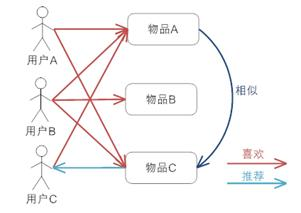

# 协同过滤 - 基于 item 的协同过滤（Item-based Recommendation） IBCF

## 一、介绍

- 基于项目的协同过滤推荐机制是 Amazon 在基于用户的协同过滤（User-based Recommendation）上改良的一种策略
- 通过分析用户的行为记录计算物品之间的相似度

## 二、组织架构

### 3.2



- 可用于看了又看

```
一个用户喜欢物品集合的矩阵:(物品\物品)
      WA  WB  WC
  WA  1       1

  WB  1   1   1

  WC  1  


实现原理 :
  1. 用户 A 喜欢(物品 A, 物品 C)
  2. 用户 B 喜欢(物品 A, 物品 B, 物品 C)
  3. 用户 C 喜欢(物品 A)
  4. 喜欢(物品 A )的人(用户 A 和 B)都喜欢(物品 C)
  5. 把物品 C 推荐给 用户 C


基本原理 :
1. 所有"用户"对物品或者物品信息的偏好,发现物品和物品之间的相似度,然后根据用户的历史偏好信息,将类似的物品推荐给用户
  A 喜欢吃:
    葡萄
    红葡萄酒
    葡萄干
  B 喜欢吃:
    葡萄
    红葡萄酒
    白葡萄酒
  C 喜欢吃:
    葡萄

  * 喜欢吃物品(葡萄)的人都喜欢吃(红葡萄酒),则把(红葡萄酒) 推荐给 C


总结:
1. 在大部分的 Web 站点中，物品的个数是远远小于用户的数量的，而且物品的个数和相似度相对比较稳定，同时基于项目的机制比基于用户的实时性更好一些
2. 但也不是所有的场景都是这样的情况，可以设想一下在一些新闻推荐系统中，也许物品，也就是新闻的个数可能大于用户的个数,而且新闻的更新程度也有很快，所以它的形似度依然不稳定
3. 所以，其实可以看出，推荐策略的选择其实和具体的应用场景有很大的关系。
```
