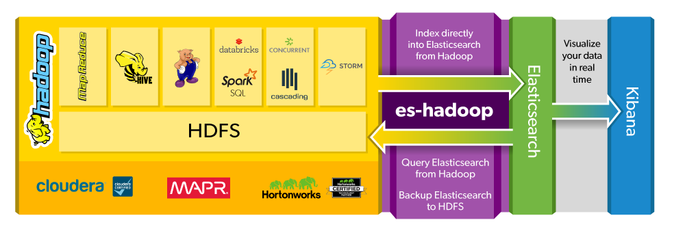

# ES-Hadoop

## 一、说明

- 这就是一个补充方法, 使用 ES 处理数据的思想来补充 hadoop 的计算方式, 并不是直接使用 ES 集群
- es 一般通过插件连接 hdfs, 用作 快照 和 恢复数据
- 通过 hadoop 的 mapreduce 算法并行建立索引, 支持 spark,pig,hive 等



```
Elasticsearch Apache Hadoop - 也称为ES-Hadoop
  是一个双向的连接器,可以让你读和写数据实时 Elasticsearch 和查询它。ES-Hadoop 是一个优雅的解决方案,帮助您利用 Hadoop 和 Elasticsearch 的力量。

1. Elasticsearch和Hadoop之间无缝移动数据
  本机集成和丰富的查询 API,ES-Hadoop 可以直接索引数据到 Elasticsearch Hadoop,查询 Elasticsearch Hadoop,并使用 HDFS 作为 Elasticsearch 长期存档。

2. Hadoop的有一个广阔的生态系统，ES-Hadoop与您喜爱的组件本身进行交互。
  利用 ES-Hadoop 与 SPARK 弹性分布式数据集（RDD）和 DataFrames 协调 Elasticsearch 以提高你的学习机使用的情况下，联合整个Elasticsearch 和 HDFS 查询与 HIVE，并直接与其他各种流行的系统，如暴风，猪八戒，层叠连接，并且标准的 MapReduce

3. 在实时与 Kibana 可视化数据 HDFS
  Elasticsearch适用于Kibana帮助您直观地探索实时的大数据。 随着设计精美的图形，图表和地图，Kibana将您的数据转换成实时的，可定制的仪表盘的深刻见解。

4. 增强的安全性让你的大数据在右手
  管理谁有权访问你的数据，防止窥探过线以保持数据的保密性。 ES-Hadoop 的增强的安全性，包括基本的 HTTP 验证，为SSL / TLS支持 Elasticsearch 和 Hadoop 集群之间的连接，同时还与支持 Kerberos 的 Hadoop 和启用盾 Elasticsearch 集群工作。

```
