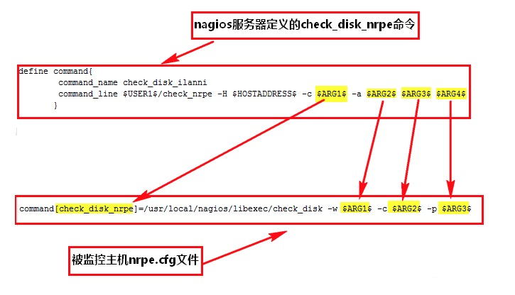

# NRPE - Nagios Remote Plugin Executor 主动监控插件

- 版本 3.x

- 调用流程
  - nagios -> check_nrpe -> ssl -> NRPE daemon

- 组成结构
  - check_nrpe : 插件, 安装在 nagios 监控服务器和被监控主机上
  - NRPE daemon : agent 守护进程, NRPE daemon 运行在被监控主机上

- 需要安装 nagios

- 用来执行远程命令


## 一、 Nagios 主机安装 check_nrpe 插件,  远程主机安装 NRPE daemon 服务

``` sh
1. 安装依赖
  yum install -y gcc glibc glibc-common gd gd-devel xinetd openssl-devel cmake make vim c++  

2. 下载编译
  cd /usr/local/src/
  sudo wget https://github.com/NagiosEnterprises/nrpe/releases/download/nrpe-3.1.0/nrpe-3.1.0.tar.gz
  tar -zxvf nrpe-3.1.1.tar.gz

  cd nrpe-3.1.1
  # –enable-command-args 参数很重要，如果要给NRPE传递参数的话，在安装配置NRPE时一定要加上该参数
  ./configure --prefix=/usr/local/nagios –enable-command-args
  # 编译
  make all

3. 安装参数说明
  all                  builds nrpe and check_nrpe
  nrpe                 builds nrpe only
  check_nrpe           builds check_nrpe only
  install              install nrpe and check_nrpe
  install-plugin       install the check_nrpe plugin
  install-daemon       install the nrpe daemon
  install-config       install the nrpe configuration file
  install-inetd        install the startup files fr inetd, launchd, etc
  install-init         install the startup files or init, systemd, etc

4.1 安装 install-plugin, check_nrpe 插件(Nagios 主机操作)
  make install-plugin

4.2 安装 NRPE daemon 守护进程(远程主机上操作)
  # 安装 nrpe
  make nrpe
  # 安装 nrpe 守护进程
  make install-daemon
  # 安装 nrpe 配置文件
  make install-config

5. NRPE daemon 配置文件(远程主机上操作)
  vim /usr/local/nagios/etc/nrpe.cfg

  # 定义 NRPE 的PID文件。
  pid_file=/usr/local/nagios/var/nrpe.pid

  # 日志文件
  log_file=/usr/local/nagios/var/nrpe.log

  # NRPE daemon 监听端口。
  server_port=5666

  # 运行用的身份和组
  nrpe_user=nagios
  nrpe_group=nagios

  # 记住打开支持传参
  dont_blame_nrpe=1

  # 允许连接到 NRPE daemon 的 IP 列表, 多个 ip 使用逗号隔开，网段格式 192.168.1.0/24。(可注释掉)
  # allowed_hosts=127.0.0.1,::1,host_name

6. 启动 NRPE daemon 任务(远程主机上操作)
  参数解说：
    -n 表示不使用SSL方式传输数据，默认使用 SSL 方式传输数据
    -c <config_file> 配置文件路径
    -d  独立守护进程方式运行 NRPE, 本文使用此方法
    -i  以超级守护进程 inetd 或 xinetd 方式运行 NRPE

  启动服务：
    /usr/local/nagios/bin/nrpe -c /usr/local/nagios/etc/nrpe.cfg -d

    tail -f /var/log/messages
    tail -f /usr/local/nagios/var/nrpe.log

    netstat -tunlp | grep 5666
```


## 二、Nagios 远程操作 NRPE 案例

- Nagions 调用流程: etc/objects/services.cfg -> etc/objects/commands.cfg -> 命令行方式流程
- 命令行方式流程: libexec/check_nrpe 命令行 -> ssl -> NRPE 服务 -> etc/nrpe.cfg 中配置的<脚本名称>
- 

### 1. 配置文件部署案例, 服务端和客户端

``` sh
1. nagios 配置流程(服务端)
# etc/objects/services.cfg 配置
define service{
        # 使用的模板
        use                     service_base_template

        # 监控的 host 组
        hostgroup_name          HadoopCluster
        # 监控 service 描述
        service_description     ClusterDisk
        # 监控命令
          # check_nrpe    <远程插件, 在 commands.cfg 中会说明>
          # arg_script    <远程执行的脚本名称, 在 commands.cfg 中会说明>
          # arg_abc       <远程执行的脚本参数, 在 commands.cfg 中会说明>
        check_command           check_nrpe!arg_script!arg_abc

        contact_groups          MonitorGroup
        notifications_enabled   0
}

# etc/objects/commands.cfg 配置
define command{
        # 脚本名称: 对应 services.cfg 中的 check_nrpe
        command_name    check_nrpe

        # 远程脚本配置
        # -c: <远程脚本名称>
        # -a: $ARG1$ - $ARG999$: <远程参数列表>
          # $ARG1$: 对应 services.cfg 中的 arg_script
          # $ARG2$: 对应 services.cfg 中的 arg_abc
        command_line    $USER1$/check_nrpe -H $HOSTADDRESS$ -c $ARG1$ -a $ARG2 $HOSTADDRESS$
}

# 修改完成
重启 nagios


2. NRPE daemon (客户端配置)
# etc/nrpe.cfg

# 开启允许长参数
dont_blame_nrpe=1

# 允许连接到 NRPE daemon 的 IP 列表, 多个 ip 使用逗号隔开，网段格式 192.168.1.0/24。(可注释掉)
# allowed_hosts=127.0.0.1,::1,host_name

# 单参数
# $ARG1$: 对应 commands.cfg 中, -a 长参数选项的 $ARG2
command[arg_script]=/usr/local/nagios/libexec/custom/test.sh $ARG1$

# 多参数
# $ARG1$: 对应 commands.cfg 中, -a 长参数选项的 $ARG2
# $ARG2$: 对应 commands.cfg 中, -a 长参数选项的 $HOSTADDRESS$
command[arg_script]=/usr/local/nagios/libexec/custom/test.sh -a $ARG1$ -b $ARG2$

# 远程调试用来查看报错信息
command[arg_script]=/usr/local/nagios/libexec/custom/test.sh $ARG1$  >> /tmp/output 2>&1

# 修改完成
重启 nrpe
```


### 2. 使用 check_nrpe 命令行测试

``` sh
*. 建议脚本放在: libexec/custom 目录中

1. check_nrpe 远程插件语法
  # hostname: 远程 NRPE ip 地址
  # script_name: 脚本名称, 配置在 etc/nrpe.cfg 中
  # -a : ARG1 ~  ARGn:  需要传递的参数列表
  libexec/check_nrpe -H [hostname] -c [script_name] -a [$ARG1$] [$ARG1$] [$ARG1$]


2. 使用插件 check_nrpe 远程测试调试(命令行方式)
  libexec/check_nrpe -H hostname -c cluster_disk -a 11 bb cc

  错误: 如果出现如下情况, 是因为权限不够 nagios 无法打开
    NRPE: Unable to read output:
```


### 3. 自定义 <脚本名称> 脚本的书写格式

- 0(OK)表示状态正常/绿色
- 1(WARNING)表示出现警告/黄色
- 2(CRITICAL)表示出现非常严重的错误/红色
- 3(UNKNOWN)表示未知错误/深黄色。

``` sh
#!/bin/bash

# 引入
source ~/.bashrc

# 打印入参
echo $0,$1,$2,$3
# 打印返回值
echo "Test: OK Total: test  - concurrent_count|USED=test;200;500;;"
# 返回执行状态
$(exit 0)
```
