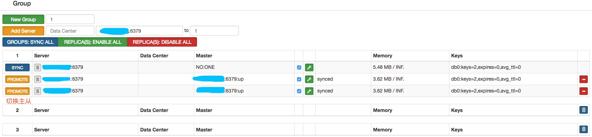
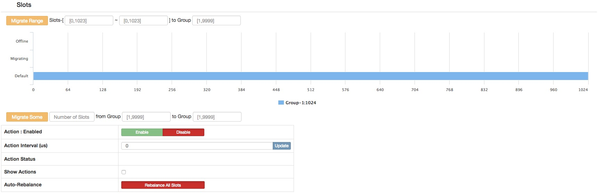
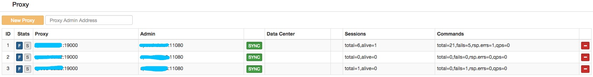

# codis

- [下载 codis3.2.2-go1.9.2-linux.tar.gz](https://github.com/CodisLabs/codis/releases)
- [官方文档](https://github.com/CodisLabs/codis/blob/release3.2/doc/tutorial_zh.md)

## 下载

``` sh
cd app/codis
```

## 安装

### Codis Dashboard 集群管理(只能部署 1 个)

- 集群管理工具，支持 codis-proxy、codis-server 的添加、删除，以及据迁移等操作。
- 在集群状态发生改变时，codis-dashboard 维护集群下所有 codis-proxy 的状态的一致性。
- 注意事项
  - 对于同一个业务集群而言，同一个时刻 codis-dashboard 只能有 0个或者1个；
  - 所有对集群的修改都必须通过 codis-dashboard 完成。

``` sh
1. 生成/修改配置文件
# 生成配置
mkdir -p config
./bin/codis-dashboard --default-config > config/dashboard.toml

# 编辑配置
vim ./config/dashboard.toml

#coordinator_name = "filesystem"
#coordinator_addr = "/tmp/codis"
# 外部存储类型，接受 zookeeper/etcd
coordinator_name = "zookeeper"
# 外部存储地址
coordinator_addr = "zookeeper-1:2181,zookeeper-2:2181,zookeeper-3:2181"
#coordinator_auth = ""

# 集群名称 Set Codis Product Name/Auth.
product_name = "codis-infrastructure"
# 集群密码，默认为空
product_auth = "codis-123456"

# RESTful API 端口
# Set bind address for admin(rpc), tcp only.
admin_addr = "0.0.0.0:18080"

# Set arguments for data migration (only accept 'sync' & 'semi-async').
migration_method = "semi-async"
migration_parallel_slots = 100
migration_async_maxbulks = 200
migration_async_maxbytes = "32mb"
migration_async_numkeys = 500
migration_timeout = "30s"

# Set configs for redis sentinel.
sentinel_client_timeout = "10s"
sentinel_quorum = 2
sentinel_parallel_syncs = 1
sentinel_down_after = "30s"
sentinel_failover_timeout = "5m"
sentinel_notification_script = ""
sentinel_client_reconfig_script = ""


2. 查看命令
$ ./codis-dashboard -h
Usage:
    codis-dashboard [--ncpu=N] [--config=CONF] [--log=FILE] [--log-level=LEVEL] [--host-admin=ADDR]
    codis-dashboard  --default-config
    codis-dashboard  --version

Options:
    --ncpu=N                    最大使用 CPU 个数
    -c CONF, --config=CONF      指定启动配置文件
    -l FILE, --log=FILE         设置 log 输出文件
    --log-level=LEVEL           设置 log 输出等级：INFO,WARN,DEBUG,ERROR；默认INFO，推荐WARN


3. 启动
# 创建日志目录
sudo mkdir -p /opt/logs/codis
sudo chown hadoop:hadoop /opt/logs/codis

# 后台启动
./codis-dashboard --ncpu=1 --config=config/dashboard.toml \
    --log=/opt/logs/codis/dashboard.log --log-level=WARN  &

# 查看日志
tail -f /logs/codis/dashboard.log.[日期]

# 查看启动状态
netstat -tunlp | grep 18080
```


### Codis Proxy 代理服务

- 客户端连接的 Redis 代理服务, 实现了 Redis 协议。

``` sh
1. 生成/修改配置
./codis-proxy --default-config > config/proxy.toml

vim config/proxy.toml

## 集群名称，参考 dashboard 参数说明
# Set Codis Product Name/Auth.
product_name = "codis-infrastructure"
# 集群密码，默认为空
product_auth = "codis-123456"

# Set auth for client session
#   1. product_auth is used for auth validation among codis-dashboard,
#      codis-proxy and codis-server.
#   2. session_auth is different from product_auth, it requires clients
#      to issue AUTH <PASSWORD> before processing any other commands.
session_auth = ""

# RESTful API 端口, Set bind address for admin(rpc), tcp only.
admin_addr = "0.0.0.0:11080"

## 设置代理端口类型，接受 tcp/tcp4/tcp6/unix/unixpacket
# Set bind address for proxy, proto_type can be "tcp", "tcp4", "tcp6", "unix" or "unixpacket".
proto_type = "tcp4"
# 设置代理绑定的端口地址或者路径
proxy_addr = "0.0.0.0:19000"

# Set jodis address & session timeout
#   1. jodis_name is short for jodis_coordinator_name, only accept "zookeeper" & "etcd".
#   2. jodis_addr is short for jodis_coordinator_addr
#   3. jodis_auth is short for jodis_coordinator_auth, for zookeeper/etcd, "user:password" is accepted.
#   4. proxy will be registered as node:
#        if jodis_compatible = true (not suggested):
#          /zk/codis/db_{PRODUCT_NAME}/proxy-{HASHID} (compatible with Codis2.0)
#        or else
#          /jodis/{PRODUCT_NAME}/proxy-{HASHID}

## 设置 jodis 地址和会话超时
# Jodis 外部存储类型，接受 zookeeper/etcd
jodis_name = "zookeeper"
# Jodis 注册 zookeeper 地址
jodis_addr = "zookeeper-1:2181,zookeeper-2:2181,zookeeper-3:2181"
jodis_auth = ""
# Jodis 注册 session timeout 时间，单位 second
jodis_timeout = "20s"
jodis_compatible = false

# Set datacenter of proxy.
proxy_datacenter = "Codis Dashboard"

# 设置最大会话数
# Set max number of alive sessions.
proxy_max_clients = 1000

# 设置最大内存
# Set max offheap memory size. (0 to disable)
proxy_max_offheap_size = "10240mb"

# 设置堆占位符以降低 GC 频率。
# Set heap placeholder to reduce GC frequency.
proxy_heap_placeholder = "256mb"

# 代理将在预定义的时间间隔内 ping 后端 redis（并清除'MASTERDOWN'状态）。 （0表示禁用）
# Proxy will ping backend redis (and clear 'MASTERDOWN' state) in a predefined interval. (0 to disable)
backend_ping_period = "5s"


# 设置后端recv缓冲区大小和超时。
# Set backend recv buffer size & timeout.
backend_recv_bufsize = "128kb"
backend_recv_timeout = "30s"

# 设置后端发送缓冲区和超时。
# Set backend send buffer & timeout.
backend_send_bufsize = "128kb"
backend_send_timeout = "30s"

# 设置后端管道缓冲区大小。
# Set backend pipeline buffer size.
backend_max_pipeline = 20480

# 设置后端从不读取副本组，默认为 false
# Set backend never read replica groups, default is false
backend_primary_only = false

# 为每个服务器设置后端并行连接
# Set backend parallel connections per server
backend_primary_parallel = 1
backend_replica_parallel = 1

# 设置后端 tcp keepalive 周期。(0禁用)
# Set backend tcp keepalive period. (0 to disable)
backend_keepalive_period = "75s"

# 设置后台数据库数量
# Set number of databases of backend.
backend_number_databases = 16

# 如果长时间没有来自客户端的请求，连接将被关闭。(0禁用)
# If there is no request from client for a long time, the connection will be closed. (0 to disable)
# Set session recv buffer size & timeout.
session_recv_bufsize = "128kb"
session_recv_timeout = "30m"

# 设置会话发送缓冲区大小和超时。
# Set session send buffer size & timeout.
session_send_bufsize = "64kb"
session_send_timeout = "30s"

# 确保这高于每个管道请求的最大请求数量，否则您的客户机可能被阻塞。
# Make sure this is higher than the max number of requests for each pipeline request, or your client may be blocked.
# Set session pipeline buffer size.
session_max_pipeline = 10000

# 设置会话 tcp keepalive 周期。(0禁用)
# Set session tcp keepalive period. (0 to disable)
session_keepalive_period = "75s"

# 将会话设置为对失败敏感。默认为false，代理将向客户端发送错误响应，而不是关闭套接字。
# Set session to be sensitive to failures. Default is false, instead of closing socket, proxy will send an error response to client.
session_break_on_failure = false

# 设置 metrics server, proxy 将在预定义的时间内向指定的服务器报告json格式的度量。
# Set metrics server (such as http://localhost:28000), proxy will report json formatted metrics to specified server in a predefined period.
metrics_report_server = ""
metrics_report_period = "1s"

# Set influxdb server (such as http://localhost:8086), proxy will report metrics to influxdb.
metrics_report_influxdb_server = ""
metrics_report_influxdb_period = "1s"
metrics_report_influxdb_username = ""
metrics_report_influxdb_password = ""
metrics_report_influxdb_database = ""

# Set statsd server (such as localhost:8125), proxy will report metrics to statsd.
metrics_report_statsd_server = ""
metrics_report_statsd_period = "1s"
metrics_report_statsd_prefix = ""


2. 查看命令
$ ./codis-proxy -h
Usage:
	codis-proxy [--ncpu=N] [--config=CONF] [--log=FILE] [--log-level=LEVEL] [--host-admin=ADDR] [--host-proxy=ADDR] [--ulimit=NLIMIT]
	codis-proxy  --default-config
	codis-proxy  --version

Options:
	--ncpu=N                    最大使用 CPU 个数
	-c CONF, --config=CONF      指定启动配置文件
	-l FILE, --log=FILE         设置 log 输出文件
	--log-level=LEVEL           设置 log 输出等级：INFO,WARN,DEBUG,ERROR；默认INFO，推荐WARN
	--ulimit=NLIMIT             检查 ulimit -n 的结果，确保运行时最大文件描述不少于 NLIMIT


3. 启动服务
# 后台启动
nohup ./codis-proxy --ncpu=4 --config=config/proxy.toml \
    --log=/opt/logs/codis/proxy.log --log-level=WARN &

# 查看日志
tail -f /opt/logs/codis/proxy.log.[日期]

# 查看启动状态
netstat -tunlp | grep 19000
```


### Codis Server 基于 redis-3.2.8 分支开发

- 基于 redis-3.2.8 分支开发。增加了额外的数据结构，以支持 slot 有关的操作以及数据迁移指令。
- Codis Server 只负责发送 slave of 指令，具体行为取决于 redis 自身

- [redis.conf](hhttp://download.redis.io/releases/redis-3.2.8.tar.gz) 解压获取配置文件 redis.conf

``` sh
1. 编辑/修改配置文件
vim redis.conf

# 注释掉
# bind 127.0.0.1

# Redis默认不是以守护进程的方式运行，可以通过该配置项修改，使用yes启用守护进程，设置为no
daemonize no

# 关闭保护模式
protected-mode no

# 配置 redies 密码
requirepass codis-123456


2. 查看命令
./codis-server --help

Usage: ./redis-server [/path/to/redis.conf] [options]
       ./redis-server - (read config from stdin)
       ./redis-server -v or --version
       ./redis-server -h or --help
       ./redis-server --test-memory <megabytes>

Examples:
       ./redis-server (run the server with default conf)
       ./redis-server /etc/redis/6379.conf
       ./redis-server --port 7777
       ./redis-server --port 7777 --slaveof 127.0.0.1 8888
       ./redis-server /etc/myredis.conf --loglevel verbose

Sentinel mode:
       ./redis-server /etc/sentinel.conf --sentinel


3. 启动
# 与启动普通 redis 的方法一致。 启动完成后，可以通过 codis-fe 提供的界面或者 codis-admin 命令行工具添加到集群中。
./codis-server config/redis.conf --port 6379 &

# 查看端口
netstat -tunlp | grep 6379
```


### Codis FE 集群管理界面

``` sh
1. 查看命令
$ ./codis-fe -h
Usage:
	codis-fe [--ncpu=N] [--log=FILE] [--log-level=LEVEL] [--assets-dir=PATH] (--dashboard-list=FILE|--zookeeper=ADDR|--etcd=ADDR|--filesystem=ROOT) --listen=ADDR
	codis-fe  --version

Options:
	--ncpu=N                        最大使用 CPU 个数
	-d LIST, --dashboard-list=LIST  配置文件，能够自动刷新
	-l FILE, --log=FILE             设置 log 输出文件
	--log-level=LEVEL               设置 log 输出等级：INFO,WARN,DEBUG,ERROR；默认INFO，推荐WARN
	--listen=ADDR                   HTTP 服务端口


2. 启动服务
# 后台启动
./codis-fe --ncpu=1 --log=/opt/logs/codis/fe.log --log-level=WARN \
    --zookeeper=zookeeper-1:2181,zookeeper-2:2181,zookeeper-3:2181 --listen=0.0.0.0:21050 &

# 查看日志
tail -f /opt/logs/codis/fe.log

# 查看端口
netstat -tunlp | grep 21050


# 查看 Codis Dashboard 信息
./codis-admin --dashboard-list --zookeeper=zookeeper-1:2181,zookeeper-2:2181,zookeeper-3:2181 | tee codis.json

3. 打开 Codis FE 服务
http://host-name:21050

```


### 集群管理

- [添加节点到集群](http://host-name:21050)

``` sh
1. 添加组 Group
  输入组 ID(1) -> 点击(New Group)


2. 添加 Codis Server(Redis) 到指定组
  输入 Codis Server 实际部署地址和端口(xxx.xxx.xxx.xxx:6379) -> to -> 到指定组(1) -> 点击(Add Server)

  PS: 一组 Codis-Group 一般为 3 个 Codis Server, 1 主 2 从.
```



- 分配 slot 到组中

``` sh
新增的集群 slot 状态是 offline，因此我们需要对它进行初始化（将 1024 个 slot 分配到各个 group），而初始化最快的方法可通过 fe 提供的 rebalance all slots 按钮来做，如下图所示，点击此按钮，我们即快速完成了一个集群的搭建。
```



- 上线 Codis Proxy 节点

``` sh
Codis Proxy 节点启动后，处于 waiting 状态，监听 proxy_addr 地址，但是不会 accept 连接，添加到集群并完成集群状态的同步，才能改变状态为 online。添加的方法有以下两种

方法 1. 通过 codis-fe 添加：通过 Add Proxy 按钮，将 admin_addr 加入到集群中(建议)

  输入 Codis Proxy 配置 admin_addr 参数的地址(xxx.xxx.xxx.xxx:18080 ) -> 点击(New Proxy 添加即可)

  PS: Codis Proxy 的代理地址为 admin_addr 参数. 默认 11080 端口

方法 2. 通过 codis-admin 命令行工具添加:

  codis-admin --dashboard=127.0.0.1:18080 --create-proxy -x 127.0.0.1:11080
  # Codis Dashboard 地址
  127.0.0.1:18080

  # Codis Proxy 代理的地址, 用于添加 Codis Proxy 代理. RESTful API 端口
  127.0.0.1:11080


添加过程中，dashboard 会完成如下一系列动作
  1. 获取 proxy 信息，对集群 name 以及 auth 进行验证，并将其信息写入到外部存储中；
  2. 同步 slots 状态；  
  3. 标记 proxy 状态为 online，此后 proxy 开始 accept 连接并开始提供服务；
```




- HA

``` sh
对下层的 redis 实例来说，当一个 group 的 master 挂掉的时候，应该让管理员清楚，并手动的操作，因为这涉及到了数据一致性等问题（redis的主从同步是最终一致性的）。因此 codis 不会自动的将某个 slave 升级成 master。关于外部 codis-ha 工具（具体可以参考之前的章节），这是一个通过 codis-dashboard 开放的 RESTful API 实现自动切换主从的工具。该工具会在检测到 master 挂掉的时候主动应用主从切换策略，提升单个 slave 成为新的 master。

需要注意，codis 将其中一个 slave 升级为 master 时，该组内其他 slave 实例是不会自动改变状态的，这些 slave 仍将试图从旧的 master 上同步数据，因而会导致组内新的 master 和其他 slave 之间的数据不一致。因此当出现主从切换时，需要管理员手动创建新的 sync action 来完成新 master 与 slave 之间的数据同步（codis-ha 不提供自动操作的工具，因为这样太不安全了）。
```
