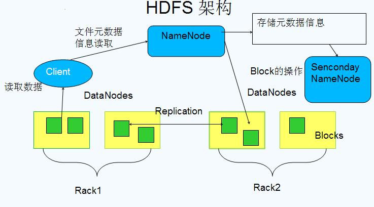

# hdfs 配置

- [hadoop 优化思维导图](http://www.processon.com/view/link/5662d493e4b01db999f419b1)

## 一、特点

- 以流式数据访问模式来存储超大文件 ，一次写多次读
- 不适合处理大量小文件

  ```
  1) HDFS 通常使用 128 MB 作为一个数据块,会保存 3 份快照在不同节点上.
  2) 当客户端提交的文件不足 128 MB 的时候,也会占用一个块的容量
     当客户端提交的文件超过 128 MB 的时候,比如 200 MB 的时候,会占用 2 个块的容量
  ```


## 二、系统

[hdfs-core 详细原理图](https://www.processon.com/view/link/56629a87e4b01db999f2f337)




### 1.NameNode 和 DataNode


```
1) 集群以 一个管理者(NameNode) 多个工作者模式运行(DataNode)

2) NameNode
  (1) 维护文件系统树及整棵树内所有的文件和目录，以文件形式保存在 NameNode 节点的本地磁盘上
  (2) 命名空间镜像文件和编辑日志文件
  (3) 记录每个文件中各个块所在的数据节点(DataNode)信息，但它并不永久保存块的位置信息，这些信息会在系统启动由数据节点(DataNode)重建

3) DataNode
  (1) 文件系统的工作节点，储存检索数据块，定期向 NameNode 发送们所存储块的列表

4) 客户端
  通过与 NameNode 和 DataNode 交互获取整个 HDFS 文件系统。
```

### 2. 高可用 HDFS HA


```
1) NameNode
  (1) 共享存储实现编辑日志的共享。
  (2) 当备用的 NameNode 接管工作之后，他将通读共享编辑日志直至末尾，以实现与互动 NameNode 的状态同步，并继续读取活动的 NameNode 写入的新记录

2) DataNode
  需要向两个 NameNode 发送数据块处理报告，因为数据块的映射信息存储在 NameNode 的内存中，而非磁盘中

3) 客户端
  需要通过特定的机制处理 NameNode 之间的实效，比如指定某个 NameNode 服务器
```

### 3. 重要配置

``` sh
1) core-default.xml
  fs.defaultFS (fs.default.name)
    默认文件系统的名称。一个URI和权威确定文件系统实现的方案
    如 : hdfs://NameNode:8020

  file.replication
    复制因子 ，默认 3


2) hdfs-default.xml
  dfs.replication
    默认的块复制 , 一般设置为 3

  dfs.namenode.name.dir (dfs.name.dir)
    file://${hadoop.tmp.dir}/dfs/nn
    NameNode 节点元数据目录

  dfs.datanode.data.dir (dfs.data.dir)
    file://${hadoop.tmp.dir}/dfs/dn
    DataNode 节点数据目录

  dfs.nameservices (dfs.federation.nameservices)
    以逗号分隔的名称服务
    如 Ucluster

  dfs.datanode.failed.volumes.tolerated
    默认值为 0, 只要有一个磁盘出现故障就会导致整个 DataNode 不可用
    可以设置为 1, 表示可以容忍一个磁盘故障

  fs.trash.interval
    默认值为 1440, 回收站保留时间


3) 服务端配置
  dfs.namenode.handler.count  NameNode 服务线程数。用于处理客户端 RPC 请求

  dfs.datanode.handler.count  DataName 服务线程数。用于接收请求，处理业务命令

  dfs.namenode.avoid.read.stale.datanode（true）避开从脏 DN 上读数据。脏 DN 指在一个指定的时间间隔内没有收到心跳信息。脏 DN 将被移到可以读取(写入)节点列表的尾端。

  dfs.namenode.avoid.write.stale.datanode（true） 是为了避免向脏 DN 写数据

```

### 4、接口服务

```
1) http 方式开启端口
  (1) hdfs-default.xml 配置 dfs.webhdfs.enabled 为 True(默认为)
  (2) 服务形式
      NameNode 内嵌的 Web 服务器(port 50070),提供目录服务,目录列表以 xml 或 json 格式存储
      DataNode 内嵌的 Web 服务器(port 50075),提供具体数据流形式传输


2) HttpFS 的代理服务器(具备读和写的能力),推荐使用这种方式
  (1) 提供了和 WebHDFS 一样的 HTTP 接口，因此客户端可以通过 webhdfs URI 访问这 2 类接口的了
  (2) 在规范正式定义了 WebHDFS 中使用 HTTP REST API
  (3) 一般 WEBHDFS 协议的端口运行在 (fs.defaultFS 8020) 中


3) 编程语言接口
  java 、shell、python 等，使用第二种方式访问 HDFS 文件系统，如 hdfs://NameNode:8020/user/hive

```


## 三、Hadoop IO

- [Hadoop IO 文章](http://sishuok.com/forum/blogPost/list/5963.html)

### 1、压缩

```
1) hdfs 可以对文件进行压缩，并且支持各种压缩算法，但是需要注意的是
  (1) 对大文件，不要使用不支持切分整个文件的压缩格式，因为会失去数据的本地特性，进而造成了 MapReduce 应用效率降低

2) MapReduce 中的 Map 阶段使用压缩可以提高效率

  -- 开启 Map 合并阶段的压缩
  mapreduce.map.output.compress=true;
  -- 压缩格式, 均衡压缩: org.apache.hadoop.io.compress.SnappyCodec , 高压缩比: org.apache.hadoop.io.compress.BZip2Codec
  mapreduce.map.output.compress.codec=org.apache.hadoop.io.compress.SnappyCodec;

  -- 是否压缩最终作业输出（true 或 false）
  mapreduce.output.fileoutputformat.compress=true;
  -- 对于 SequenceFile 输出，应使用什么类型的压缩（NONE、RECORD 或 BLOCK）。建议使用 BLOCK
  mapreduce.output.fileoutputformat.compress.type=BLOCK;
  -- 如果要压缩最终作业输出，应使用哪个编码解码器
  mapreduce.output.fileoutputformat.compress.codec=org.apache.hadoop.io.compress.SnappyCodec;

```

### 2、序列化

- 序列化(serialization): 将结构化对象转化为字节流以便在网络上传输或写到磁盘永久存储
- 反序列化(deserialization): 将字节流转回结构化对象的逆过程

```
1) 应用
  进程间的通讯和永久存储

2) 序列化在 Hadoop 中的应用
  (1) 系统多个节点的通信是通过 "远程过程调用(remote procedure call ,PRC)" 实现的
  (2) RPC 协议将消息序列化成二进制流后发到远程节点，远程节点再讲二进制流反序列化为原始信息

3) Avro 独立与编程语言的数据序列化系统 ，更多详细见 Avro 章节
  (1) Avro 模式: 通常用 JSON 编写,数据通常采用二进制格式来编码
  (2) Avro 规范: 精确定义所有实现都必须支持二进制格式
  (3) Avro 丰富的解析模式
  (4) Avro 可以用于 RPC
```


### 3、SequenceFile 和 MapFile

- http://blog.csdn.net/javaman_chen/article/details/7241087
- http://blog.csdn.net/xhh198781/article/details/7693358

```
1) 介绍
  为二进制键/值对提供了一个持久数据结构

2) 应用场景
  Hadoop 的 HDFS 和 MapReduce 子框架主要是针对大数据文件来设计的，在小文件的处理上不但效率低下，而且十分消耗内存资源(每一个小文件占用一个 Block,每一个 block 的元数据都存储在 namenode 的内存里)。
  解决办法通常是选择一个容器，将这些小文件组织起来统一存储。HDFS提供了两种类型的容器，分别是SequenceFile和MapFile。
```
