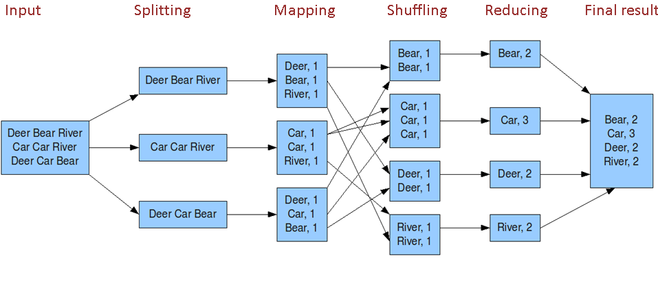

# Yarn 上的 MapReduce

## 一、 Yarn 上的 MarReduce 实体

``` doc
1. 客户端: 提交 MapReduce 作业

2. Yarn ResourceManager: 资源管理器，负责协调集群上计算资源的分配

3. Yarn NodeManager: 节点管理器，负责启动和监视集群中机器上的计算容器 (container)

4. MapReduce 应用程序 master, 负责协调运行 MapReduce 作业的任务。
   它和 MapReduce 任务在容器(container) 中运行，这些容器由资源管理器(ResourceManager) 分配并由节点管理器(NodeManager)进行管理

5. 分布式文件系统 (HDFS)
```

## 二、MapReduce 工作机制

### 1、工作在 Yarn 上的 MapReduce

- [Yarn 上的 MapReduce 原理图](https://www.processon.com/view/link/56643e61e4b026a7ca2ac271)
- [MapReduce 详细工作原理,包含 Shuffle](https://www.processon.com/view/link/566d79e4e4b0187009265f4a)

### 2、shuffle 和排序

系统执行排序的过程称为 shuffle, 即将 Map 输出作为输入传给 reducer 的过程

#### 2.1、详细流程图




#### 2.2、详细流程说明说明

- [shuffle 过程说明](http://www.cnblogs.com/hanganglin/articles/4064284.html)

``` doc
Map 端 :
1) 环形内存缓冲区 buffer
  每个 Map 任务都有一个环形内存缓冲区 buffer, 用于存储任务输出 (一个 Map 任务一般会拉去一个 HDFS 块的数据)

2) combiner  组合器
  combiner 使得 map 输出结果更紧凑, 因此减少写磁盘的数据和传递给 reduce 的数据

3) 压缩
  对 Map 输出进行压缩, 可以增加写磁盘的的速度, 减少传递给 reduce 的数量


Reduce 端 :
1) reduce 任务复制阶段
  PS:
  Reduce 端会从 AM 那里获取已经执行完的 map 任务，然后以 http 的方法将 map 输出的对应数据拷贝至本地(拷贝最大线程数 mapreduce.reduce.shuffle.parallelcopies 默认值5).
  每次拷贝过来的数据都存于内存缓冲区中，当数据量大于缓冲区大小(由 mapreduce.reduce.shuffle.input.buffer.percent 控制，默认0.7) 的一定比例 (由 mapreduce.reduce.shuffle.merge.percent控制，默认0.66) 时, 则将缓冲区的数据溢写到一个本地磁盘中。
  由于数据来自多个 map 的同一个分区，溢写时不需要再分区，但要进行排序和分组，如果设置了 Combiner，还会执行 Combine 操作。溢写过程与 map 端溢写类似，输出写入可同时进行。

  (1) map 任务输出文件位于运行 map 任务的 tasktracker 的本地磁盘，但 reduce 任务并不是这样
  (2) reduce 任务需要若干个 map 任务的 map 输出作为特殊的分区文件
  (3) 每个 map 任务的完成时间可能不同,只要有个 1 个 map 任务完成,reduce 任务就开始复制 map 任务的输出
  (4) map 任务输出很小，会被复制到 reduce 任务 JVM 的内存(由配置属性决定)

2) reduce 任务排序阶段
  PS:
  当所有的 map 端输出该分区数据都已经拷贝完毕时，本地磁盘可能存在多个 spill 文件，需要将他们再次排序、分组合并，最后形成一个最终文件，作为 Reduce 任务的输入。

  (1) 复制完成所有的 map 输出后,reduce 任务进入排序阶段 (更恰当的说法是合并阶段,因为排序是在 map 端进行的)
  (2) 合并 map 输出,维持 map 输出的排序.
    a) 排序阶段是循环进行的
    b) 比如有 50 个 map 任务输出,合并的的因子(配置决定)为 10,那么会合并 5 次(50/10 = 5),每次将 10 个文件合并成一个文件,因此最终会有 5 个中间文件

3) reduce 阶段
  PS:
  此时标志 Shuffle 阶段结束，然后 Reduce 任务启动，将最终文件中的数据处理形成新的键值对<k3,v3>。
  将生成的数据 <k3,v3> 输出到 HDFS 文件中

  (1) 直接把数据输出到 reduce 函数,省略了一次磁盘往返形成，并没有将这 5 个文件合并成一个已排序的文件。最后的合并可以来自内存和磁盘片段
  (2) map 已排序输出文件的每个 key,都调用 reduce 函数,此阶段的输出写到文件系统 HDFS
  (3) reduce 阶段合并策略 (重要)
    a) 达到最小合并数量的文件，卯足最后一趟的合并数
    b) 比如有 40 个文件等待合并,第一次合并 3 个，后面三次每次合并 10 个, 最后一次把 33 个合并的文件与剩下的 6 个文件合并在一起。
    3) 这样做的目的是减少磁盘的数据量，因为最后一次总是合并到 reduce

```
