# 第一章 - 并发编程的挑战

## 1. 上下文切换

即使是单核 CPU 也支持多线程执行代码, CPU通过给每个线程分配CPU时间片来实现这个机制.
时间片是CPU分配给各个线程的时间, 因为时间片非常短, 所以CPU通过不停地切换线程执行, 让我们感觉多个线程是同时执行的, 时间片一般是几十毫秒 (ms) .

CPU通过时间片分配算法来循环执行任务, 当前任务执行一个时间片后会切换到下一个任务.
但是, 在切换前会保存上一个任务的状态, 以便下次切换回这个任务时, 可以再加载这个任务的状态.
所以任务从保存到再加载的过程就是一次上下文切换.

- 测试上下文切换次数和时长

``` doc
Lmbench3 测量上下文切换的时长
    性能分析工具

vmstat  测量上下文切换的次数
    vmstat 1
```

- 如何减少上下文切换

``` doc
减少上下文切换的方法: 无锁并发编程、CAS 算法、使用最少线程、使用协程

a) 无锁并发编程:
    多线程竞争锁时, 会引起上下文切换, 所以多线程处理数据时, 可以用一
些办法来避免使用锁, 如将数据的ID按照Hash算法取模分段, 不同的线程处理不同段的数据

b) CAS(比较并替换) 算法:
    Java 的 Atomic 包使用 CAS 算法来更新数据, 而不需要加锁.

c) 使用最少线程:
    避免创建不需要的线程, 比如任务很少, 但是创建了很多线程来处理, 这
样会造成大量线程都处于等待状态

d) 协程:
    在单线程里实现多任务的调度, 并在单线程里维持多个任务间的切换
```

- 减少上下文切换实战

``` doc
案例: 减少线上大量 WAITING 的线程, 来减少上下文切换次数


# dump 线程信息
    jstack 16935 > ./jvm.log


# 查询线程状态信息
    grep java.lang.Thread.State ./jvm.log | awk '{print $2$3$4$5}' | sort | uniq -c

        9 RUNNABLE
        11 TIMED_WAITING(onobjectmonitor)
        5 TIMED_WAITING(sleeping)       parking | sleeping 定时的, 那个条件不到来, 也将定时唤醒自己
        2 WAITING(onobjectmonitor)
        73 WAITING(parking)             一直等那个条件发生
        BLOCKED (on object monitor)     在等待进入一个临界区


# 查找 WAITING(parking) 或其他状态占用次数较多的状态进行分析
    vim ./jvm.log

    # 发现线程状态次数过多的程序, 找出问题
    waiting on condition [0x00007f83185c4000]
        java.lang.Thread.State: WAITING (parking)
        at sun.misc.Unsafe.park(Native Method)
        - parking to wait for  <0x000000060a41cf00> (a java.util.concurrent.locks.AbstractQueuedSynchronizer$ConditionObject)
        at java.util.concurrent.locks.LockSupport.park(LockSupport.java:175)
        at java.util.concurrent.locks.AbstractQueuedSynchronizer$ConditionObject.await(AbstractQueuedSynchronizer.java:2039)
        at java.util.concurrent.LinkedBlockingQueue.take(LinkedBlockingQueue.java:442)
        at java.util.concurrent.ThreadPoolExecutor.getTask(ThreadPoolExecutor.java:1067)
        at java.util.concurrent.ThreadPoolExecutor.runWorker(ThreadPoolExecutor.java:1127)
        at java.util.concurrent.ThreadPoolExecutor$Worker.run(ThreadPoolExecutor.java:617)
        at java.lang.Thread.run(Thread.java:748)

    WAITING 的线程少了, 系统上下文切换的次数就会少, 因为每一次从 WAITTING 到 RUNNABLE 都会进行一次上下文的切换


# 线程状态
    PS: Thread State 线程状态详见: https://www.cnblogs.com/rainy-shurun/p/5732341.html

    waiting for monitor entry:
        意味着它在等待进入一个临界区, 所以它在 <Entry Set> 队列中等待.
        此时线程状态一般都是:
            Blocked: java.lang.Thread.State: BLOCKED (on object monitor)

        可能是一个全局锁阻塞住了大量线程.
        如果短时间内打印的 thread dump 文件反映, 随着时间流逝, waiting for monitor entry 的线程越来越多, 没有减少的趋势, 可能意味着某些线程在临界区里呆的时间太长了, 以至于越来越多新线程迟迟无法进入临界区

    waiting on condition:
        说明它在等待另一个条件的发生, 来把自己唤醒, 或者干脆它是调用了 sleep(N).
        此时线程状态大致为以下几种:
            java.lang.Thread.State: WAITING (parking)：一直等那个条件发生
            java.lang.Thread.State: TIMED_WAITING (parking或sleeping)：定时的, 那个条件不到来, 也将定时唤醒自己

        如果大量线程在 waiting on condition
            可能是它们又跑去获取第三方资源, 尤其是第三方网络资源, 迟迟获取不到Response, 导致大量线程进入等待状态.
            所以如果你发现有大量的线程都处在 Wait on condition, 从线程堆栈看, 正等待网络读写, 这可能是一个网络瓶颈的征兆, 因为网络阻塞导致线程无法执行.

    java.lang.Thread.State: TIMED_WAITING (on object monitor)；

    java.lang.Thread.State: WAITING (on object monitor)；
```


## 2. 死锁

锁是个非常有用的工具, 运用场景非常多, 因为它使用起来非常简单, 而且易于理解.但同时它也会带来一些困扰, 那就是可能会引起死锁, 一旦产生死锁, 就会造成系统功能不可用

- 避免死锁的几个常见方法

``` doc
避免一个线程同时获取多个锁

避免一个线程在锁内同时占用多个资源, 尽量保证每个锁只占用一个资源

尝试使用定时锁, 使用 lock.tryLock (timeout) 来替代使用内部锁机制

对于数据库锁, 加锁和解锁必须在一个数据库连接里, 否则会出现解锁失败的情况
```


# 第二章 - Java 并发机制的底层实现原理

Java 代码在编译后会变成 Java 字节码, 字节码被类加载器加载到 JVM 里, JVM 执行字节码, 最终需要转化为汇编指令在 CPU 上执行, Java 中所使用的并发机制依赖于 JVM 的实现和 CPU 的指令


## 1. volatile

在多 CPU 开发中保证了共享变量的"可见性".可见性的意思是当一个线程
修改一个共享变量时, 另外一个线程能读到这个修改的值.如果volatile变量修饰符使用恰当
的话, 它比synchronized的使用和执行成本更低, 因为它不会引起线程上下文的切换和调度.

- volatile 的定义与实现原理

``` doc
1) 线程共享变量的方式:
    a) 线程通过<排他锁>单独获得变量: Java 编程语言允许线程访问共享变量, 为了确保共享变量能被准确和一致地更新
    b) volatile: 在某些情况下比锁要更加方便.如果一个字段被声明成 volatile, Java 线程内存模型确保所有线程看到这个变量的值是一致的

2) volatile 实现原理:
    // instance 是 volatile 变量
    instance = new Singleton();

    // 转换为汇编后, 有 volatile 变量修饰的共享变量进行写操作的时候会多出第二行汇编代码: lock addl $0×0,(%esp);
    0x01a3de1d: movb $0×0,0×1104800(%esi);0x01a3de24: lock addl $0×0,(%esp);

    // 通过查 IA-32 架构软件开发者手册可知, Lock 前缀的指令在多核 CPU 下会引发了两件事
    a) 将当前 CPU 缓存行的数据写回到系统内存. Lock 前缀指令会引起 CPU 缓存回写到内存
    b) 这个写回内存的操作会使在其他 CPU 里缓存了该内存地址的数据无效. 一个 CPU 的缓存回写到内存会导致其他 CPU 的缓存无效


3) volatile 使用优化: 字节填充, 因为 CPU 会把不足 64 位放在同一级缓存中
```


## 2. synchronized

Java 中的每一个对象都可以作为锁
>
a) 对于普通同步方法, 锁是当前实例对象
b) 对于静态同步方法, 锁是当前类的Class对象
c) 对于同步方法块, 锁是 Synchonized 括号里配置的对象


- Java 对象头

``` doc
1) synchronized 锁是存在 Java 对象头里
    数组类型: 虚拟机用 3 个字宽 (Word) 存储对象头
    非数组类型: 用 2 字宽存储对象头
```

- 锁的升级与对比

``` doc
JavaSE 1.6 为了减少获得锁和<释放>锁带来的性能消耗, 引入了"偏向锁"和"轻量级锁", 在 Java SE 1.6 中, 锁一共有 4 种状态, 级别从低到高依次是:
    无锁状态 < 偏向锁状态 < 轻量级锁状态 < 重量级锁状态

    这几个状态会随着竞争情况逐渐升级.锁可以升级但不能降级, 意味着偏向锁升级成轻量级锁后不能降级成偏向锁.

1) 偏向锁
    HotSpot[1]的作者经过研究发现, 大多数情况下, 锁不仅不存在多线程竞争, 而且总是由同一线程多次获得, 为了让线程获得锁的代价更低而引入了偏向锁.
    当一个线程访问同步块并获取锁时, 会在对象头和栈帧中的锁记录里存储锁偏向的线程 ID.
    以后该线程在进入和退出同步块时不需要进行 CAS 操作来加锁和解锁, 只需简单地测试一下对象头的 ark Word 里是否存储着指向当前线程的偏向锁

    a) 偏向锁的撤销
        偏向锁使用了一种等到竞争出现才<释放>锁的机制, 所以当其他线程尝试竞争偏向锁时, 持有偏向锁的线程才会<释放>锁

    b) 关闭偏向锁
        偏向锁在 Java 6 和 Java 7 里是默认启用的, 但是它在应用程序启动几秒钟之后才激活, 如有必要可以使用JVM参数来关闭延迟：-XX:BiasedLockingStartupDelay=0.
        如果你确定应用程序里所有的锁通常情况下处于竞争状态, 可以通过 JVM 参数关闭偏向锁：-XX:-UseBiasedLocking=false, 那么程序默认会进入轻量级锁状态.

2) 轻量级锁
    a) 轻量级锁加锁
        线程在执行同步块之前, JVM会先在当前线程的栈桢中创建用于存储锁记录的空间, 并将对象头中的Mark Word复制到锁记录中, 官方称为Displaced Mark Word.
        然后线程尝试使用 CAS 将对象头中的 Mark Word 替换为指向锁记录的指针.如果成功, 当前线程获得锁, 如果失败, 表示其他线程竞争锁, 当前线程便尝试使用自旋来获取锁.

    b) 轻量级锁解锁
        轻量级解锁时, 会使用原子的 CAS 操作将 Displaced Mark Word 替换回到对象头.如果成功, 则表示没有竞争发生.如果失败, 表示当前锁存在竞争, 锁就会膨胀成重量级锁

3) 锁的优缺点对比
    见图 2 - 6
```


## 3. 原子操作的实现原理

原子操作 (atomic operation) : 意为不可被中断的一个或一系列操作

- CPU 实现原子操作

``` doc
 CPU 提供总线锁定和缓存锁定两个机制来保证复杂内存操作的原子性

1) CPU 总线锁 - 保证原子性
    如果多个 CPU 同时对共享变量进行读改写操作 (i++ 就是经典的读改写操作) , 那么共享变量就会被多个 CPU 同时进行操作.
    这样读改写操作就不是原子的, 操作完之后共享变量的值会和期望的不一致.

    所谓总线锁就是使用 CPU 提供的一个 LOCK＃ 信号, 当一个 CPU 在总线上输出此信号时, 其他 CPU 的请求将被阻塞住, 那么该 CPU 可以独占共享内存.
    但总线锁定把 CPU 和内存之间的通信锁住了, 这使得锁定期间, 其他 CPU 不能操作其他内存地址的数据, 所以总线锁定的开销比较大

b) CPU 缓存锁 - 保证原子性
    "缓存锁定"是指内存区域如果被缓存在 CPU 的缓存行中, 并且在 Lock 操作期间被锁定.
     那么当它执行锁操作回写到内存时,  CPU 不在总线上声言 LOCK＃ 信号, 而是修改内部的内存地址, 并允许它的缓存一致性机制来保证操作的原子性.
     因为缓存一致性机制会阻止同时修改由两个以上 CPU 缓存的内存区域数据, 当其他 CPU 回写已被锁定的缓存行的数据时, 会使缓存行无效

c) 有两种情况下 CPU 不会使用缓存锁定
    第一种情况是：当操作的数据不能被缓存在 CPU 内部, 或操作的数据跨多个缓存行 (cache line) 时, 则 CPU 会调用总线锁定
    第二种情况是：有些 CPU 不支持缓存锁定.对于 Intel 486 和 Pentium  CPU , 就算锁定的内存区域在 CPU 的缓存行中也会调用总线锁定
```

- Java 实现原子操作

``` doc
Java 通过锁和循环 CAS 的方式来实现原子操作

1) 使用循环 CAS 实现原子操作
    JVM 中的 CAS 操作正是利用了 CPU 提供的 CMPXCHG 指令实现的
    自旋 CAS 实现的基本思路就是循环进行 CAS 操作直到成功为止

2) CAS 实现原子操作的三大问题
    Java 并发包中有一些并发框架也使用了自旋 CAS 的方式来实现原子操作, 比如 LinkedTransferQueue 类的 Xfer 方法

    a) ABA 问题
        因为CAS需要在操作值的时候, 检查值有没有发生变化, 如果没有发生变化则更新, 但是如果一个值原来是A, 变成了B, 又变成了A, 那么使用CAS进行检查时会发现它的值没有发生变化, 但是实际上却变化了

        ABA问题的解决思路就是使用版本号.
        在变量前面追加上版本号, 每次变量更新的时候把版本号加1, 那么A→B→A就会变成1A→2B→3A.
        从Java 1.5开始, JDK 的 Atomic 包里提供了一个类 AtomicStampedReference 来解决ABA问题.

    b) 循环时间长开销大
        自旋 CAS 如果长时间不成功, 会给CPU带来非常大的执行开销.

    c) 只能保证一个共享变量的原子操作
        当对一个共享变量执行操作时, 我们可以使用循环 CAS 的方式来保证原子操作, 但是对多个共享变量操作时, 循环 CAS 就无法保证操作的原子性, 这个时候就可以用锁
```


# 第三章 - Java 内存模型(JMM)

主要介绍内存模型相关的基本概念；

- Java 内存模型中的顺序一致性, 主要介绍重排序与顺序一致性内存模型；

- 同步原语, 主要介绍3个同步原语 (synchronized、volatile和final) 的内存语义及重排序规则在 CPU 中的实现；

- Java 内存模型的设计, 主要介绍 Java 内存模型的设计原理, 及其与 CPU 内存模型和顺序一致性内存模型的关系


## 1. Java 内存模型(JMM)概念

- 并发编程模型的两个关键问题: 线程之间通信, 线程之间同步

``` doc
1) 线程通信
    通信是指线程之间以何种机制来交换信息.在命令式编程中, 线程之间的通信机制有两种：共享内存和消息传递
    a) 共享内存的并发模型里:
        线程之间共享程序的公共状态, 通过 写-读 内存中的公共状态进行隐式通信
    b) 消息传递的并发模型里:
        线程之间没有公共状态, 线程之间必须通过发送消息来显式进行通信

2) 线程同步
    同步是指程序中用于控制不同线程间操作发生相对顺序的机制.

    a) Java 的并发采用的是共享内存模型, Java 线程之间的通信总是隐式进行, 整个通信过程对程序员完全透明
```

- Java 内存模型(JMM) - 抽象结构

``` doc
1) Java 线程之间的通信由 Java 内存模型 (本文简称为 JMM) 控制, JMM 决定一个线程对共享变量的写入何时对另一个线程可见. JMM 定义了线程和主内存之间的抽象关系.

2) 线程之间的共享变量存储在主内存 (Main Memory) 中, 每个线程都有一个私有的本地内存 (Local Memory) , 本地内存中存储了该线程以读/写共享变量的副本
    本地内存是 JMM 的一个抽象概念, 并不真实存在.它涵盖了缓存、写缓冲区、寄存器以及其他的硬件和编译器优化

PS: Java 内存模型的抽象结构示意图
```


- Java 内存模型(JMM) - 线程通信

``` doc
1) 如果线程 A 与线程 B 之间要通信的话, 必须要经历下面 2 个步骤
    a) 线程 A 把本地内存 A 中更新过的共享变量刷新到主内存中去.
    b) 线程 B 到主内存中去读取线程 A 之前已更新过的共享变量.

2) 流程
    a) 线程 A 和线程 B 中的本地内存 x, 是共享主内存中的 x
    b) 线程 A 在执行 x=1 时, 把更新后的 x 值, 临时存放在自己的本地内存 A 中
    c) 线程 A 和线程 B 需要通信时, 线程 A 首先会把自己本地内存中修改后的 x 值刷新到主内存中
    d) 线程 B 到主内存中去读取线程 A 更新后的 x 值, 此时线程 B 的本地内存的 x 值也变为了 1

3) JMM 可见性的流程
    从整体来看, 这两个步骤实质上是线程 A 在向线程 B 发送消息, 而且这个通信过程必须要经过主内存.
    JMM 通过控制主内存与每个线程的本地内存之间的交互, 来为 Java 程序员提供内存可见性保证.

PS: 线程之间的通信图
```
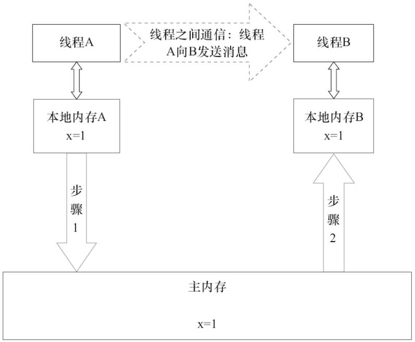


- Java 内存模型(JMM) - 控制指令序列的重排序

``` doc
1) 在执行程序时, 为了提高性能, 编译器和 CPU 常常会对指令做重排序.重排序分3种类型.
    a) 编译器优化的重排序
        编译器在不改变单线程程序语义的前提下, 可以重新安排语句的执行顺序.

    b) 指令级并行的重排序
        现代 CPU 采用了指令级并行技术 (Instruction-LevelParallelism, ILP) 来将多条指令重叠执行.如果不存在数据依赖性,  CPU 可以改变语句对应机器指令的执行顺序.

    c) 内存系统的重排序
        由于 CPU 使用缓存和读/写缓冲区, 这使得加载和存储操作看上去可能是在乱序执行.

2) JMM 可见性实现的方法
    a) 上列中, 1 属于编译器重排序, 2 和 3 属于 CPU 重排序, 这些重排序可能会导致多线程程序出现内存可见性问题.

    b) JMM 属于语言级的内存模型, 它确保在不同的编译器和不同的 CPU 平台之上, 通过禁止特定类型的编译器重排序和 CPU 重排序, 为程序员提供一致的内存可见性保证.  

    c) JMM 的编译器重排序规则会禁止特定类型的编译器重排序, 对于 CPU 重排序, JMM 的 CPU 重排序规则会要求 Java 编译器在生成指令序列时, 插入特定类型的内存屏障 (MemoryBarriers, Intel 称之为 Memory Fence) 指令, 通过内存屏障指令来禁止特定类型的 CPU 重排序.

PS: 源码到最终执行的指令序列的示意图
```


- Java 内存模型(JMM) - 并发编程模型的分类

``` doc
为了保证内存可见性, Java 编译器在生成指令序列的适当位置会插入内存屏障指令来禁止特定类型的 CPU 重排序.

JMM 把内存屏障指令分为 4 类. 见下图
  a) StoreLoad Barriers:
      是一个"全能型"的屏障, 它同时具有其他 3 个屏障的效果.现代的多 CPU 大多支持该屏障 (其他类型的屏障不一定被所有 CPU 支持) .
      执行该屏障开销会很昂贵, 因为当前 CPU 通常要把写缓冲区中的数据全部刷新到内存中 (Buffer Fully Flush) .

PS: 内存屏障类型表
```
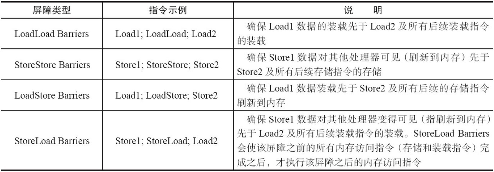


## 2. 重排序

编译器和 CPU 为了优化程序性能而对指令序列进行重新排序的一种手段

- 重排序 - 数据依赖性

``` doc
1) 如果两个操作访问同一个变量, 且这两个操作中有一个为写操作, 此时这两个操作之间就存在数据依赖性.

2) 编译器和 CPU 在重排序时, 会遵守数据依赖性, 编译器和 CPU 不会改变存在数据依赖关系的两个操作的执行顺序.

3) 这里所说的数据依赖性仅针对 <单个 CPU> 中执行的指令序列和单个线程中执行的操作, 不同 CPU 之间和不同线程之间的数据依赖性不被编译器和 CPU 考虑.

PS: 下图 3 种情况, 只要重排序两个操作的执行顺序, 程序的执行结果就会被改变.
```


- 重排序 - happens-before(之前) 介绍

``` doc
在 JMM 中, 如果一个操作执行的结果需要对另一个操作可见, 那么这两个操作之间必须要存在 happens-before 关系.

1) happens-before 规则如下
    a) 程序顺序规则
        一个线程中的每个操作, happens-before 于该线程中的任意后续操作

    b) 监视器锁规则
        对一个锁的解锁, happens-before 于随后对这个锁的加锁

    c) volatile 变量规则
        对一个 volatile 域的写, happens-before 于任意后续对这个 volatile 域

    d) 传递性
        如果 A happens-before B(A 之前与 B), 且 B happens-before C, 那么 A happens-before C 两个操作之间具有 happens-before 关系, 并不意味着前一个操作必须要在后一个操作之前执！
        happens-before 仅仅要求前一个操作 (执行的结果) 对后一个操作可见, 且前一个操作按顺序排在第二个操作之前

PS: happens-before 与 JMM 的关系, 一个 happens-before 规则对应于一个或多个编译器和 CPU 重排序规则
```
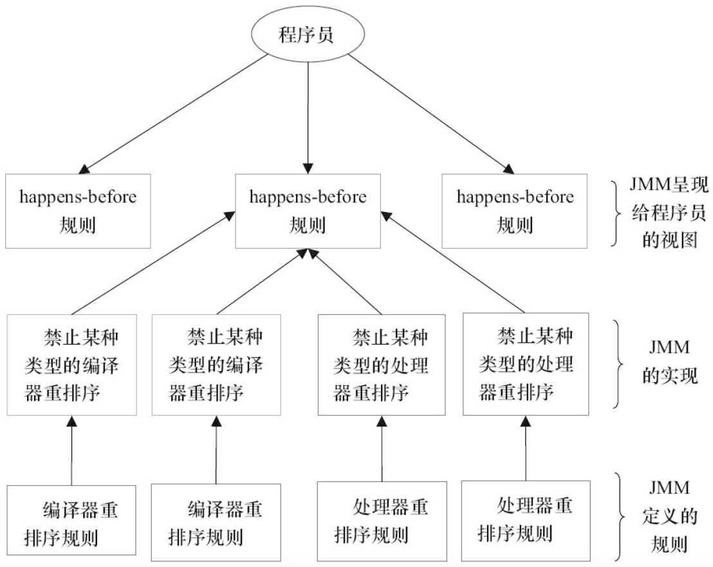


- 重排序 - as-if-serial 语义

``` doc
1) as-if-serial 语义
    不管怎么重排序 (编译器和 CPU 为了提高并行度) ,  (单线程) 程序的执行结果不能被改变.编译器、runtime 和 CPU 都必须遵守 as-if-serial 语义.
    编译器和 CPU 不会对存在数据依赖关系的操作做重排序, 因为这种重排序会改变执行结果

2) JMM 中的 as-if-serial
    在计算机中, 软件技术和硬件技术有一个共同的目标：在不改变程序执行结果的前提下, 尽可能提高并行度.
    编译器和 CPU 遵从这一目标, 从 happens-before 的定义我们可以看出, JMM 同样遵从这一目标.
```

- 重排序 - 重排序对多线程的影响

``` doc
会影响执行结果
```


## 3. 顺序一致性模型

JMM 顺序一致性内存模型是一个理论参考模型, 在设计的时候, CPU 的内存模型和编程语言的内存模型都会以顺序一致性内存模型作为参照

- 数据竞争与顺序一致性

``` doc
1) 当程序未正确同步时, 就可能会存在数据竞争.Java 内存模型规范对数据竞争的定义如下
    在一个线程中写一个变量, 在另一个线程读同一个变量, 而且写和读没有通过同步来排序, 多个线程同时操作一个变量

2) JMM 对正确同步的多线程程序的内存一致性做了如下保证
    如果程序是正确同步的, 程序的执行将具有顺序一致性 (Sequentially Consistent) ——即程序的执行结果与该程序在顺序一致性内存模型中的执行结果相同
```

- 顺序一致性内存模型

``` doc
1) 顺序一致性内存模型是一个被计算机科学家理想化了的理论参考模型, 它为程序员提供了极强的内存可见性保证.顺序一致性内存模型有两大特性.
    a) 一个线程中的所有操作必须按照程序的顺序来执行

    b) (不管程序是否同步) 所有线程都只能看到一个单一的操作执行顺序.在顺序一致性内存模型中, 每个操作都必须原子执行且立刻对所有线程可见.

2) 顺序一致性内存模型视图
    a) 在概念上, 顺序一致性模型有一个单一的全局内存, 这个内存通过一个左右摆动的开关可以连接到任意一个线程, 同时每一个线程必须按照程序的顺序来执行内存读/写操作.

    b) 从下面的示意图可以看出, 在任意时间点最多只能有一个线程可以连接到内存.当多个线程并发执行时, 图中的开关装置能把所有线程的所有内存读/写操作串行化 (即在顺序一致性模型中, 所有操作之间具有全序关系)
```
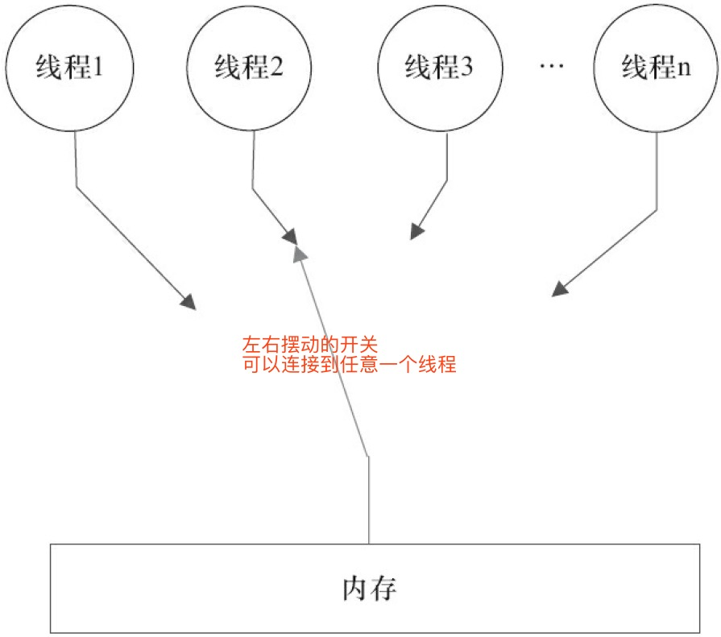


- 同步程序的顺序一致性模型效果

``` java
class SynchronizedExample {
  int a = 0;
  boolean flag = false;

  public synchronized void writer() { // 获取锁
      a = 1;
      flag = true;
  }                                   // 释放锁  

  public synchronized void reader() { // 获取锁
      if (flag) {
          int i = a;
      }                               // 释放锁
  }
}

1) 顺序一致性模型
    所有操作完全按程序的顺序串行执行

2) JMM 模型
    临界区内的代码可以重排序 (但JMM不允许临界区内的代码"逸出"到临界区之外, 那样会破坏监视器的语义)
    JMM 在具体实现上的基本方针为：在不改变 (正确同步的) 程序执行结果的前提下, 尽可能地为编译器和 CPU 的优化打开方便之门.

PS: 两个内存模型中的执行时序对比图
```
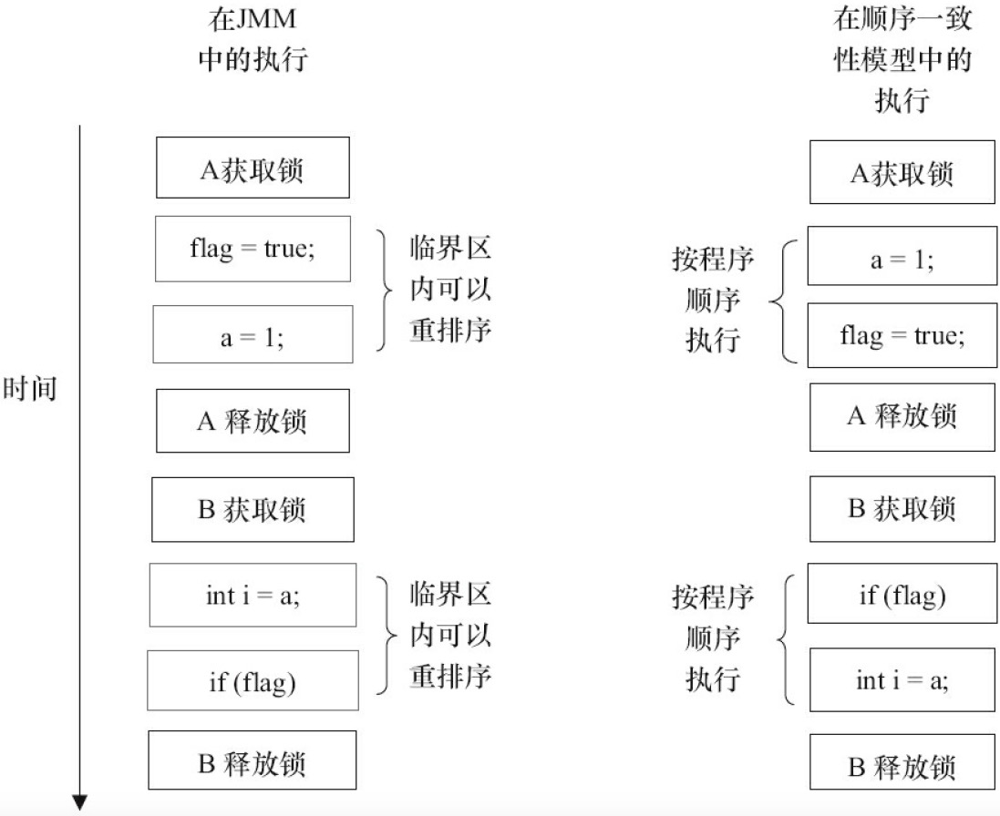


- 未同步程序的执行模型特性

``` doc
1) 对于未同步或未正确同步的多线程程序
    JMM 只提供最小安全性：线程执行时读取到的值, 要么是之前某个线程写入的值, 要么是默认值 (0, Null, False) , JMM 保证线程读操作读取到的值不会无中生有 (Out Of Thin Air) 的冒出来.
    为了实现最小安全性, JVM 在堆上分配对象时, 首先会对内存空间进行清零, 然后才会在上面分配对象 (JVM内部会同步这两个操作) .因此, 在已清零的内存空间 (Pre-zeroed Memory) 分配对象时, 域的默认初始化已经完成了.

2) JMM 不保证未同步程序的执行结果与该程序在顺序一致性模型中的执行结果一致
    因为如果想要保证执行结果一致, JMM需要禁止大量的 CPU 和编译器的优化, 这对程序的执行性能会产生很大的影响.
    而且未同步程序在顺序一致性模型中执行时, 整体是无序的, 其执行结果往往无法预知.
    而且, 保证未同步程序在这两个模型中的执行结果一致没什么意义.

3) 未同步程序在两个模型(顺序一致性模型、JMM 模型)中的执行特性有如下几个差异
    a) 顺序一致性模型保证单线程内的操作会按程序的顺序执行, 而 JMM 模型不保证单线程内的操作会按程序的顺序执行 (比如上面正确同步的多线程程序在临界区内的重排序)

    b) 顺序一致性模型保证所有线程只能看到一致的操作执行顺序, 而 JMM 不保证所有线程能看到一致的操作执行顺序

    c) JMM 不保证对 64 位的 long 型和 double 型变量的写操作具有原子性, 而顺序一致性模型保证对所有的内存读/写操作都具有原子性, 原因如下:
        在一些 32 位的 CPU 上, 如果要求对 64 位数据的写操作具有原子性, 会有比较大的开销.为了照顾这种 CPU , Java 语言规范鼓励但不强求 JVM 对 64 位的 long 型变量和 double 型变量的写操作具有原子性.
        当 JVM 在这种 CPU 上运行时, 可能会把一个 64 位 long/double 型变量的写操作拆分为两个32位的写操作来执行.这两个 32 位的写操作可能会被分配到不同的总线事务中执行, 此时对这个 64 位变量的写操作将不具有原子性.
```

-  CPU 总线的工作机制

``` doc
1) 总线事务 (Bus Transaction)
    数据通过总线在 CPU 和内存之间传递, 每次 CPU 和内存之间的数据传递都是通过一系列步骤来完成的, 这一系列步骤称之为总线事务 (Bus Transaction) .
    总线事务包括读事务 (Read Transaction) 和写事务 (Write Transaction) .读事务从内存传送数据到 CPU , 写事务从 CPU 传送数据到内存, 每个事务会 读/写 内存中一个或多个物理上连续的字.

2) 总线会同步试图并发使用总线的事务.
    在一个 CPU 执行总线事务期间, 总线会禁止其他的 CPU 和 I/O 设备执行内存的 读/写.
    总线的这些工作机制可以把所有 CPU 对内存的访问以串行化的方式来执行.在任意时间点, 最多只能有一个 CPU 可以访问内存.
    这个特性确保了单个总线事务之中的内存 读/写 操作具有原子性.

PS: 总线的工作机制
```
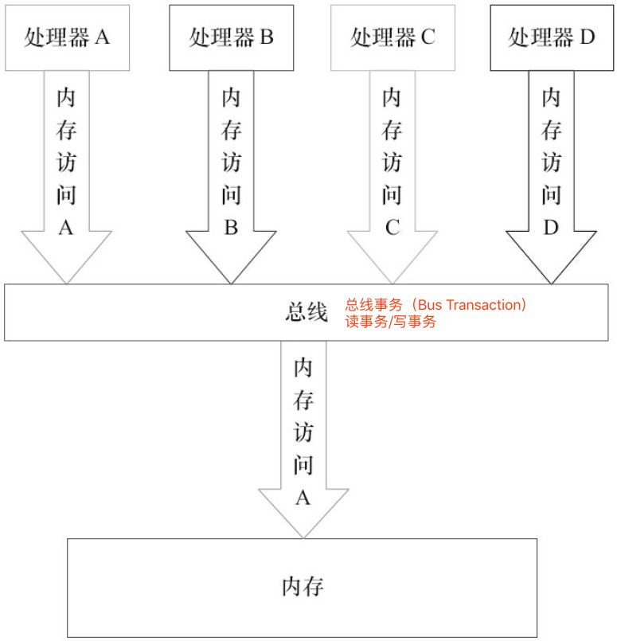


## 4. volatile 的内存语义

当声明共享变量为volatile后, 对这个变量的读/写将会很特别.

- volatile 的特性

``` doc
1) 可见性: 对一个 volatile 变量的读, 总是能看到 (任意线程) 对这个 volatile 变量最后的写入.

2) 原子性: 对任意单个 volatile 变量的读/写具有原子性, 但类似于 volatile++ 这种复合操作不具有原子性.
```

- volatile 写-读 建立的 happens-before 关系

``` doc
JSR-133 开始 (即从JDK5开始) , volatile 变量的 写-读 可以实现线程之间的通信.
```

- volatile 写-读 的内存语义

``` doc
1) volatile 变量读写
    a) 当写一个 volatile 变量时, JMM 会把该线程对应的本地内存中的共享变量值刷新到主内存.

    b) 当读一个 volatile 变量时, JMM 会把该线程对应的本地内存置为无效, 线程会从主内存中读取共享变量到本地内存

2) volatile 变量读写原理
    a) 线程 A 写一个 volatile 变量, 实质上是线程 A 向接下来将要读这个 volatile 变量的某个线程发出了 (其对共享变量所做修改的) 消息.

    b) 线程 B 读一个 volatile 变量, 实质上是线程 B 接收了之前某个线程发出的 (在写这个 volatile 变量之前对共享变量所做修改的) 消息.

    c) 线程 A 写一个 volatile 变量, 随后线程 B 读这个 volatile 变量, 这个过程实质上是线程 A 通过主内存向线程B发送消息.

PS: 共享变量的状态示意图
```
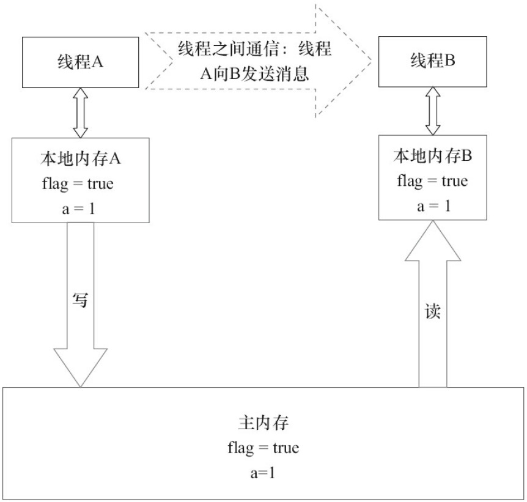

- volatile 内存语义的实现

``` doc
JMM 实现 volatile 写/读 的内存语义

    重排序分为 <编译器重排序> 和 <CPU 重排序>

    JMM 为了实现 volatile 内存语义, 会分别限制这两种类型的重排序类型
```
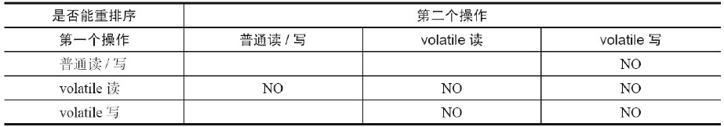


- JSR-133 增强 volatile 内存语义

``` doc
为了提供比锁更轻量级的线程之间通信的机制, JSR-133 专家组决定增强 volatile 的内存语义.

1) 严格限制编译器和 CPU 对 volatile 变量与普通变量的重排序, 确保 volatile 的 <写-读> 和锁的 <释放-获取> 具有相同的内存语义.

2) 从编译器重排序规则和 CPU 内存屏障插入策略来看, 只要 volatile 变量与普通变量之间的重排序可能会破坏 volatil e的内存语义, 这种重排序就会被编译器重排序规则和 CPU 内存屏障插入策略禁止.
```

## 5. 锁的内存语义

- 锁的释放 - 获取建立的 happens-before 关系

- 锁的释放和获取的内存语义

``` doc
1) 当线程<释放>锁时
    JMM 会把该线程对应的本地内存中的共享变量刷新到主内存中.

2) 当线程<获取>锁时
    JMM 会把该线程对应的本地内存置为无效.从而使得被监视器保护的临界区代码必须从主内存中读取共享变量.图3-26是锁获取的状态示意图.

3) 锁 与 volatile 对比
    a) 锁<释放>内存语义 = volatile 写内存语义, 这两个内存语义是相等的

    b) 锁<获取>内存语义 = volatile 读内存语义, 这两个内存语义是相等的

4) 锁<释放>和锁<获取>的内存语义总结
    a) 线程 A 释放一个锁, 实质上是线程 A 向接下来将要获取这个锁的某个线程发出了 (线程 A 对共享变量所做修改的) 消息

    b) 线程 B 获取一个锁, 实质上是线程 B 接收了之前某个线程发出的 (在释放这个锁之前对共享变量所做修改的) 消息

    c) 线程 A 释放锁, 随后线程 B 获取这个锁, 这个过程实质上是线程 A 通过主内存向线程 B 发送消息
```

- 锁内存语义的实现

``` doc

```

- concurrent 包的实现

``` doc
1) 由于 CAS 同时具有 volatile 读和 volatile 写的内存语义, 因此 Java 线程之间的通信现在有了下面 4 种方式
    a) A 线程写 volatile 变量, 随后B线程读这个 volatile 变量

    b) A 线程写 volatile 变量, 随后B线程用 CAS 更新这个 volatile 变量

    d) A 线程用 CAS 更新一个 volatile 变量, 随后 B 线程读这个 volatile 变量

    c) A 线程用 CAS 更新一个 volatile 变量, 随后 B 线程用 CAS 更新这个 volatile 变量

2) concurrent 包的源代码实现, 有一个通用化的实现模式:
    a) 首先, 声明共享变量为 volatile

    b) 然后, 使用 CAS 的原子条件更新来实现线程之间的同步

    c) 同时, 配合以 volatile 的读/写和 CAS 所具有的 volatile 读和写的内存语义来实现线程之间的通信

3) AQS, 非阻塞数据结构和原子变量类 (java.util.concurrent.atomic 包中的类)
    这些 concurrent 包中的基础类都是使用这种模式来实现的, 而 concurrent 包中的高层类又是依赖于这些基础类来实现的从整体来看, concurrent 包的实现如下图所示
```
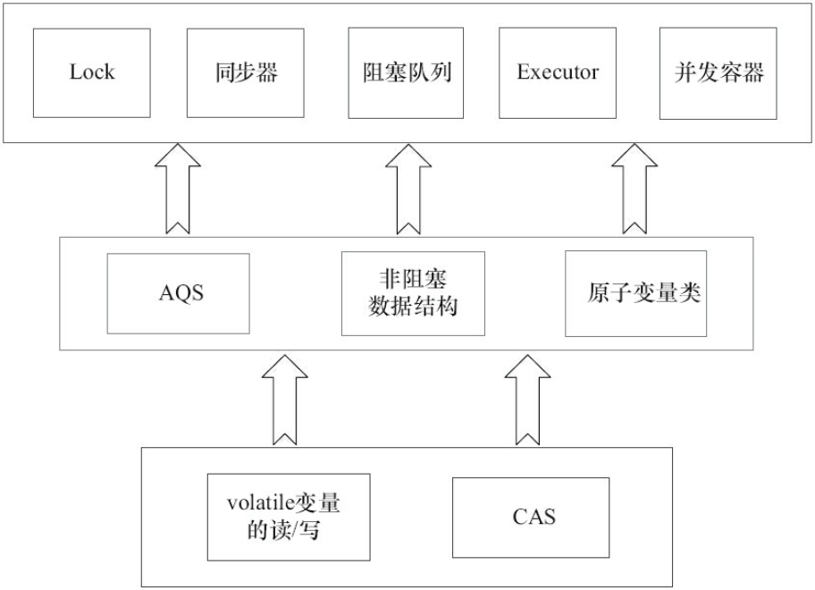


## 6. final 域的内存语义

与锁和 volatile 相比, 对 final 域的读和写更像是普通的变量访问.

- final 域的重排序规则

``` doc
1) 对于 final 域, 编译器和 CPU 要遵守两个重排序规则
    a) 在构造函数内对一个 final 域的写入, 与随后把这个被构造对象的引用赋值给一个引用变量, 这两个操作之间不能重排序

    b) 初次读一个包含 final 域的对象的引用, 与随后初次读这个 final 域, 这两个操作之间不能重排序

2) 写 final 域的重排序规则
    a) 写 final 域的重排序规则禁止把 final 域的写, 重排序到构造函数之外

    b) JMM 禁止编译器把 final 域的写, 重排序到构造函数之外

    c) 编译器会在 final 域的写之后, 构造函数 return 之前, 插入一个 StoreStore 屏障, 这个屏障禁止 CPU 把 final 域的写重排序到构造函数之外

3) 读 final 域的重排序规则
    a) 在一个线程中, 初次读对象引用与初次读该对象包含的 final 域, JMM 禁止 CPU 重排序这两个操作 (注意, 这个规则仅仅针对 CPU )

    b) 编译器会在读 final 域操作的前面插入一个 LoadLoad 屏障
```

- 为什么 final 引用不能从构造函数内 <溢出>

``` doc
1) 在 final 域构造函数返回前, 被构造对象的引用不能为其他线程所见, 因为此时的 final 域可能还没有被初始化.在构造函数返回后, 任意线程都将保证能看到 final 域正确初始化之后的值

2) 在 final 域构造函数内部, 不能让这个被构造对象的引用为其他线程所见, 也就是溢出
```

- final 语义在 CPU 中的实现

``` doc
1) final 域的读和写
    a) 写 final 域的重排序规则会要求编译器在 final 域的写之后, 构造函数 return 之前插入一个 StoreStore 障屏

    b) 读 final 域的重排序规则要求编译器在读 final 域的操作前面插入一个 LoadLoad 屏障

2) X86  CPU 处理规则
    a) X86  CPU 不会对<写-写>操作做重排序, 所以在 X86  CPU 中, 写 final 域需要的 StoreStore 障屏会被省略掉

    b) X86  CPU 不会对存在间接依赖关系的操作做重排序, 所以在 X86  CPU 中, 读 final 域需要的 LoadLoad 屏障也会被省略掉

    c) 也就是说, 在 X86  CPU 中, final 域的读/写不会插入任何内存屏障(无效)
```


## 7. happens-before

- JMM 的设计

``` doc
1) JSR-133 专家组对 JMM 的设计意图
    a) 程序员对内存模型的使用.程序员希望内存模型易于理解、易于编程.程序员希望基于一个强内存模型来编写代码.

    b) 编译器和 CPU 对内存模型的实现.编译器和 CPU 希望内存模型对它们的束缚越少越好, 这样它们就可以做尽可能多的优化来提高性能.编译器和 CPU 希望实现一个弱内存模型.

2) JMM 把 happens-before 要求禁止的重排序分为了下面两类
    a) 会改变程序执行结果的重排序
        对于会改变程序执行结果的重排序, JMM要求编译器和 CPU 必须禁止这种重排序

    b) 不会改变程序执行结果的重排序
        对于不会改变程序执行结果的重排序, JMM对编译器和 CPU 不做要求 (JMM允许这种重排序)

3) JMM 对编译器和 CPU 中, 处理重排序和 happens-before 的原则
    JMM 其实是在遵循一个基本原则：只要不改变程序的执行结果 (指的是单线程程序和正确同步的多线程程序) , 编译器和 CPU 怎么优化都行.
    例如, 如果编译器经过细致的分析后, 认定一个锁只会被单个线程访问, 那么这个锁可以被消除.
    再如, 如果编译器经过细致的分析后, 认定一个 volatile 变量只会被单个线程访问, 那么编译器可以把这个 volatile 变量当作一个普通变量来对待.
    这些优化既不会改变程序的执行结果, 又能提高程序的执行效率.

PS: JMM 的设计示意图
```
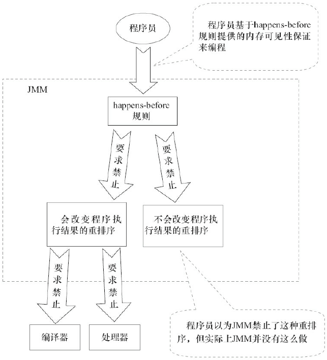


- happens-before 规则

``` doc
《JSR-133:Java Memory Model and Thread Specification》 定义了如下 happens-before 规则

1) 程序顺序规则：一个线程中的每个操作, happens-before 于该线程中的任意后续操作.
2) 监视器锁规则：对一个锁的解锁, happens-before 于随后对这个锁的加锁.
3) volatile 变量规则：对一个 volatile 域的写, happens-before 于任意后续对这个 volatile 域的读.
4) 传递性：如果 A happens-before B, 且 B happens-before C, 那么 A happens-before C.
5) start() 规则：如果线程 A 执行操作 ThreadB.start() (启动线程B) , 那么 A 线程的 ThreadB.start() 操作 happens-before 于线程 B 中的任意操作.
6) join() 规则：如果线程 A 执行操作 ThreadB.join() 并成功返回, 那么线程 B 中的任意操作 happens-before 于线程 A 从 ThreadB.join() 操作成功返回.
```


## 8. 双重检查锁定与延迟初始化

- 双重检查锁定的由来

``` java
/**
双重检查锁定看起来似乎很完美, 但这是一个错误的优化！在线程执行到第4行, 代码读取到instance不为null时, instance引用的对象有可能还没有完成初始化.

前面的双重检查锁定示例代码的第7行（instance=new Singleton();）创建了一个对象.这一行代码可以分解为如下的3行伪代码.
    memory = allocate();　　// 1：分配对象的内存空间
    ctorInstance(memory);　 // 2：初始化对象
    instance = memory;　　 // 3：设置instance指向刚分配的内存地址

上面3行伪代码中的2和3之间, 可能会被重排序（在一些JIT编译器上, 这种重排序是真实
发生的, 详情见参考文献1的"Out-of-order writes"部分）.2和3之间重排序之后的执行时序如下.
**/
public class DoubleCheckedLocking {                             // 1
    private static Instance instance;                           // 2
    public static Instance getInstance() {                      // 3
        if (instance == null) {                                 // 4:第一次检查
            synchronized (DoubleCheckedLocking.class) {         // 5:加锁
                if (instance == null)                           // 6:第二次检查
                    instance = new Instance();                  // 7:问题的根源出在这里
            }                                                   // 8
        }                                                       // 9
        return instance;                                        // 10
    }                                                           // 11
}
```

- 基于 volatile 的解决方案

``` java
/**
这个解决方案需要 JDK 5 或更高版本（因为从JDK 5开始使用新的JSR-133内存模型规范, 这个规范增强了 volatile 的语义）
**/
public class SafeDoubleCheckedLocking {
    private volatile static Instance instance;
    public static Instance getInstance() {
        if (instance == null) {
            synchronized (SafeDoubleCheckedLocking.class) {
                if (instance == null)
                  instance = new Instance(); // instance为volatile, 现在没问题了
            }
        }
        return instance;
    }
}
```

- 基于类初始化的解决方案

``` java
/**
JVM 在类的初始化阶段（即在Class被加载后, 且被线程使用之前）, 会执行类的初始化.
在执行类的初始化期间, JVM 会去获取一个锁.这个锁可以同步多个线程对同一个类的初始化.
基于这个特性, 可以实现另一种线程安全的延迟初始化方案（这个方案被称之为Initialization On Demand Holder idiom）.
**/
public class InstanceFactory {
    private static class InstanceHolder {
        public static Instance instance = new Instance();
    }
    public static Instance getInstance() {
        return InstanceHolder.instance ;　　// 这里将导致InstanceHolder类被初始化
    }
}
```


## 9. Java 内存模型 JMM 综述

顺序一致性内存模型是一个理论参考模型

CPU 内存模型是硬件级的内存模型

JMM 是一个语言级的内存模型

- CPU 的内存模型

``` doc
1) 顺序一致性内存模型
    顺序一致性内存模型是一个理论参考模型, JMM 和 CPU 内存模型在设计时通常会以顺序一致性内存模型为参照.
    JMM 和 CPU 内存模型会对顺序一致性模型做一些放松, 因为如果完全按照顺序一致性模型来实现 CPU 和 JMM, 那么很多的 CPU 和编译器优化都要被禁止, 这对执行性能将会有很大的影响.

2) 对不同类型的 读/写 操作组合的执行顺序的放松, 常见 CPU 的内存模型划分为如下几种类型
    a) Total Store Ordering 内存模型（简称为TSO）
        放松程序中写-读操作的顺序, 由此产生了 Total Store Ordering 内存模型（简称为TSO）

    b) Partial Store Order 内存模型（简称为PSO）
        在上面的基础上, 继续放松程序中写-写操作的顺序, 由此产生了 Partial Store Order 内存模型（简称为PSO）

    c) Relaxed Memory Order 内存模型（简称为RMO）和 PowerPC 内存模型
        在前面两条的基础上, 继续放松程序中 读-写 和 读-读 操作的顺序, 由此产生了 RelaxedMemory Order 内存模型（简称为RMO）和 PowerPC 内存模型

3)  CPU 内存模型特征
    a) 所有 CPU 内存模型都允许<写-读>重排序, 原因：它们都使用了写缓存区.写缓存区可能导致写-读操作重排序

    b) 所有 CPU 内存模型都允许更早读到当前 CPU 的写, 原因同样是因为写缓存区

    c) 由于写缓存区仅对当前 CPU 可见, 这个特性导致当前 CPU 可以比其他 CPU 先看到临时保存在自己写缓存区中的写

PS:  CPU 内存模型的特征表
    CPU 内存模型的特征表中的各种 CPU 内存模型, 从上到下, 模型由强变弱.
    越是追求性能的 CPU , 内存模型设计得会越弱.因为这些 CPU 希望内存模型对它们的束缚越少越好, 这样它们就可以做尽可能多的优化来提高性能
```
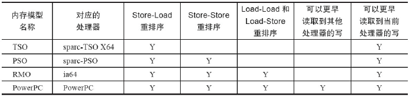


- CPU 内存模型和 JMM 内存模型

``` doc
1) 由于常见的 CPU 内存模型比 JMM 要弱, Java 编译器在生成字节码时, 会在执行指令序列的适当位置插入内存屏障来限制 CPU 的重排序

2) 由于各种 CPU 内存模型的强弱不同, 为了在不同的 CPU 平台向程序员展示一个一致的内存模型, JMM 在不同的 CPU 中需要插入的内存屏障的数量和种类也不相同.

3) JMM 屏蔽了不同 CPU 内存模型的差异, 它在不同的 CPU 平台之上为 Java 程序员呈现了一个一致的内存模型.

PS: JMM 在不同 CPU 内存模型中需要插入的内存屏障的示意图.
```
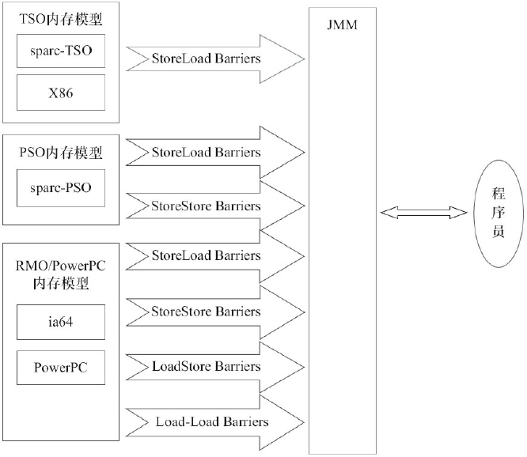


- 各种内存模型之间的关系

``` doc
JMM 是一个语言级的内存模型
CPU 内存模型是硬件级的内存模型
顺序一致性内存模型是一个理论参考模型
```

- JMM 的内存可见性保证

``` doc
按程序类型, Java程序的内存可见性保证可以分为下列3类

1) 单线程程序
    单线程程序不会出现内存可见性问题.编译器、runtime 和 CPU 会共同确保单线程程序的执行结果与该程序在顺序一致性模型中的执行结果相同.

2) 正确同步的多线程程序
    正确同步的多线程程序的执行将具有顺序一致性（程序的执行结果与该程序在顺序一致性内存模型中的执行结果相同）.
    这是JMM关注的重点, JMM 通过限制编译器和 CPU 的重排序来为程序员提供内存可见性保证.

3) 未同步/未正确同步的多线程程序
    JMM 为它们提供了最小安全性保障：线程执行时读取到的值, 要么是之前某个线程写入的值, 要么是默认值（0、null、false）.

```
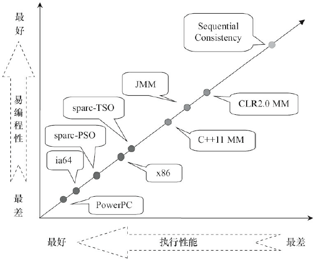


- JSR-133 对旧内存模型的修补

``` doc
JSR-133 对 JDK 5 之前的旧内存模型的修补主要有两个

1) 增强 volatile 的内存语义
    旧内存模型允许volatile变量与普通变量重排序.
    JSR-133 严格限制 volatile 变量与普通变量的重排序, 使 volatile 的 写-读 和锁的 释放-获 取具有相同的内存语义.

2) 增强 final 的内存语义
    在旧内存模型中, 多次读取同一个 final 变量的值可能会不相同.
    为此, JSR-133 为 final 增加了两个重排序规则.在保证 final 引用不会从构造函数内逸出的情况下, final 具有了初始化安全性
```
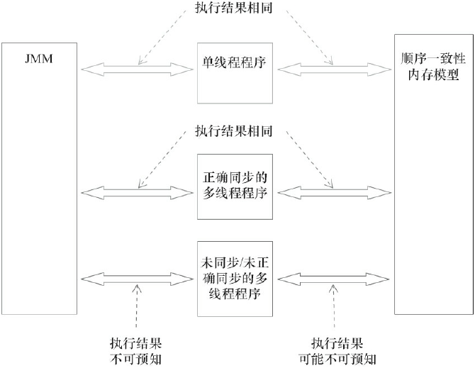
