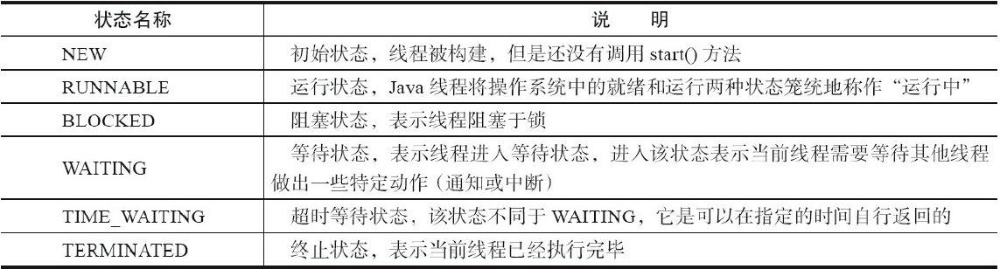
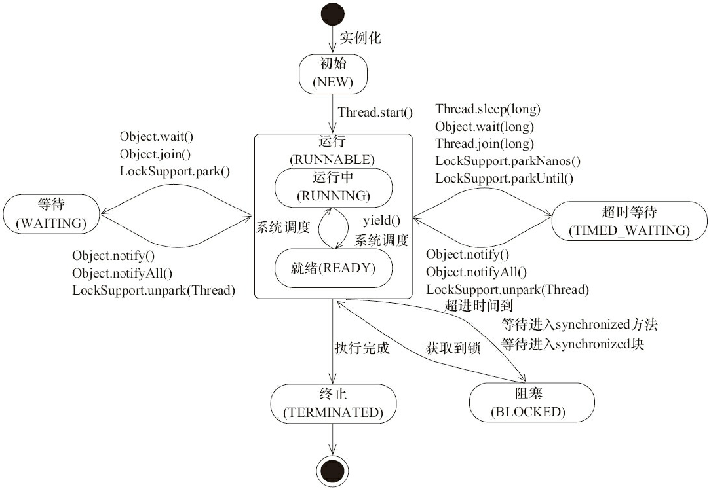

# 第四章 - Java 并发编程基础

## 1. 线程简介

- Java 线程的状态

``` doc
Java 线程在运行的生命周期中可能处于表所示的6种不同的状态，在给定的一个时刻，线程只能处于其中的一个状态
```



- Java 线程状态变迁

``` java
/**
Java 线程在自身的生命周期中，并不是固定地处于某个状态，而是随着代码的执行在不同的状态之间进行切换
**/
public class ThreadState {
    public static void main(String[] args) {
        new Thread(new TimeWaiting (), "TimeWaitingThread").start();
        new Thread(new Waiting(), "WaitingThread").start();
        // 使用两个Blocked线程，一个获取锁成功，另一个被阻塞
        new Thread(new Blocked(), "BlockedThread-1").start();
        new Thread(new Blocked(), "BlockedThread-2").start();
    }

    // 该线程不断地进行睡眠
    static class TimeWaiting implements Runnable {
        @Override
        public void run() {
            while (true) {
                SleepUtils.second(100);
            }
        }
    }

    // 该线程在 Waiting.class 实例上等待
    static class Waiting implements Runnable {
        @Override
        public void run() {
            while (true) {
                synchronized (Waiting.class) {
                    try {
                        Waiting.class.wait();
                    } catch (InterruptedException e) {
                        e.printStackTrace();
                    }
                }
            }
        }
    }

    // 该线程在 Blocked.class 实例上加锁后，不会释放该锁
    static class Blocked implements Runnable {
        public void run() {
            synchronized (Blocked.class) {
                while (true) {
                    SleepUtils.second(100);
                }
            }
        }
    }
}

class SleepUtils {
    public static final void second(long seconds) {
        try {
            TimeUnit.SECONDS.sleep(seconds);
        } catch (InterruptedException e) {
        }
    }
}


jstack [线程 id] 命令分析：
// BlockedThread-2线程阻塞在获取Blocked.class示例的锁上
"BlockedThread-2" prio=5 tid=0x00007feacb05d000 nid=0x5d03 waiting for monitor entry[0x000000010fd58000]
    java.lang.Thread.State: BLOCKED (on object monitor)

// BlockedThread-1 线程获取到了 Blocked.class 的锁
"BlockedThread-1" prio=5 tid=0x00007feacb05a000 nid=0x5b03 waiting on condition[0x000000010fc55000]
    java.lang.Thread.State: TIMED_WAITING (sleeping)

// WaitingThread 线程在 Waiting 实例上等待
"WaitingThread" prio=5 tid=0x00007feacb059800 nid=0x5903 in Object.wait()[0x000000010fb52000]
    java.lang.Thread.State: WAITING (on object monitor)

// TimeWaitingThread 线程处于超时等待
"TimeWaitingThread" prio=5 tid=0x00007feacb058800 nid=0x5703 waiting on condition[0x000000010fa4f000]
    java.lang.Thread.State: TIMED_WAITING (sleeping)


PS：Java线程状态变迁图
```



- Daemon 线程

``` java
Daemon 线程是一种支持型线程，因为它主要被用作程序中后台调度以及支持性工作, 当一个Java虚拟机中不存在非 Daemon 线程的时候，Java 虚拟机将会退出

public class Daemon {
    public static void main(String[] args) {
        Thread thread = new Thread(new DaemonRunner(), "DaemonRunner");
        // 通过调用 Thread.setDaemon(true) 将线程设置为 Daemon 线程
        thread.setDaemon(true);
        thread.start();
    }

    static class DaemonRunner implements Runnable {
        @Override
        public void run() {
            try {
                SleepUtils.second(10);
            } finally {
                System.out.println("DaemonThread finally run.");
            }
        }
    }
}
```
