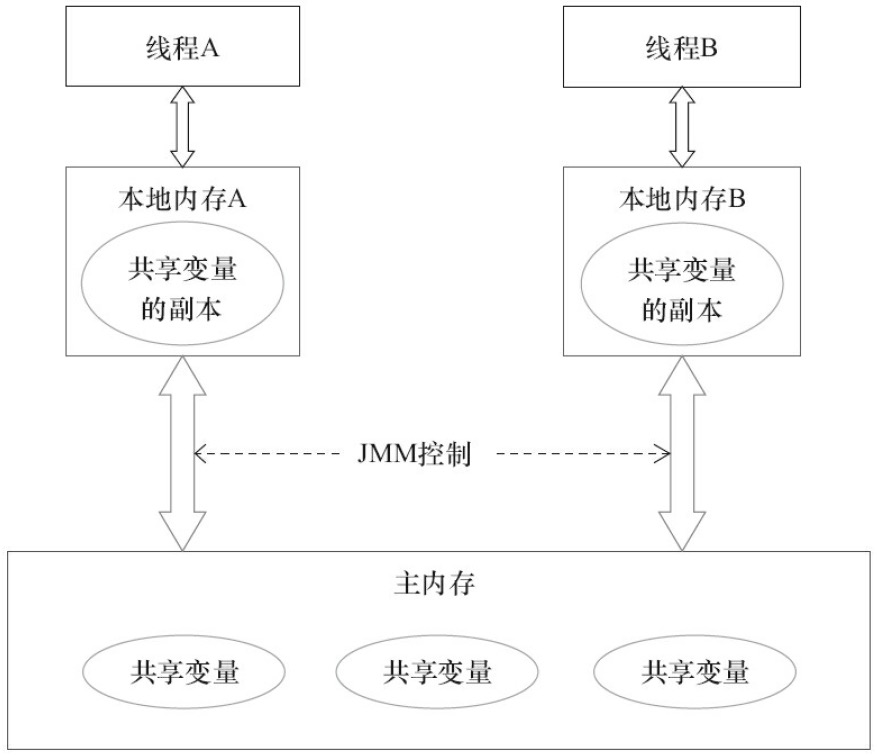

# 第一章 - 并发编程的挑战

## 1. 上下文切换

即使是单核处理器也支持多线程执行代码，CPU通过给每个线程分配CPU时间片来实现这个机制。
时间片是CPU分配给各个线程的时间，因为时间片非常短，所以CPU通过不停地切换线程执行，让我们感觉多个线程是同时执行的，时间片一般是几十毫秒（ms）。

CPU通过时间片分配算法来循环执行任务，当前任务执行一个时间片后会切换到下一个任务。
但是，在切换前会保存上一个任务的状态，以便下次切换回这个任务时，可以再加载这个任务的状态。
所以任务从保存到再加载的过程就是一次上下文切换。

- 测试上下文切换次数和时长

``` doc
Lmbench3 测量上下文切换的时长
    性能分析工具

vmstat  测量上下文切换的次数
    vmstat 1
```

- 如何减少上下文切换

``` doc
减少上下文切换的方法: 无锁并发编程、CAS算法、使用最少线程、使用协程

a) 无锁并发编程:
    多线程竞争锁时，会引起上下文切换，所以多线程处理数据时，可以用一
些办法来避免使用锁，如将数据的ID按照Hash算法取模分段，不同的线程处理不同段的数据

b) CAS 算法:
    Java 的 Atomic 包使用 CAS 算法来更新数据, 而不需要加锁

c) 使用最少线程:
    避免创建不需要的线程，比如任务很少，但是创建了很多线程来处理，这
样会造成大量线程都处于等待状态

d) 协程:
    在单线程里实现多任务的调度，并在单线程里维持多个任务间的切换
```

- 减少上下文切换实战

``` doc
案例: 减少线上大量 WAITING 的线程, 来减少上下文切换次数


# dump 线程信息
    jstack 16935 > ./jvm.log


# 查询线程状态信息
    grep java.lang.Thread.State ./jvm.log | awk '{print $2$3$4$5}' | sort | uniq -c

        9 RUNNABLE
        11 TIMED_WAITING(onobjectmonitor)
        5 TIMED_WAITING(sleeping)       parking | sleeping 定时的，那个条件不到来，也将定时唤醒自己
        2 WAITING(onobjectmonitor)
        73 WAITING(parking)             一直等那个条件发生
        BLOCKED (on object monitor)     在等待进入一个临界区


# 查找 WAITING(parking) 或其他状态占用次数较多的状态进行分析
    vim ./jvm.log

    # 发现线程状态次数过多的程序, 找出问题
    waiting on condition [0x00007f83185c4000]
        java.lang.Thread.State: WAITING (parking)
        at sun.misc.Unsafe.park(Native Method)
        - parking to wait for  <0x000000060a41cf00> (a java.util.concurrent.locks.AbstractQueuedSynchronizer$ConditionObject)
        at java.util.concurrent.locks.LockSupport.park(LockSupport.java:175)
        at java.util.concurrent.locks.AbstractQueuedSynchronizer$ConditionObject.await(AbstractQueuedSynchronizer.java:2039)
        at java.util.concurrent.LinkedBlockingQueue.take(LinkedBlockingQueue.java:442)
        at java.util.concurrent.ThreadPoolExecutor.getTask(ThreadPoolExecutor.java:1067)
        at java.util.concurrent.ThreadPoolExecutor.runWorker(ThreadPoolExecutor.java:1127)
        at java.util.concurrent.ThreadPoolExecutor$Worker.run(ThreadPoolExecutor.java:617)
        at java.lang.Thread.run(Thread.java:748)

    WAITING的线程少了，系统上下文切换的次数就会少，因为每一次从
    WAITTING到RUNNABLE都会进行一次上下文的切换


# 线程状态
    PS: Thread State 线程状态详见: https://www.cnblogs.com/rainy-shurun/p/5732341.html

    waiting for monitor entry:
        意味着它在等待进入一个临界区, 所以它在 <Entry Set> 队列中等待.
        此时线程状态一般都是:
            Blocked: java.lang.Thread.State: BLOCKED (on object monitor)

        可能是一个全局锁阻塞住了大量线程.
        如果短时间内打印的 thread dump 文件反映，随着时间流逝，waiting for monitor entry 的线程越来越多，没有减少的趋势，可能意味着某些线程在临界区里呆的时间太长了，以至于越来越多新线程迟迟无法进入临界区

    waiting on condition:
        说明它在等待另一个条件的发生，来把自己唤醒，或者干脆它是调用了 sleep(N).
        此时线程状态大致为以下几种:
            java.lang.Thread.State: WAITING (parking)：一直等那个条件发生
            java.lang.Thread.State: TIMED_WAITING (parking或sleeping)：定时的，那个条件不到来，也将定时唤醒自己

        如果大量线程在 waiting on condition
            可能是它们又跑去获取第三方资源，尤其是第三方网络资源，迟迟获取不到Response，导致大量线程进入等待状态。
            所以如果你发现有大量的线程都处在 Wait on condition，从线程堆栈看，正等待网络读写，这可能是一个网络瓶颈的征兆，因为网络阻塞导致线程无法执行。

    java.lang.Thread.State: TIMED_WAITING (on object monitor)；

    java.lang.Thread.State: WAITING (on object monitor)；
```


## 2. 死锁

锁是个非常有用的工具，运用场景非常多，因为它使用起来非常简单，而且易于理解。
但同时它也会带来一些困扰，那就是可能会引起死锁，一旦产生死锁，就会造成系统功能不可
用

- 避免死锁的几个常见方法

``` doc
避免一个线程同时获取多个锁

避免一个线程在锁内同时占用多个资源，尽量保证每个锁只占用一个资源

尝试使用定时锁，使用 lock.tryLock（timeout）来替代使用内部锁机制

对于数据库锁，加锁和解锁必须在一个数据库连接里，否则会出现解锁失败的情况

```


# 第二章 - Java 并发机制的底层实现原理

Java 代码在编译后会变成 Java 字节码，字节码被类加载器加载到 JVM 里，JVM 执行字节码，最终需要转化为汇编指令在 CPU 上执行，Java 中所使用的并发机制依赖于 JVM 的实现和 CPU 的指令


## 1. volatile

在多处理器开发中保证了共享变量的“可见性”。可见性的意思是当一个线程
修改一个共享变量时，另外一个线程能读到这个修改的值。如果volatile变量修饰符使用恰当
的话，它比synchronized的使用和执行成本更低，因为它不会引起线程上下文的切换和调度.

- volatile 的定义与实现原理

``` doc
1) 线程共享变量的方式:
    a) 线程通过<排他锁>单独获得变量: Java 编程语言允许线程访问共享变量，为了确保共享变量能被准确和一致地更新
    b) volatile: 在某些情况下比锁要更加方便。如果一个字段被声明成volatile，Java线程内存模型确保所有线程看到这个变量的值是一致的

2) volatile 实现原理:
    // instance 是 volatile 变量
    instance = new Singleton();

    // 转换为汇编后, 有 volatile 变量修饰的共享变量进行写操作的时候会多出第二行汇编代码: lock addl $0×0,(%esp);
    0x01a3de1d: movb $0×0,0×1104800(%esi);0x01a3de24: lock addl $0×0,(%esp);

    // 通过查 IA-3 2架构软件开发者手册可知，Lock 前缀的指令在多核处理器下会引发了两件事
    a) 将当前处理器缓存行的数据写回到系统内存. Lock 前缀指令会引起处理器缓存回写到内存
    b) 这个写回内存的操作会使在其他CPU里缓存了该内存地址的数据无效. 一个处理器的缓存回写到内存会导致其他处理器的缓存无效


3) volatile 使用优化: 字节填充, 因为 CPU 会把不足 64 位放在同一级缓存中
```


## 2. synchronized

Java 中的每一个对象都可以作为锁

a) 对于普通同步方法，锁是当前实例对象
b) 对于静态同步方法，锁是当前类的Class对象
c) 对于同步方法块，锁是 Synchonized 括号里配置的对象


- Java 对象头

``` doc
1) synchronized 锁是存在 Java 对象头里
    数组类型: 虚拟机用 3 个字宽（Word）存储对象头
    非数组类型: 用 2 字宽存储对象头
```

- 锁的升级与对比

``` doc
JavaSE 1.6 为了减少获得锁和释放锁带来的性能消耗, 引入了“偏向锁”和“轻量级锁”, 在 Java SE 1.6 中, 锁一共有 4 种状态, 级别从低到高依次是:
    无锁状态 < 偏向锁状态 < 轻量级锁状态 < 重量级锁状态

    这几个状态会随着竞争情况逐渐升级。锁可以升级但不能降级，意味着偏向锁升级成轻量级锁后不能降级成偏向锁.

1) 偏向锁
    HotSpot[1]的作者经过研究发现，大多数情况下，锁不仅不存在多线程竞争，而且总是由同一线程多次获得，为了让线程获得锁的代价更低而引入了偏向锁。
    当一个线程访问同步块并获取锁时，会在对象头和栈帧中的锁记录里存储锁偏向的线程 ID.
    以后该线程在进入和退出同步块时不需要进行 CAS 操作来加锁和解锁，只需简单地测试一下对象头的 ark Word 里是否存储着指向当前线程的偏向锁

    a) 偏向锁的撤销
        偏向锁使用了一种等到竞争出现才释放锁的机制，所以当其他线程尝试竞争偏向锁时，持有偏向锁的线程才会释放锁

    b) 关闭偏向锁
        偏向锁在 Java 6 和 Java 7 里是默认启用的，但是它在应用程序启动几秒钟之后才激活，如有必要可以使用JVM参数来关闭延迟：-XX:BiasedLockingStartupDelay=0。
        如果你确定应用程序里所有的锁通常情况下处于竞争状态，可以通过 JVM 参数关闭偏向锁：-XX:-UseBiasedLocking=false，那么程序默认会进入轻量级锁状态。

2) 轻量级锁
    a) 轻量级锁加锁
        线程在执行同步块之前，JVM会先在当前线程的栈桢中创建用于存储锁记录的空间，并将对象头中的Mark Word复制到锁记录中，官方称为Displaced Mark Word。
        然后线程尝试使用 CAS 将对象头中的 Mark Word 替换为指向锁记录的指针。如果成功，当前线程获得锁，如果失败，表示其他线程竞争锁，当前线程便尝试使用自旋来获取锁。

    b) 轻量级锁解锁
        轻量级解锁时，会使用原子的 CAS 操作将 Displaced Mark Word 替换回到对象头.如果成功，则表示没有竞争发生。如果失败，表示当前锁存在竞争，锁就会膨胀成重量级锁

3) 锁的优缺点对比
    见图 2 - 6
```


## 3. 原子操作的实现原理

原子操作（atomic operation）: 意为不可被中断的一个或一系列操作

- CPU 处理器实现原子操作

``` doc
处理器提供总线锁定和缓存锁定两个机制来保证复杂内存操作的原子性

1) CPU 总线锁 - 保证原子性
    如果多个处理器同时对共享变量进行读改写操作（i++ 就是经典的读改写操作），那么共享变量就会被多个处理器同时进行操作。
    这样读改写操作就不是原子的，操作完之后共享变量的值会和期望的不一致。

    所谓总线锁就是使用处理器提供的一个 LOCK＃ 信号，当一个处理器在总线上输出此信号时，其他处理器的请求将被阻塞住，那么该处理器可以独占共享内存。
    但总线锁定把 CPU 和内存之间的通信锁住了，这使得锁定期间，其他处理器不能操作其他内存地址的数据，所以总线锁定的开销比较大

b) CPU 缓存锁 - 保证原子性
    “缓存锁定”是指内存区域如果被缓存在处理器的缓存行中，并且在 Lock 操作期间被锁定.
     那么当它执行锁操作回写到内存时，处理器不在总线上声言 LOCK＃ 信号，而是修改内部的内存地址，并允许它的缓存一致性机制来保证操作的原子性.
     因为缓存一致性机制会阻止同时修改由两个以上处理器缓存的内存区域数据，当其他处理器回写已被锁定的缓存行的数据时，会使缓存行无效

c) 有两种情况下处理器不会使用缓存锁定
    第一种情况是：当操作的数据不能被缓存在处理器内部，或操作的数据跨多个缓存行（cache line）时，则处理器会调用总线锁定
    第二种情况是：有些处理器不支持缓存锁定。对于 Intel 486 和 Pentium 处理器，就算锁定的内存区域在处理器的缓存行中也会调用总线锁定
```

- Java 实现原子操作

``` doc

Java 通过锁和循环 CAS 的方式来实现原子操作

1) 使用循环 CAS 实现原子操作
    JVM 中的 CAS 操作正是利用了处理器提供的 CMPXCHG 指令实现的
    自旋 CAS 实现的基本思路就是循环进行 CAS 操作直到成功为止

2) CAS 实现原子操作的三大问题
    Java 并发包中有一些并发框架也使用了自旋 CAS 的方式来实现原子操作，比如 LinkedTransferQueue 类的 Xfer 方法

    a) ABA 问题
        因为CAS需要在操作值的时候，检查值有没有发生变化，如果没有发生变化则更新，但是如果一个值原来是A，变成了B，又变成了A，那么使用CAS进行检查时会发现它的值没有发生变化，但是实际上却变化了

        ABA问题的解决思路就是使用版本号。
        在变量前面追加上版本号，每次变量更新的时候把版本号加1，那么A→B→A就会变成1A→2B→3A。
        从Java 1.5开始，JDK 的 Atomic 包里提供了一个类 AtomicStampedReference 来解决ABA问题。

    b) 循环时间长开销大
        自旋 CAS 如果长时间不成功，会给CPU带来非常大的执行开销。

    c) 只能保证一个共享变量的原子操作
        当对一个共享变量执行操作时，我们可以使用循环 CAS 的方式来保证原子操作，但是对多个共享变量操作时，循环 CAS 就无法保证操作的原子性，这个时候就可以用锁
```


# 第 3 章 - Java 内存模型

主要介绍内存模型相关的基本概念；

- Java 内存模型中的顺序一致性，主要介绍重排序与顺序一致性内存模型；

- 同步原语，主要介绍3个同步原语（synchronized、volatile和final）的内存语义及重排序规则在处理器中的实现；

- Java 内存模型的设计，主要介绍 Java 内存模型的设计原理，及其与处理器内存模型和顺序一致性内存模型的关系


## 1. Java 内存模型基础

- 并发编程模型的两个关键问题: 线程之间如何通信, 线程之间如何同步

``` doc
1) 线程通信
    通信是指线程之间以何种机制来交换信息。在命令式编程中，线程之间的通信机制有两种：共享内存和消息传递
    a) 共享内存的并发模型里:
        线程之间共享程序的公共状态，通过 写-读 内存中的公共状态进行隐式通信
    b) 消息传递的并发模型里:
        线程之间没有公共状态，线程之间必须通过发送消息来显式进行通信

2) 线程同步
    同步是指程序中用于控制不同线程间操作发生相对顺序的机制。

    a) Java 的并发采用的是共享内存模型，Java 线程之间的通信总是隐式进行，整个通信过程对程序员完全透明
```

- Java 内存模型的抽象结构

``` doc
1) Java 线程之间的通信由 Java 内存模型（本文简称为JMM）控制, JMM 决定一个线程对共享变量的写入何时对另一个线程可见. JMM 定义了线程和主内存之间的抽象关系.

2) 线程之间的共享变量存储在主内存（Main Memory）中，每个线程都有一个私有的本地内存（Local Memory），本地内存中存储了该线程以读/写共享变量的副本
    本地内存是 JMM 的一个抽象概念，并不真实存在。它涵盖了缓存、写缓冲区、寄存器以及其他的硬件和编译器优化

3) 如果线程 A 与线程 B 之间要通信的话，必须要经历下面 2 个步骤
    a）线程 A 把本地内存 A 中更新过的共享变量刷新到主内存中去。
    b）线程 B 到主内存中去读取线程 A 之前已更新过的共享变量。

4)
```

