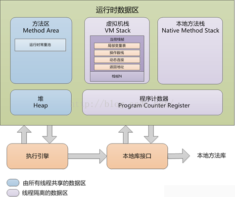

# JVM 内存布局 和 OutOfMemoryError 内存溢出异常区域

## 一、JVM 运行内存布局

### 1. 程序计数器 Program Counter Register (线程私有内存)

- 程序计数器
  - 是一块较小的内存区域，是当前线程所执行的<字节码的行号>指示器。

- Java 虚拟机的多线程是通过线程轮流切换, 并分配处理器执行时间的方式来实现的。

- 为了线程切换后能恢复到正确的执行位置, 每条线程都需要一个独立的程序计数器，各条线程之间计数器互补影响，独立存储，这类的内存叫做: 线程私有内存。

- 此内存区域是唯一不会出现 OutOfMemoryError 情况的内存

---

### 2. 虚拟机栈 VM Stack (线程私有内存)

- VM Stack 的生命周期与线程相同, VM Stack 也是线程私有

- VM Stack 用来描述 Java 方法执行的内存模型：
  - 每个方法在执行的同时会创建一个栈帧(Stack Frame)

- 栈帧(Stack Frame)：
  - 用于存储 <局部变量、操作数栈、动态链接、方法出口>, 每个方法从调用到执行完成的过程，就是对应一个栈帧(Stack Frame)在虚拟机中入栈到出栈的过程。

- 这个区域会有两种异常:
  - StackOverFlowError: 线程请求的深度大于虚拟机允许的深度。
  - OutOfMemoryError: 虚拟机栈 VM Stack 需要动态扩展内存大小，无法申请到足够的内存时会出现

---

### 3. 本地方法栈 Native Method Stack (线程私有内存)

- 本地方法栈与虚拟机栈作用类似，区别是：
  - 虚拟机栈 VM Stack: 是为虚拟机执行 Java 方法。 本地方法栈 Native Method Stack: 是为虚拟机使用到的本地方法(Native) 准备的，本地方法栈对使用的语言、数据结构没有明显

- 这个区域会有两种异常(与虚拟机栈 VM Stack 相似):
  - StackOverFlowError: 线程请求的深度大于虚拟机允许的深度。
  - OutOfMemoryError: 虚拟机栈 VM Stack 需要动态扩展内存大小，无法申请到足够的内存时会出现

---

### 4. Java 堆 Heap (线程共享内存)

Java 堆是虚拟机中内存管理的最大一块区域，被所有线程共享，在虚拟机启动的时候创建。堆唯一的目的是存放对象实例、分配的数组

Java 堆可以细分为:
- 新生代 Young Generation 区
  - Eden Space 任何新进入运行时数据区域的实例都会存放在此
  - S0 Suvivor Space 存在时间较长，经过垃圾回收没有被清除的实例，就从Eden 搬到了S0
  - S1 Survivor Space 同理，存在时间更长的实例，就从S0 搬到了S1

- 旧生代 Old Generation/tenured 区
  - 存在时间更长的实例，对象多次回收没被清除，就从S1 搬到了 tenured

- Perm 永久代存放运行时数据区的方法区

这个区域内存不足会抛出: OutOfMemoryError 异常

---

### 5. 方法区 Method Area (线程共享内存)

方法区 Method Area 是各个线程共享的内存区域, 存储已经被虚拟机加载的 Class 信息(字段,方法,接口等)、常量、静态变量、即使编译后的代码数据。

这个区域内存不足会抛出: OutOfMemoryError 异常

---

### 5.1. 运行时常量池 Runtime Constant Pool 也是 方法区 Method Area 的一部分 (属于方法区 Method Area 规则)

存放编译期间生成的各种<字面量>和<符号引用>, 这部分数据将在类加载后进入 <方法区的运行时常量池> 中存放

这个区域内存不足会抛出: OutOfMemoryError 异常

---

### 6. 直接内存 Direct Memory

直接内存 Direct Memory 不是 JVM 运行时内存的一部分，而是 JDK 1.4 中新加入的 NIO(New Input/Output) 类, 引入了基于通道(Channel) 与 缓冲区(Buffle) 的 I/O 方式。
这种方式可以使用 本地(Native) 函数库直接在堆外分配内存，通过一个存储在 Java 堆中的 DirectByteBuffer 对象, 作为这块堆外内存的引用，这样就避免了 Java 堆和 Native 堆来回复制数据.

直接内存分配的堆外内存会受到物理机和操作系统的内存限制, 如果动态扩展不足会出现: OutOfMemoryError 异常

---

## 二、内存溢出区域

- Java 堆溢出: Java 堆用于存储对象实例，只要不断的创建对象就有可能存在内存溢出, 但是要确认是哪种情况 (OutOfMemoryError)
  - 内存泄露: GC 收集器无法自动回收它们, 通过 GC Roots 的引用链定位问题
  - 内存溢出: 对象必须正常活着, 检查 -Xmx 和 -Xms 是否可以调大

- 虚拟机栈和本地方法栈溢出: 虚拟机栈、本地方法栈
  - StackOverflowError 异常: 如果线程请求的栈深度大于虚拟机所允许的最大深度
  - OutOfMemoryError 异常: 在单线程下，无论由于<栈帧>太大还是<虚拟机栈>容量太小，当内存无法分配的时候
  - PS: 多线程导致的内存溢出，与栈空间是否足够大并不存在任何联系，这个时候每个线程的栈分配的内存越大，反而越容易产生内存溢出异常。解决的时候是在不能减少线程数或更换64为的虚拟机的情况下，就只能通过减少最大堆和减少栈容量来换取更多的线程

- 方法区和运行时常量池溢出 (PermGen space)
  - 由于<常量池分配在永久代>中，可以通过 -XX:PermSize 和 -XX:MaxPermSize 限制方法区大小，从而间接限制其中常量池的容量
  - JDK 1.8 中 PermGen 空间被永久删除, 使用 MetaSpace 空间代替(-XX:MetaspaceSize)
    - 利用Java语言规范属性：类和相关的元数据生命周期匹配类加载器
    - 每个装载机存储区域 - Metaspace
    - 仅线性分配
    - 没有个人回收（除了RedefineClass和类加载失败）
    - 没有GC扫描或压缩
    - 元空间对象没有重定位

- 本机直接内存溢出: 此区域明显的特征是 Heap Dump 文件中不会看见明显的异常，程序中简介或者直接使用了 NIO
  - -XX:MaxDirectMemorySize: 直接指定大小, 若不指定则与 Java 堆最大值(-Xmx)一样大
