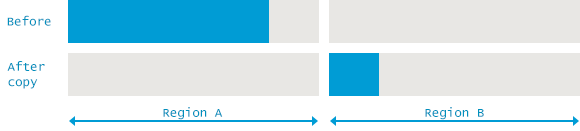

# Object 存活算法和 GC 回收算法

判定对象存活、垃圾收集器算法、垃圾收集器实现

程序计数器、虚拟机栈、本地方法栈:
> 三个区域随线程而生，随线程而灭；栈中的栈帧随着方法的进入和退出而有条不紊的执行着出栈和入栈操作。每一个栈帧中分配多少内存基本是在类结构确定下来时就已知的，因此这三个区域的内存分配和回收都具有确定性，在这三个区域内不需要过多考虑回收的问题，因为方法结束或者线程结束时，内存自然就跟着回收了。

java 堆、方法区:
> 一个接口中的多个实现类需要的内存可能不一样，一个方法中的多个分支需要的内存也不一样，我们只有在程序运行时才能知道会创建哪些对象，这部分内存的分配和回收是动态的，垃圾收集器所关注的是这部分内存


## 一、 虚拟机对象存活算法

### 1. 引用计数器法

给对象中添加一个引用计数器，每当有一个地方引用它时，计数器值就加1；当引用失效计数器值就减1；任何时刻计数器都为 0 的对象就是不可能再被使用的。


Java 语言并没有选用引用计数器算法来管理内存，其中最主要的原因就是它很难解决对象之间相互循环引用的问题。 引用和去引用伴随加法和减法，影响性能. 致命的缺陷：对于循环引用的对象无法进行回收.


---

### 2. 可达性分析法(引用链法)

通过 GC Roots 作为起点，当一个对象到到 GC Roots 没有任何引用链相连时，证明对象是不可用的。


- GC Roots 作用的对象包括:
  - 虚拟机栈（栈帧中的本地变量表）中引用的对象
  - 方法区中类静态属性引用的对象
  - 方法区中常量引用的对象
  - 本地方法栈 JNI（即 Native 方法）引用的对象

---

### 3. 对象引用类型

引用计数器法、可达性分析法, 判定对象是否存活都与引用有关

对象的四种引用:
- 1. 强引用：程序中普遍存在的，类似 String s=”hello wold”、Object object = new Object() 这类的引用, 只要强引用还在，垃圾收集器永远不会回收
- 2. 软引用：用来描述一些还有用但并非必须的元素, 对于它在系统将要发生内存溢出异常之前，将会把这些对象列进回收范围之中进行第二次回收，如果这次回收还没有足够的内存才会抛出内存溢出异常, SoftReference 类实现软引用
- 3. 弱引用：用来描述非必须对象的，但是它的强度比软引用更弱一些，被引用关联的对象只能生存到下一次垃圾收集发生之前，当垃圾收集器工作时，无论当前内存是否足够都会回收掉只被弱引用关联的对象, WeakReference 类实现弱引用
- 4. 虚引用：最弱的引用关系，不能通过虚引用取得对象的实例，为对象设置虚引用的唯一目的就是在这个对象被收集器回收时收到一个系统通知, PhantomReference 类实现虚引用

---

### 4. 确认对象死亡标准

真正确认一个对象是否死亡, 至少需要经历两次标记过程

``` Python
finalize() 方法: 拯救对象，避免当次被 GC 清理。任何一个对象的 finalize() 方法都只会被系统调用一次, 如果下次虚拟机需要回收对象，则 finalize() 不会被再次执行。
                不建议使用此方法拯救对象, 因为不确定大、无法保证各个对象的调用顺序, 使用 try-finally 代替.


确认对象死亡方法: 通过可达性分析对象是否有 GC Roots 相连接的引用链, 流程如下

if (对象有 GC Roots 相连接的引用链):
    // 虚拟机不回收对象
    pass

else (对象无 GC Roots 相连接的引用链):
    // 虚拟机使用回收算法

    1. 对象进行一次标记

    2. 判断 finalize() 方法是否有必要执行:
    if (对象覆盖了 finalize() 方法 and finalize() 未被虚拟机调用):
        放置对象到 F-Queue 队列中, 避免对象下次被虚拟机回收
    else
        进行一次标记, 等待下次被虚拟机回收
```

---

### 5. 方法区的回收标准

永久代的垃圾收集主要回收两部分内容：**废弃常量、无用的类**

- 废弃常量:
  - 例如 String abc = 123 已经在常量池中, 但是当前虚拟机中没有任何一个 String 对象 abc 对象, 也就是没有任何 Stirng 对象引用常量池的 abc 常量，也没有其他地方引用的这个字面量，这个时候发生内存回收这个常量就会被清理出常量池
- 无用的类:
  - 1.该类所有的实例都已经被回收，就是 Java 堆中不存在该类的任何实例
  - 2.加载该类的 ClassLoader 已经被回收
  - 3.该类对应的 java.lang.Class 对象没有在任何地方被引用，无法再任何地方通过反射访问该类的方法

---


## 二、GC 垃圾收集算法

### 1. 标记整理 - 算法

分为两个阶段，标记和清除。标记所有需要回收的对象，然后统一回收。这是最基础的算法，后续的收集算法都是基于这个算法扩展的。

算法特性：
- 1.效率比较低（递归与全堆对象遍历），导致 Stop The World 的时间比较长，尤其对于交互式的应用程序来说简直是无法接受。试想一下，如果你玩一个网站，这个网站一个小时就挂五分钟，你还玩吗？
- 2.则是这种方式清理出来的空闲内存是不连续的，死亡对象都是随即的出现在内存的各个角落的，把它们清除之后，内存的布局自然会乱七八糟。而为了应付这一点，JVM 就不得不维持一个内存的空闲列表，这又是一种开销。而且在分配数组对象的时候，寻找连续的内存空间会不太好找。


---

### 2. 复制 - 算法

把内存空间划为两个相等的区域，每次只使用其中一个区域。垃圾回收时，遍历当前使用区域，把正在使用中的对象复制到另外一个区域中。此算法每次只处理正在使用中的对象，因此复制成本比较小，同时复制过去以后还能进行相应的内存整理，不会出现“碎片”问题。当然，此算法的缺点也是很明显的，就是需要两倍内存空间。效果图如下

算法特性:
- 1.与标记-清除算法相比，复制算法是一种相对高效的回收方法。
- 2.不适用于存活对象较多的场合，如老年代（复制算法适合做新生代的GC）
- 3.复制算法的最大的问题是：空间的浪费



---

### 3. 分代收集 - 算法

当前商业虚拟机常用的垃圾收集算法。将对象按其生命周期的不同划分成：年轻代(Young Generation)、年老代(Old Generation)、持久代(Permanent Generation)。其中持久代主要存放的是类信息，所以与 java 对象的回收关系不大，与回收息息相关的是年轻代和年老代。

算法特性:
- 1.根据对象的存活周期的不同将内存划分为几块儿。
- 2.把Java堆分为新生代和老年代：短命对象归为新生代，长命对象归为老年代。


---
