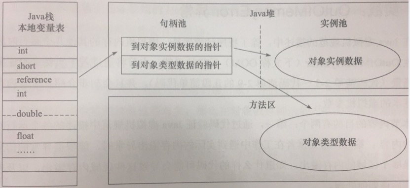
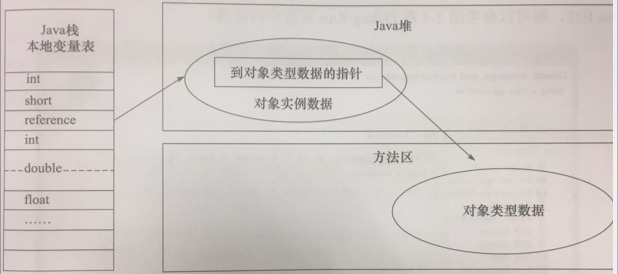
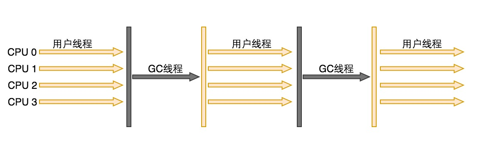
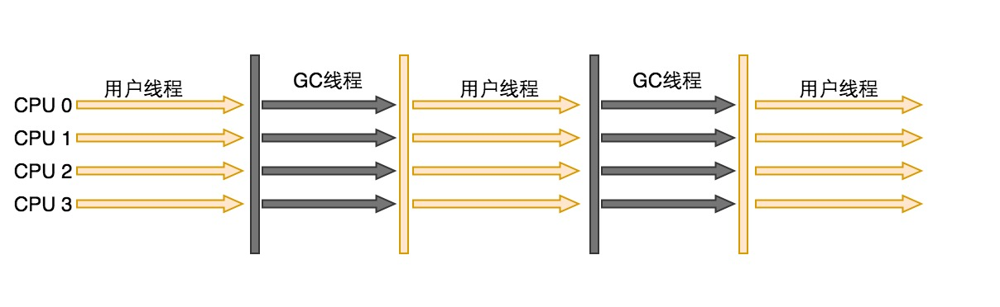
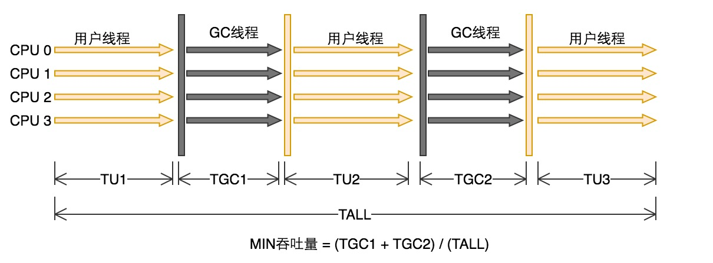
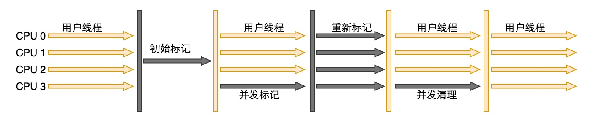

# HotSpot 虚拟机

## 一、HotSpot 虚拟机 - 对象属性

- 对象的创建方法
- 对象的内存布局
- 对象的访问定位

### 1. HotSpot 虚拟机中对象创建、对象指针原子性

a) 创建对象: 分配内存的时候，会把确定大小的内存从 Java 堆中划分出来，在分配对象内存的时候会有两种算法, 具体使用哪种由 Java 虚拟机决定, 具体如下

- 指针碰撞
  - 把指针从堆的空闲空间, 挪动一段与对象大小相同的距离, 这样做的前提是 Java 堆中的内存是规整的
- 空闲列表
  - 虚拟机维护一个<列表>，记录内存块中可用的区域，在分配内存的时候从<列表>中查找可用的区域分配给对象，并且更新<列表>


b) 对象指针原子性: 分配对象在虚拟机中非常频繁, 多并发的场景中，指针的修改被多个对象操作不是线程安全，为了解决这个问题有如下 2 个方法

- 内存分配空间的动作: 进行同步处理（默认）
  - 虚拟机采用的是 CAS 配上失败重试的方法保证更新操作的原子性
- 内存分配空间的动作: 按照线程划分到不同的空间进行
  - 每个线程在 Java 堆中预先分配一小块内存，叫做本地线程分配缓存 TLAB (Thread Local Allocation Buffer)
  - 哪个线程需要分配内存，就在哪个线程的 TLAB 上进行, 每当哪个线程的 TLAB 空间用光，会分配新的 TLAB，并且同步锁定住
  - 开启 TLAB : -XX:+/-UseTLAB


### 2. HotSpot 虚拟机中的对象布局

HotSpot 虚拟机中，对象有 3 个区域:  (1. 对象头、2. 实例数据、3. 对齐填充)

- 对象头(Header): 由 2 个部分组成
  - 第一部分: 存储对象自身的运行时的数据, 官方称为 <MarkWord>
    - 对象哈希码
    - 对象GC分代年龄
    - 锁状态标志
    - 线程持有的锁
    - 偏向线程 ID
    - 偏向时间戳
  - 第二部分: 类型指针
    - 对象指向它的类元数据的指针, 虚拟机通过这个指针来确定这个对象是哪个类的实例
- 实例数据(Instance Data)
  - 对象中存储的字段类型、父类字段类型
  - longs/doubles、ints、shorts/chars、bytes/booleans、opps 相同宽度的字段类型会被分配到一起
- 对齐填充(Padding)
  - 启到占位符的作用


### 3. HotSpot 虚拟机中对象的访问定位

对象的访问定位: Java 程序通过<栈上的引用数据操>作堆中的具体对象, 目前主要有两种方法：(句柄访问、直接指针访问)

- 句柄访问
  - Java 堆中将会划分出一块内存来作为<句柄池>，引用中存储对象的<句柄地址>，而句柄中包含了<对象实例数据与类型数据>各自的具体地址
  - 优点: 使用句柄的好处是引用中存储的是稳定的句柄地址，在对象被移动（垃圾回收导致对象的移动）时只会改变句柄重的实例数据指针
  - 

- 直接指针访问
  - 栈中的引用直接指向对象在堆中的地址，对象在头数据中指向方法区中其类元数据的地址。
  - 优点: 使用直接指针访问的好处是速度更快
  - 

---


## 二、 HotSpot 虚拟机 - GC 算法

### 1. 枚举根节点算法

以可达性分析中从 GC Roots 节点找引用链为例, 执行中会 GC 会停顿即 Stop The World, 因为在分析过程中对象的引用关系是不能变化的, 如果对象的引用关系变化就会出现检测结果不准确的问题.

当执行系统停顿下来后, 并不需要一个不漏的检查完所有执行上下文和全局的引用位置, 在 HotSpot 虚拟机中使用 OopMap 的数据结构来保存对象引用


### 2. OopMap 数据结构

HotSpot 虚拟机使用 OopMap 的数据结构来保存对象引用, 减少 GC 停顿时间

- Stop The World 时 不需要全局检查对象上下文的引用关系, HotSpot 使用 OopMap 数据结构, 用来存储哪些方法有对象的引用
- 这样 HotSpot 虚拟机可以通过 OopMap 快速完成 GC Roots 枚举


### 3. 安全点(SafePoint)

解决 OopMap 引起的对象引用变化、额外空间浪费

- 若每个指令都生成 OopMap 对象, 会导致空间大量浪费, 所以 HotSpot 只在特定的位置(安全点) 记录信息。
- 这些记录点是"长时间执行的"明显特征是指令序列复用: <方法调用、循环跳转、异常跳转>  


### 4. 安全点(SafePoint)中断方式

场景是 GC 发生时让所有线程(不包括执行 JNI 调用的线程), 都 run 到最近的安全点再停顿下来的两种方式

- 抢占式中断(Preemptive Suspension)
  - 不需要线程的执行代码主动配合, GC 发生时, 首先把所有线程全部中断
  - 如果发现有线程中断的地方不在安全点上, 就回复线程, 让他 run 到安全点上
  - 目前几乎没有虚拟机使用此方法来暂停线程, 从而影响 GC 事件
- 主动式中断(Voluntary Suspension)
  - 当 GC 需要中断时, 不直接对线程操作, 紧紧简单设置一个标志, 各个线程主动轮训这个标志
  - 线程发现中断标志为 true 就自己中断挂起
  - 轮询标志的地方和安全点是重合的


### 5. 安全区域(SafeRegion)

指在一段代码片段总, 引用关系不会发生变化。这个区域中的任意地方开始 GC 都是安全的


---


## 三、HotSpot 虚拟机 - GC 垃圾收集器程序

### 1. 概念

下图的 7 种收集器.分为两块, 上面为新生代收集器, 下面是老年代收集器。 如果两个收集器之间存在连线, 就说明它们可以搭配使用。

- 并行(Parallel): 顺序执行. 多条 GC 线程并行工作, 用户线程处于等待状态

- 并发(Concurrent): 轮流切换执行. 用户线程与 GC 线程同时执行(不一定是并行, 可能会交替执行), 用户程序运行时, GC 线程运行在其他 CPU 上


### 2. HotSpot 虚拟机 GC 收集器

- 新生代收集器, 单线程收集器, 进行 GC 垃圾收集时必须暂定所有工作线程, 一直到 GC 结束


| 收集器类型 | GC 代 | 特点 | 优点 | 缺点 |
| --- | --- | --- | --- | --- |
| Serial(单线程) | Young | Client 模式下的默认收集器 | 简单高效, 单个 CPU 环境中没有线程交互开销 | GC 垃圾收集时必须暂定所有工作线程 Stop The World, 一直到 GC 结束
| ParNew(多线程) | Young | Server 模式下的首选新生代收集器, Serial 的多线程版本 | 随着 CPU 的增加 ParNew 的效果或好起来 | ParNew 在单 CPU 中效果没有 Serial 好, 因为切换线程会增加开销 |
| Parallel Scavenge(并行的多线程) | Young | 并行的多线程收集器, 使用 复制算法. 包含 GC 自适应调节策略(GC Ergonomics) , 这是与 ParNew 收集器比较大的区别 | 减少用户的 Stop The World 停顿时间, 提高吞吐量而设计的 | 使用了复制算法 |
| --- | --- | --- | --- | --- |
| Serial Old(单线程) | Old | Client 模式下的虚拟机使用, Serial 的老年代版本, 标记-整理算法  | Serial Old 作为 CMS 出现 <Concurrent Mode Failure> 失败后的后备收集器使用. 作为 CMS 的后备方案 | 同 Serial |
| Parallel Old(多线程) | Old | Parallel Scavenge 的老年版本, 多线程收集器, 使用 标记-整理算法 | Parallel Old 是 JDK 1.6 中出现的, 之前新生代使用 Parallel Scavenge 收集器, 老年代只能使用 Serial Old, 由于 Serial Old 在 Server 模式下拖累了虚拟机的性能, 所以才有了此 Parallel Old 的存在 | 同 Parallel Scavenge |
| CMS | Old | 为了获取最短 Stop The World 停顿时间而设计的, 目前在网站 B/S 系统上应用较多, 使用 标记-清除算法. 初始标记->并发标记->重新标记->并发清除 | 并发收集、低停顿 | 对 CPU 资源要求高, 无法处理浮动垃圾, 使用标记-清除算法, 会产生大量空间碎片 |
| --- | --- | --- | --- | --- |
| G1 | Young/Old | 通过预测停顿, 把 Java 堆分为多个 Region, 每个 Region 维护一个 Remembered Set 避免全盘扫描 | 预测停顿时间 | 初始标记->并发标记->最终标记->筛选回收 |


---


## 三、HotSpot 虚拟机 - GC 垃圾收集器程序详细说明

### 1. Serial - 新生代收集器

特点:
``` sh
Serial 单线程收集器, 新生代使用 复制算法, 垃圾收集时必须暂定所有工作线程 Stop The World, 一直到 GC 结束.

Serial 简单高效, 单个 CPU 环境中没有线程交互开销.

Serial 在 Client 模式下的默认收集器.
```

控制参数:

``` sh
-XX:+UseSerialGC 启用
```




---


### 2. ParNew - 新生代收集器

特点:
``` sh
ParNew 是 Serial 的多线程版本, 在 Server 模式下的虚拟机中首选的新生代收集器, 因为除了 Serial 只有 ParNew 可以与 CMS 配合一起工作. 新生代使用复制算法, 暂停所有用户线程

ParNew 在单 CPU 中效果没有 Serial 好, 因为切换线程会增加开销, 但随着 CPU 的增加 ParNew 的效果或好起来.
```

控制参数:
``` sh
-XX:+UseConcMarkSweepGC 默认使用 ParNew 收集器,  -XX:+UseParNewGC 强制使用

-XX:ParallelGCThreads 限制垃圾回收的线程数

-XX:SurvivorRatio 新生代中 Eden 区域与 Survivor 区域的容量比值, 默认为 8, 代表 Eden:Subrvivor = 8:1

-XX:PretenureSizeThreshold 直接晋升到老年代对象的大小，设置这个参数后，大于这个参数的对象将直接在老年代分配

-XX:HandlePromotionFailure 是否允许新生代收集担保，进行一次 minor gc 后, 另一块 Survivor 空间不足时，将直接会在老年代中保留

```



---


### 3. Parallel Scavenge - 新生代收集器

特点:
``` sh
Parallel Scavenge 并行的多线程收集器, 有限资源内做到可控吞吐量, 使用复制算法

Parallel Scavenge 收集器是为了减少用户的 Stop The World 停顿时间, 提高吞吐量而设计的, 计算公式:  吞吐量 = 运行用户代码时间 / (运行用户代码时间 + GC 时间)

Parallel Scavenge 收集器包含了, GC 自适应调节策略(GC Ergonomics) , 这是与 ParNew 收集器比较大的区别
```

控制参数:
``` sh
-XX:MaxGCPauseMillis  GC 最大停顿时间, 大于 0 的毫秒数. Parallel Scavenge 收集器尽可能保证在内存回收时间不大于这个值. GC 回收时间减少是用吞吐量和新生代空间换来的. 这个参数过小会导致频繁 GC.

-XX:GCTimeRatio  GC 时间占总时间的比列, 大于 0 小于 100 的整数. 默认值为 99，即允许 1% 的 GC 时间, 计算公式公式: 1 / (1 + 99). 仅在使用 Parallel Scavenge 收集器时有效。

-XX:UseAdaptiveSizePolicy  GC 自适应调节策略(GC Ergonomics): 虚拟机会根据当前系统运行的情况收集性能监控信息, 动态调整参数以最合适的停顿时间和最大吞吐量.
设置此参数就不需要指定: 新生代内存(-Xmn)、Eden 与 Survivor 区的比例(-XX:SurvivorRatio)、晋升老年代对象大小(-XX:PretenureSizeThreshold) 等细节参数了.

Parallel Scavenge 自适应策略:
使用 -XX:UseAdaptiveSizePolicy 参数, 只需要配置: 最大堆内存(-Xmx)、 GC 最大停顿时间(-XX:MaxGCPauseMillis)、GC 时间占总时间的比列(-XX:GCTimeRatio), 就可以给虚拟机设定一个优化目标, 具体参数虚拟机会完成.

```


---


### 4. Serial Old 收集器 - 老年代收集器

特点:
``` sh
Serial Old 是 Serial 的老年代版本, 单线程收集器, 老年代使用 标记-整理算法, 暂停所有用户线程.

Serial Old 主要在 Client 模式下的虚拟机使用.

Serial Old 在 Server 模式下主要用途是:
  1) Serial Old 在 JDK 1.5 之前与 Parallel Scavenge 配合使用.
  2) Serial Old 作为 CMS 出现 <Concurrent Mode Failure> 失败后的后备收集器使用. 作为 CMS 的后备方案.
```


---


### 5. Parallel Old 收集器 - 老年代收集器

特点:
``` sh
Parallel Old 是 Parallel Scavenge 的老年版本, 多线程收集器, 使用 标记-整理算法.

Parallel Old 是 JDK 1.6 中出现的, 之前新生代使用 Parallel Scavenge 收集器, 老年代只能使用 Serial Old, 由于 Serial Old 在 Server 模式下拖累了虚拟机的性能, 所以才有了此 Parallel Old 的存在.
```

控制参数:
``` sh
-XX:+UseParallelOldGC 启用

```




---


### 6. CMS 收集器 - 老年代收集器

特点:
``` sh
CMS(Concurrent Mark Sweep) 收集器是为了获取最短 Stop The World 停顿时间而设计的. 目前在网站 B/S 系统上应用较多.

CMS(Concurrent Mark Sweep) 优点是: 并发收集、低停顿. 缺点是: 对 CPU 资源要求高、无法处理浮动垃圾、使用了 标记-清除算法 会产生大量空间碎片

CMS(Concurrent Mark Sweep) 是基于 标记-清除 算法的, 但具体过程更加复杂, 分为下面 4 个步骤:
  1) 初始标记(CMS initial mark)
    a) Stop The World
    b) 标记 GC Roots 能关联到的对象

  2) 并发标记(CMS concurrent mark)
    a) Stop The World
    b) GC Roots Tracing, GC Roots 跟踪

  3) 重新标记(CMS remark)
    a) 修正 并发标记 期间因用户程序运行而导致标记变化的对象的标记记录, 这个阶段也会停顿, 停顿时间是( 初始标记 < 重新标记 < 并发标记 )

  4) 并发清除(CMS concurrent sweep)

```

控制参数:
``` sh
-XX:+UseConcMarkSweepGC   新生代使用并行收集器，老年代使用 CMS+串行收集器

-XX:+ParallelCMSThreads   设定 CMS 的线程数量。

-XX:+CMSInitiatingOccupancyFraction   设置 CMS 收集器在老年代空间被使用多少后触发，默认为 68%

-XX:CMSInitiatingPermOccupancyFraction   当永久区占用率达到这一百分比后，启动 CMS 回收 (前提是-XX:+CMSClassUnloadingEnabled 激活了)

-XX:UseCMSInitatingOccupancyOnly        表示只在到达阈值的时候，才进行 CMS 回收

-XX:+UseFullGCsBeforeCompaction   设定进行多少次 CMS 垃圾回收后，进行一次内存压缩

-XX:+CMSClassUnloadingEnabled     允许对类元数据进行回收

-XX:+CMSParallelRemarkEndable     启用并行重标记

-XX:+UseCMSCompactAtFullCollection  默认开启, 当 CMS 要进行 Full GC 时开启内存碎片合并过程, 打开对年老代的压缩。可能会影响性能，但是可以消除内存碎片

-XX:CMSFullGCsBeforeCompaction=10 默认为 0, 表示每次进行 Full GC 都会进行空间碎片整理

-XX:+CMSIncrementalMode                使用增量模式，比较适合单 CPU

```



---


### 7. G1 收集器 - 新生/老年代收集器

特点:
``` sh

G1(Garbage-First) 通过预测停顿, 把 Java 堆分为多个 Region, 每个 Region 维护一个 Remembered Set 避免全盘扫描,
  1) 初始标记(CMS initial mark)
    a) Stop The World
    b) 标记 GC Roots 能关联到的对象

  2) 并发标记(CMS concurrent mark)
    a) Stop The World
    b) GC Roots Tracing, GC Roots 跟踪

  3) 最终标记(Final Marking)
    a) 修正 并发标记 期间因用户程序运行而导致标记变化的对象的标记记录, 这个阶段也会停顿, 停顿时间是( 初始标记 < 重新标记 < 并发标记 )

  4) 筛选回收(Live Data Counting and Evacuation)


```

控制参数:
``` sh
-XX:+UseG1GC  使用G1垃圾回收器

-XX:+UnlockExperimentalVMOptions  允许使用实验性参数

-XX:+MaxGCPauseMills   设置最大垃圾收集停顿时间

-XX:+GCPauseIntervalMills     设置停顿间隔时间
```


---


## 四、HotSpot 虚拟机 - 参数

### 1. GC 类型和场景下的参数

- `-XX:+<option> 启用选项`
- `-XX:-<option> 不启用选项`
- `-XX:<option>=<number>`
- `-XX:<option>=<string>`

| 参数 | GC 类型 | 场景(Young + Old + Perm) | 说明 |
| --- | --- | --- | --- |
| -XX:+UseSerialGC | Serial + Serial Old | Young + Old | Jvm 运行在 -client 模式下的默认值，打开此开关后，使用 Serial + Serial Old 的收集器组合进行内存回收 |
| -XX:+UseParallelGC | Parallel Scavenge + Serial Old | Young + Old | Jvm 运行在 -server 模式下的默认值，打开此开关后，使用 Parallel Scavenge +  Serial Old 的收集器组合进行回收 |
| -XX:+UseParNewGC | ParNew + Serial Old | Young + Old | 使用 ParNew + Serial Old 的收集器进行垃圾回收 |
| -XX:+UseConcMarkSweepGC | ParNew + CMS + Serial Old | Young + Old | 使用 ParNew + CMS +  Serial Old 的收集器组合进行内存回收，Serial Old 作为 CMS 出现 “Concurrent Mode Failure” 失败后的后备收集器使用 |
| -XX:+UseParallelOldGC | Parallel Scavenge + Parallel Old | Young + Old | 使用 Parallel Scavenge + Parallel Old 的收集器组合进行回收 |
| -XX:+UnlockExperimentalVMOptions, -XX:+UseG1GC | G1 | Young + Old | 开启 G1 |
| --- | --- | --- | --- |
| -XX:SurvivorRatio | --- | Young + Old | 新生代中 Eden 区域与 Survivor 区域的容量比值，默认为8，代表 Eden:Subrvivor = 8:1 |
| -XX:PretenureSizeThreshold | --- | Old | 直接晋升到老年代对象的大小，设置这个参数后，大于这个参数的对象将直接在老年代分配 |
| -XX:MaxTenuringThreshold | --- | Old | 晋升到老年代的对象年龄，每次 Minor GC 之后，年龄就加 1，当超过这个参数的值时进入老年代 |
| -XX:UseAdaptiveSizePolicy | --- | Old | 动态调整 java 堆中各个区域的大小以及进入老年代的年龄 |
| -XX:+HandlePromotionFailure | --- | Young | 是否允许新生代收集担保，进行一次 minor gc 后, 另一块 Survivor 空间不足时，将直接会在老年代中保留 |
| --- | --- | --- | --- |
| -XX:ParallelGCThreads | --- | Young + Old | 设置并行 GC 进行内存回收的线程数 |
| -XX:GCTimeRatio | Parallel Scavenge | Young | GC时间占总时间的比列，默认值为 99，即允许 1% 的GC时间，仅在使用 Parallel Scavenge 收集器时有效 |
| -XX:MaxGCPauseMillis | Parallel Scavenge | Young | 设置 GC 的最大停顿时间，在 Parallel Scavenge 收集器下有效, -XX:MaxGCPauseMillis=50  设置垃圾回收器的暂停时间：(设置暂停时间为 50ms) |
| -XX:CMSInitiatingOccupancyFraction | CMS | Old | 设置 CMS 收集器在老年代空间被使用多少后出发垃圾收集，默认值为 68%，仅在 CMS 收集器时有效，-XX:CMSInitiatingOccupancyFraction=70 |
| -XX:+UseCMSCompactAtFullCollection | CMS | Old | 由于 CMS 收集器会产生碎片，此参数设置在垃圾收集器后是否需要一次内存碎片整理过程，仅在CMS收集器时有效 |
| -XX:+CMSFullGCBeforeCompaction | CMS | Old | 设置 CMS 收集器在进行若干次垃圾收集后再进行一次内存碎片整理过程，通常与 UseCMSCompactAtFullCollection 参数一起使用 |
| --- | --- | --- | --- |
| -XX:+UseFastAccessorMethods | --- | --- | 原始类型优化 |
| -XX:+DisableExplicitGC | --- | --- | 是否关闭手动System.gc |
| -XX:+CMSParallelRemarkEnabled | --- | --- | 降低标记停顿 |
| -XX:LargePageSizeInBytes | --- | Perm | 内存页的大小不可设置过大，会影响 Perm 的大小，-XX:LargePageSizeInBytes=128m |
| --- | --- | --- | --- |
| -XX:+PrintGCDetails | --- | --- | 显示 GC 更详细的信息 |
| -XX:+G1YoungGenSize=512m | Young | --- | 设置新生代内存为 512 兆字节 |
| -XX:GCPauseIntervalMillis=200 | Young | --- | 垃圾回收器的暂停设置一个时间间隔 |


### 2. Sun/oracle JDK GC 下的组合方式:

> JVM 如果不指定 -server 或 -client 选项，JVM会在启动的时候根据硬件环境判断以server模式启动还是以client模式启动

| 参数 | GC 类型 | 场景(Young + Old + Perm) | 说明 |
| --- | --- | --- | --- |
| -client | Serial(串行 GC) + Serial Old(串行 GC) | Young + Old + Perm | 默认使用, Young: Serial 串行 GC , Old + Perm: Serial Old 串行 GC |
| -server | Parallel Scavenge(并行 GC) + Parallel Old(并行 GC) | Young + Old + Perm | 默认使用, Young: Parallel Scavenge  并行回收GC , Old + Perm: Parallel Old 并行 GC |
| --- | --- | --- | --- |
| -XX:+UseSerialGC | Serial(串行GC) + Serial Old(串行GC) | Young + Old + Perm | --- |
| -XX:+UseParallelGC | Parallel Scavenge(并行 GC) + Serial Old(并行 GC) | Young + Old + Perm | --- |
| -XX:+UseConcMarkSweepGC | ParNew(并行 GC) + CMS(并发 GC) | Young + Old + Perm | 当出现 “Concurrent Mode Failure”时采用Serial Old 串行GC |
| -XX:+UseParNewGC | ParNew(并行GC) + Serial Old(串行GC) | Young + Old + Perm | --- |
| -XX:+UseParallelOldGC | Parallel Scavenge(并行GC) + Parallel Old(并行GC) | Young + Old + Perm | --- |
| -XX:+UseConcMarkSweepGC,-XX:+UseParNewGC  | Serial(串行GC) | Young + Old + Perm | CMS 并发 GC 当出现“Concurrent Mode Failure”时采用Serial Old 串行GC |

---
