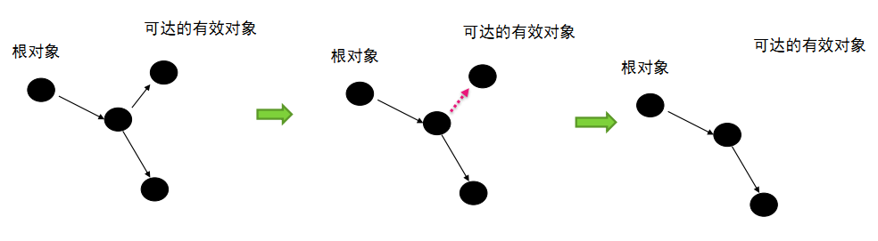
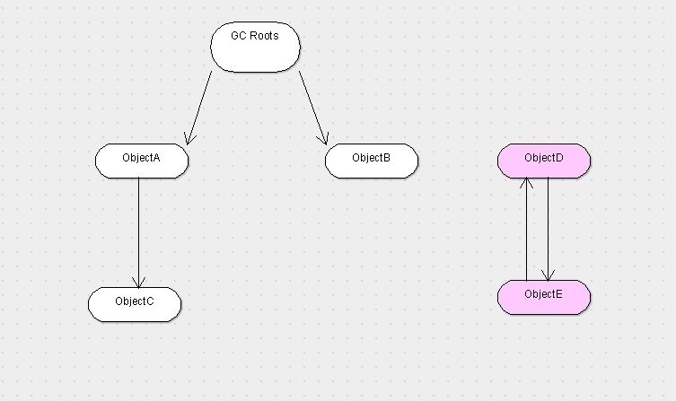
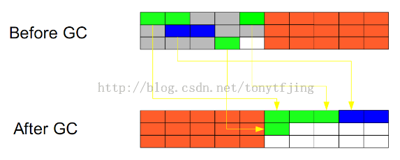

# JVM Doc

## 一、JVM 运行内存布局


### 1. 程序计数器 Program Counter Register (线程私有内存)

- 程序计数器
  - 是一块较小的内存区域，是当前线程所执行的<字节码的行号>指示器。

- Java 虚拟机的多线程是通过线程轮流切换, 并分配处理器执行时间的方式来实现的。

- 为了线程切换后能恢复到正确的执行位置, 每条线程都需要一个独立的程序计数器，各条线程之间计数器互补影响，独立存储，这类的内存叫做: 线程私有内存。

- 此内存区域是唯一不会出现 OutOfMemoryError 情况的内存

---

### 2. 虚拟机栈 VM Stack (线程私有内存)

- VM Stack 的生命周期与线程相同, VM Stack 也是线程私有

- VM Stack 用来描述 Java 方法执行的内存模型：
  - 每个方法在执行的同时会创建一个栈帧(Stack Frame)

- 栈帧(Stack Frame)：
  - 用于存储 <局部变量、操作数栈、动态链接、方法出口>, 每个方法从调用到执行完成的过程，就是对应一个栈帧(Stack Frame)在虚拟机中入栈到出栈的过程。

- 这个区域会有两种异常:
  - StackOverFlowError: 线程请求的深度大于虚拟机允许的深度。
  - OutOfMemoryError: 虚拟机栈 VM Stack 需要动态扩展内存大小，无法申请到足够的内存时会出现

---

### 3. 本地方法栈 Native Method Stack (线程私有内存)

- 本地方法栈与虚拟机栈作用类似，区别是：
  - 虚拟机栈 VM Stack: 是为虚拟机执行 Java 方法。 本地方法栈 Native Method Stack: 是为虚拟机使用到的本地方法(Native) 准备的，本地方法栈对使用的语言、数据结构没有明显

- 这个区域会有两种异常(与虚拟机栈 VM Stack 相似):
  - StackOverFlowError: 线程请求的深度大于虚拟机允许的深度。
  - OutOfMemoryError: 虚拟机栈 VM Stack 需要动态扩展内存大小，无法申请到足够的内存时会出现

---

### 4. Java 堆 Heap (线程共享内存)

Java 堆是虚拟机中内存管理的最大一块区域，被所有线程共享，在虚拟机启动的时候创建。堆唯一的目的是存放对象实例、分配的数组

Java 堆可以细分为:
- 新生代 Young Generation 区
  - Eden Space 任何新进入运行时数据区域的实例都会存放在此
  - S0 Suvivor Space 存在时间较长，经过垃圾回收没有被清除的实例，就从Eden 搬到了S0
  - S1 Survivor Space 同理，存在时间更长的实例，就从S0 搬到了S1

- 旧生代 Old Generation/tenured 区
  - 存在时间更长的实例，对象多次回收没被清除，就从S1 搬到了 tenured

- Perm 永久代存放运行时数据区的方法区

这个区域内存不足会抛出: OutOfMemoryError 异常

---

### 5. 方法区 Method Area (线程共享内存)

方法区 Method Area 是各个线程共享的内存区域, 存储已经被虚拟机加载的 Class 信息(字段,方法,接口等)、常量、静态变量、即使编译后的代码数据。

这个区域内存不足会抛出: OutOfMemoryError 异常

---

### 5.1. 运行时常量池 Runtime Constant Pool 也是 方法区 Method Area 的一部分 (属于方法区 Method Area 规则)

存放编译期间生成的各种<字面量>和<符号引用>, 这部分数据将在类加载后进入 <方法区的运行时常量池> 中存放

这个区域内存不足会抛出: OutOfMemoryError 异常

---

### 6. 直接内存 Direct Memory

直接内存 Direct Memory 不是 JVM 运行时内存的一部分，而是 JDK 1.4 中新加入的 NIO(New Input/Output) 类, 引入了基于通道(Channel) 与 缓冲区(Buffle) 的 I/O 方式。
这种方式可以使用 本地(Native) 函数库直接在堆外分配内存，通过一个存储在 Java 堆中的 DirectByteBuffer 对象, 作为这块堆外内存的引用，这样就避免了 Java 堆和 Native 堆来回复制数据.

直接内存分配的堆外内存会受到物理机和操作系统的内存限制, 如果动态扩展不足会出现: OutOfMemoryError 异常

---


## 二、HotSpot 虚拟机对象

对象的创建方法、对象的内存布局、对象的访问定位

### 1. HotSpot 虚拟机中对象创建、对象指针原子性

**创建对象**:

分配内存的时候，会把确定大小的内存从 Java 堆中划分出来，在分配对象内存的时候会有两种算法, 具体使用哪种由 Java 虚拟机决定：

- 指针碰撞
  - 把指针从堆的空闲空间, 挪动一段与对象大小相同的距离, 这样做的前提是 Java 堆中的内存是规整的
- 空闲列表
  - 虚拟机维护一个<列表>，记录内存块中可用的区域，在分配内存的时候从<列表>中查找可用的区域分配给对象，并且更新<列表>


**对象指针原子性**:

分配对象在虚拟机中非常频繁, 多并发的场景中，指针的修改被多个对象操作不是线程安全，为了解决这个问题有如下 2 个方法

- 内存分配空间的动作: 进行同步处理（默认）
  - 虚拟机采用的是 CAS 配上失败重试的方法保证更新操作的原子性
- 内存分配空间的动作: 按照线程划分到不同的空间进行
  - 每个线程在 Java 堆中预先分配一小块内存，叫做本地线程分配缓存 TLAB (Thread Local Allocation Buffer)
  - 哪个线程需要分配内存，就在哪个线程的 TLAB 上进行, 每当哪个线程的 TLAB 空间用光，会分配新的 TLAB，并且同步锁定住
  - 开启 TLAB : -XX:+/-UseTLAB

---

### 2. HotSpot 虚拟机中的对象布局

HotSpot 虚拟机中，对象有 3 个区域:  **对象头、实例数据、对齐填充**

- 第一区域: 对象头(Header): 由 2 个部分组成
  - 第一部分: 存储对象自身的运行时的数据, 官方称为 <MarkWord>
    - 对象哈希码
    - 对象GC分代年龄
    - 锁状态标志
    - 线程持有的锁
    - 偏向线程 ID
    - 偏向时间戳
  - 第二部分: 类型指针
    - 对象指向它的类元数据的指针, 虚拟机通过这个指针来确定这个对象是哪个类的实例
- 第二区域: 实例数据(Instance Data)
  - 对象中存储的字段类型、父类字段类型
  - longs/doubles、ints、shorts/chars、bytes/booleans、opps 相同宽度的字段类型会被分配到一起
- 第三区域: 对齐填充(Padding)
  - 启到占位符的作用

---

### 3. HotSpot 虚拟机中对象的访问定位

对象的访问定位: Java 程序通过<栈上的引用数据操>作堆中的具体对象, 目前主要有两种方法：**句柄访问、直接指针访问**

- 句柄访问
  - Java 堆中将会划分出一块内存来作为<句柄池>，引用中存储对象的<句柄地址>，而句柄中包含了<对象实例数据与类型数据>各自的具体地址
  - 优点: 使用句柄的好处是引用中存储的是稳定的句柄地址，在对象被移动（垃圾回收导致对象的移动）时只会改变句柄重的实例数据指针
  - 

- 直接指针访问
  - 栈中的引用直接指向对象在堆中的地址，对象在头数据中指向方法区中其类元数据的地址。
  - 优点: 使用直接指针访问的好处是速度更快
  - 

---


## 三、虚拟机对象存活算法、GC 垃圾收集算法

讨论话题: ***判定对象存活、垃圾收集器算法、垃圾收集器实现***

程序计数器、虚拟机栈、本地方法栈:
> 三个区域随线程而生，随线程而灭；栈中的栈帧随着方法的进入和退出而有条不紊的执行着出栈和入栈操作。每一个栈帧中分配多少内存基本是在类结构确定下来时就已知的，因此这三个区域的内存分配和回收都具有确定性，在这三个区域内不需要过多考虑回收的问题，因为方法结束或者线程结束时，内存自然就跟着回收了。

java 堆、方法区:
> 一个接口中的多个实现类需要的内存可能不一样，一个方法中的多个分支需要的内存也不一样，我们只有在程序运行时才能知道会创建哪些对象，这部分内存的分配和回收是动态的，垃圾收集器所关注的是这部分内存


### 1. 虚拟机判定对象是否存活的算法

#### 1.1 引用计数器法

给对象中添加一个引用计数器，每当有一个地方引用它时，计数器值就加1；当引用失效计数器值就减1；任何时刻计数器都为 0 的对象就是不可能再被使用的。



Java 语言并没有选用引用计数器算法来管理内存，其中最主要的原因就是它很难解决对象之间相互循环引用的问题。 引用和去引用伴随加法和减法，影响性能. 致命的缺陷：对于循环引用的对象无法进行回收.


---

#### 1.2 可达性分析法(引用链法)

通过 GC Roots 作为起点，当一个对象到到 GC Roots 没有任何引用链相连时，证明对象是不可用的。



- GC Roots 作用的对象包括:
  - 虚拟机栈（栈帧中的本地变量表）中引用的对象
  - 方法区中类静态属性引用的对象
  - 方法区中常量引用的对象
  - 本地方法栈 JNI（即 Native 方法）引用的对象

---

#### 1.3 对象引用类型

引用计数器法、可达性分析法, 判定对象是否存活都与引用有关

对象的四种引用:
- 1. 强引用：程序中普遍存在的，类似 String s=”hello wold”、Object object = new Object() 这类的引用, 只要强引用还在，垃圾收集器永远不会回收
- 2. 软引用：用来描述一些还有用但并非必须的元素, 对于它在系统将要发生内存溢出异常之前，将会把这些对象列进回收范围之中进行第二次回收，如果这次回收还没有足够的内存才会抛出内存溢出异常, SoftReference 类实现软引用
- 3. 弱引用：用来描述非必须对象的，但是它的强度比软引用更弱一些，被引用关联的对象只能生存到下一次垃圾收集发生之前，当垃圾收集器工作时，无论当前内存是否足够都会回收掉只被弱引用关联的对象, WeakReference 类实现弱引用
- 4. 虚引用：最弱的引用关系，不能通过虚引用取得对象的实例，为对象设置虚引用的唯一目的就是在这个对象被收集器回收时收到一个系统通知, PhantomReference 类实现虚引用

---

#### 1.4 确认对象死亡标准

真正确认一个对象是否死亡, 至少需要经历两次标记过程

``` Python
finalize() 方法: 拯救对象，避免当次被 GC 清理。任何一个对象的 finalize() 方法都只会被系统调用一次, 如果下次虚拟机需要回收对象，则 finalize() 不会被再次执行。
                不建议使用此方法拯救对象, 因为不确定大、无法保证各个对象的调用顺序, 使用 try-finally 代替.


确认对象死亡方法: 通过可达性分析对象是否有 GC Roots 相连接的引用链, 流程如下

if (对象有 GC Roots 相连接的引用链):
    // 虚拟机不回收对象
    pass

else (对象无 GC Roots 相连接的引用链):
    // 虚拟机使用回收算法

    1. 对象进行一次标记

    2. 判断 finalize() 方法是否有必要执行:
    if (对象覆盖了 finalize() 方法 and finalize() 未被虚拟机调用):
        放置对象到 F-Queue 队列中, 避免对象下次被虚拟机回收
    else
        进行一次标记, 等待下次被虚拟机回收
```

---

#### 1.5 方法区的回收标准

永久代的垃圾收集主要回收两部分内容：**废弃常量、无用的类**

- 废弃常量:
  - 例如 String abc = 123 已经在常量池中, 但是当前虚拟机中没有任何一个 String 对象 abc 对象, 也就是没有任何 Stirng 对象引用常量池的 abc 常量，也没有其他地方引用的这个字面量，这个时候发生内存回收这个常量就会被清理出常量池
- 无用的类:
  - 1.该类所有的实例都已经被回收，就是 Java 堆中不存在该类的任何实例
  - 2.加载该类的 ClassLoader 已经被回收
  - 3.该类对应的 java.lang.Class 对象没有在任何地方被引用，无法再任何地方通过反射访问该类的方法

---

### 2. GC 垃圾收集算法

#### 2.1 标记 - 清除算法

分为两个阶段，标记和清除。标记所有需要回收的对象，然后统一回收。这是最基础的算法，后续的收集算法都是基于这个算法扩展的。

算法特性：
- 1.效率比较低（递归与全堆对象遍历），导致 Stop The World 的时间比较长，尤其对于交互式的应用程序来说简直是无法接受。试想一下，如果你玩一个网站，这个网站一个小时就挂五分钟，你还玩吗？
- 2.则是这种方式清理出来的空闲内存是不连续的，死亡对象都是随即的出现在内存的各个角落的，把它们清除之后，内存的布局自然会乱七八糟。而为了应付这一点，JVM 就不得不维持一个内存的空闲列表，这又是一种开销。而且在分配数组对象的时候，寻找连续的内存空间会不太好找。


---

#### 2.2 复制算法

把内存空间划为两个相等的区域，每次只使用其中一个区域。垃圾回收时，遍历当前使用区域，把正在使用中的对象复制到另外一个区域中。此算法每次只处理正在使用中的对象，因此复制成本比较小，同时复制过去以后还能进行相应的内存整理，不会出现“碎片”问题。当然，此算法的缺点也是很明显的，就是需要两倍内存空间。效果图如下

算法特性:
- 1.与标记-清除算法相比，复制算法是一种相对高效的回收方法。
- 2.不适用于存活对象较多的场合，如老年代（复制算法适合做新生代的GC）
- 3.复制算法的最大的问题是：空间的浪费



---

#### 2.3 分代收集算法

当前商业虚拟机常用的垃圾收集算法。将对象按其生命周期的不同划分成：年轻代(Young Generation)、年老代(Old Generation)、持久代(Permanent Generation)。其中持久代主要存放的是类信息，所以与 java 对象的回收关系不大，与回收息息相关的是年轻代和年老代。

算法特性:
- 1.根据对象的存活周期的不同将内存划分为几块儿。
- 2.把Java堆分为新生代和老年代：短命对象归为新生代，长命对象归为老年代。


---


#### 2.4 HotSpot 虚拟机 - GC 算法

##### 2.4.1 枚举根节点算法

以可达性分析中从 GC Roots 节点找引用链为例, 执行中会 GC 会停顿即 Stop The World, 因为在分析过程中对象的引用关系是不能变化的, 如果对象的引用关系变化就会出现检测结果不准确的问题.

当执行系统停顿下来后, 并不需要一个不漏的检查完所有执行上下文和全局的引用位置, 在 HotSpot 虚拟机中使用 OopMap 的数据结构来保存对象引用

---

##### 2.4.2 OopMap 数据结构

HotSpot 虚拟机使用 OopMap 的数据结构来保存对象引用, 减少 GC 停顿时间

- Stop The World 时 不需要全局检查对象上下文的引用关系, HotSpot 使用 OopMap 数据结构, 用来存储哪些方法有对象的引用
- 这样 HotSpot 虚拟机可以通过 OopMap 快速完成 GC Roots 枚举

---

##### 2.4.3 安全点(SafePoint)

解决 OopMap 引起的对象引用变化、额外空间浪费

- 若每个指令都生成 OopMap 对象, 会导致空间大量浪费, 所以 HotSpot 只在特定的位置(安全点) 记录信息。
- 这些记录点是"长时间执行的"明显特征是指令序列复用: <方法调用、循环跳转、异常跳转>  

---

##### 2.4.4 安全点(SafePoint)中断方式

场景是 GC 发生时让所有线程(不包括执行 JNI 调用的线程), 都 run 到最近的安全点再停顿下来的两种方式

- 抢占式中断(Preemptive Suspension)
  - 不需要线程的执行代码主动配合, GC 发生时, 首先把所有线程全部中断
  - 如果发现有线程中断的地方不在安全点上, 就回复线程, 让他 run 到安全点上
  - 目前几乎没有虚拟机使用此方法来暂停线程, 从而影响 GC 事件
- 主动式中断(Voluntary Suspension)
  - 当 GC 需要中断时, 不直接对线程操作, 紧紧简单设置一个标志, 各个线程主动轮训这个标志
  - 线程发现中断标志为 true 就自己中断挂起
  - 轮询标志的地方和安全点是重合的

---

##### 2.4.5 安全区域(SafeRegion)

指在一段代码片段总, 引用关系不会发生变化。这个区域中的任意地方开始 GC 都是安全的


---


## 四、HotSpot 虚拟机 - GC 垃圾收集器

下图的 7 种收集器.分为两块, 上面为新生代收集器, 下面是老年代收集器。 如果两个收集器之间存在连线, 就说明它们可以搭配使用。

- 并行(Parallel): 顺序执行. 多条 GC 线程并行工作, 用户线程处于等待状态

- 并发(Concurrent): 轮流切换执行. 用户线程与 GC 线程同时执行(不一定是并行, 可能会交替执行), 用户程序运行时, GC 线程运行在其他 CPU 上


HotSpot 虚拟机 GC 收集器:

- 新生代收集器, 单线程收集器, 进行 GC 垃圾收集时必须暂定所有工作线程, 一直到 GC 结束

| 收集器类型 | GC 代 | 特点 | 优点 | 缺点 |
| --- | --- | --- | --- | --- |
| Serial(单线程) | Young | Client 模式下的默认收集器 | 简单高效, 单个 CPU 环境中没有线程交互开销 | GC 垃圾收集时必须暂定所有工作线程 Stop The World, 一直到 GC 结束
| ParNew(多线程) | Young | Server 模式下的首选新生代收集器, Serial 的多线程版本 | 随着 CPU 的增加 ParNew 的效果或好起来 | ParNew 在单 CPU 中效果没有 Serial 好, 因为切换线程会增加开销 |
| Parallel Scavenge(并行的多线程) | Young | 并行的多线程收集器, 使用 复制算法. 包含 GC 自适应调节策略(GC Ergonomics) , 这是与 ParNew 收集器比较大的区别 | 减少用户的 Stop The World 停顿时间, 提高吞吐量而设计的 | 使用了复制算法 |
| --- | --- | --- | --- | --- |
| Serial Old(单线程) | Old | Client 模式下的虚拟机使用, Serial 的老年代版本, 标记-整理算法  | Serial Old 作为 CMS 出现 <Concurrent Mode Failure> 失败后的后备收集器使用. 作为 CMS 的后备方案 | 同 Serial |
| Parallel Old(多线程) | Old | Parallel Scavenge 的老年版本, 多线程收集器, 使用 标记-整理算法 | Parallel Old 是 JDK 1.6 中出现的, 之前新生代使用 Parallel Scavenge 收集器, 老年代只能使用 Serial Old, 由于 Serial Old 在 Server 模式下拖累了虚拟机的性能, 所以才有了此 Parallel Old 的存在 | 同 Parallel Scavenge |
| CMS | Old | 为了获取最短 Stop The World 停顿时间而设计的. 目前在网站 B/S 系统上应用较多. 初始标记->并发标记->重新标记->并发清除 | 获取最少停顿时间 | --- |
| --- | --- | --- | --- | --- |
| G1 | Young/Old | 通过预测停顿, 把 Java 堆分为多个 Region, 每个 Region 维护一个 Remembered Set 避免全盘扫描 | 预测停顿时间 | 初始标记->并发标记->最终标记->筛选回收 |


---


### 1. Serial - 新生代收集器

特点:
``` sh
Serial 单线程收集器.

Serial 简单高效, 单个 CPU 环境中没有线程交互开销.

Serial GC 垃圾收集时必须暂定所有工作线程 Stop The World, 一直到 GC 结束.

Serial 在 Client 模式下的默认收集器.
```


控制参数:

``` sh
-XX:+UseSerialGC 启用
```

---


### 2. ParNew - 新生代收集器

特点:
``` sh
ParNew 是 Serial 的多线程版本, 在 Server 模式下的虚拟机中首选的新生代收集器, 因为除了 Serial 只有 ParNew 可以与 CMS 配合一起工作.

ParNew 在单 CPU 中效果没有 Serial 好, 因为切换线程会增加开销, 但随着 CPU 的增加 ParNew 的效果或好起来.
```


控制参数:
``` sh
-XX:+UseConcMarkSweepGC 默认使用 ParNew 收集器,  -XX:+UseParNewGC 强制使用

-XX:ParallelGCThreads 限制垃圾回收的线程数

-XX:SurvivorRatio 新生代中 Eden 区域与 Survivor 区域的容量比值, 默认为 8, 代表 Eden:Subrvivor = 8:1

-XX:PretenureSizeThreshold 直接晋升到老年代对象的大小，设置这个参数后，大于这个参数的对象将直接在老年代分配

-XX:HandlePromotionFailure 是否允许新生代收集担保，进行一次 minor gc 后, 另一块 Survivor 空间不足时，将直接会在老年代中保留

```

---


### 3. Parallel Scavenge - 新生代收集器

特点:
``` sh
Parallel Scavenge 并行的多线程收集器, 使用复制算法.

Parallel Scavenge 收集器是为了减少用户的 Stop The World 停顿时间, 提高吞吐量而设计的, 计算公式:  吞吐量 = 运行用户代码时间 / (运行用户代码时间 + GC 时间)

Parallel Scavenge 收集器包含了, GC 自适应调节策略(GC Ergonomics) , 这是与 ParNew 收集器比较大的区别
```


控制参数:
``` sh
-XX:MaxGCPauseMillis  GC 最大停顿时间, 大于 0 的毫秒数. Parallel Scavenge 收集器尽可能保证在内存回收时间不大于这个值. GC 回收时间减少是用吞吐量和新生代空间换来的. 这个参数过小会导致频繁 GC.

-XX:GCTimeRatio  GC 时间占总时间的比列, 大于 0 小于 100 的整数. 默认值为 99，即允许 1% 的 GC 时间, 计算公式公式: 1 / (1 + 99). 仅在使用 Parallel Scavenge 收集器时有效。

-XX:UseAdaptiveSizePolicy  GC 自适应调节策略(GC Ergonomics): 虚拟机会根据当前系统运行的情况收集性能监控信息, 动态调整参数以最合适的停顿时间和最大吞吐量.
设置此参数就不需要指定: 新生代内存(-Xmn)、Eden 与 Survivor 区的比例(-XX:SurvivorRatio)、晋升老年代对象大小(-XX:PretenureSizeThreshold) 等细节参数了.

Parallel Scavenge 自适应策略:
使用 -XX:UseAdaptiveSizePolicy 参数, 只需要配置: 最大堆内存(-Xmx)、 GC 最大停顿时间(-XX:MaxGCPauseMillis)、GC 时间占总时间的比列(-XX:GCTimeRatio), 就可以给虚拟机设定一个优化目标, 具体参数虚拟机会完成.

```

---


### 4. Serial Old 收集器 - 老年代收集器

特点:
``` sh
Serial Old 是 Serial 的老年代版本, 单线程收集器, 使用 标记-整理算法.

Serial Old 主要在 Client 模式下的虚拟机使用.

Serial Old 在 Server 模式下主要用途是:
  1) Serial Old 在 JDK 1.5 之前与 Parallel Scavenge 配合使用.
  2) Serial Old 作为 CMS 出现 <Concurrent Mode Failure> 失败后的后备收集器使用. 作为 CMS 的后备方案.
```

---


### 5. Parallel Old 收集器 - 老年代收集器

特点:
``` sh
Parallel Old 是 Parallel Scavenge 的老年版本, 多线程收集器, 使用 标记-整理算法.

Parallel Old 是 JDK 1.6 中出现的, 之前新生代使用 Parallel Scavenge 收集器, 老年代只能使用 Serial Old, 由于 Serial Old 在 Server 模式下拖累了虚拟机的性能, 所以才有了此 Parallel Old 的存在.
```


控制参数:
``` sh
-XX:+UseParallelOldGC 启用

```


---


### 6. CMS 收集器 - 老年代收集器

特点:
``` sh
CMS(Concurrent Mark Sweep) 收集器是为了获取最短 Stop The World 停顿时间而设计的. 目前在网站 B/S 系统上应用较多.

CMS(Concurrent Mark Sweep) 使用 标记-清除 算法, 分为 4 个步骤:
  1) 初始标记(CMS initial mark)
    a) Stop The World
    b) 标记 GC Roots 能关联到的对象

  2) 并发标记(CMS concurrent mark)
    a) Stop The World
    b) GC Roots Tracing, GC Roots 跟踪

  3) 重新标记(CMS remark)
    a) 修正 并发标记 期间因用户程序运行而导致标记变化的对象的标记记录, 这个阶段也会停顿, 停顿时间是( 初始标记 < 重新标记 < 并发标记 )

  4) 并发清除(CMS concurrent sweep)

```


控制参数:
``` sh
-XX:+UseConcMarkSweepGC   新生代使用并行收集器，老年代使用 CMS+串行收集器

-XX:+ParallelCMSThreads   设定 CMS 的线程数量。

-XX:+CMSInitiatingOccupancyFraction   设置 CMS 收集器在老年代空间被使用多少后触发，默认为 68%

-XX:+UseFullGCsBeforeCompaction   设定进行多少次 CMS 垃圾回收后，进行一次内存压缩

-XX:+CMSClassUnloadingEnabled     允许对类元数据进行回收

-XX:+CMSParallelRemarkEndable     启用并行重标记

-XX:CMSInitatingPermOccupancyFraction     当永久区占用率达到这一百分比后，启动 CMS 回收 (前提是-XX:+CMSClassUnloadingEnabled 激活了)

-XX:UseCMSInitatingOccupancyOnly        表示只在到达阈值的时候，才进行 CMS 回收

-XX:+CMSIncrementalMode                使用增量模式，比较适合单 CPU

```


---


### 7. G1 收集器 - 新生/老年代收集器

特点:
``` sh

G1(Garbage-First) 通过预测停顿, 把 Java 堆分为多个 Region, 每个 Region 维护一个 Remembered Set 避免全盘扫描,
  1) 初始标记(CMS initial mark)
    a) Stop The World
    b) 标记 GC Roots 能关联到的对象

  2) 并发标记(CMS concurrent mark)
    a) Stop The World
    b) GC Roots Tracing, GC Roots 跟踪

  3) 最终标记(Final Marking)
    a) 修正 并发标记 期间因用户程序运行而导致标记变化的对象的标记记录, 这个阶段也会停顿, 停顿时间是( 初始标记 < 重新标记 < 并发标记 )

  4) 筛选回收(Live Data Counting and Evacuation)


```

控制参数:
``` sh
-XX:+UseG1GC  使用G1垃圾回收器

-XX:+UnlockExperimentalVMOptions  允许使用实验性参数

-XX:+MaxGCPauseMills   设置最大垃圾收集停顿时间

-XX:+GCPauseIntervalMills     设置停顿间隔时间
```


## 五、OutOfMemoryError 内存溢出异常区域

- Java 堆溢出: Java 堆用于存储对象实例，只要不断的创建对象就有可能存在内存溢出, 但是要确认是哪种情况 (OutOfMemoryError)
  - 内出泄露: GC 收集器无法自动回收它们, 通过 GC Roots 的引用链定位问题
  - 内存溢出: 对象必须正常活着, 检查 -Xmx 和 -Xms 是否可以调大

- 虚拟机栈和本地方法栈溢出: 虚拟机栈、本地方法栈
  - StackOverflowError 异常: 如果线程请求的栈深度大于虚拟机所允许的最大深度
  - OutOfMemoryError 异常: 在单线程下，无论由于<栈帧>太大还是<虚拟机栈>容量太小，当内存无法分配的时候
  - PS: 多线程导致的内存溢出，与栈空间是否足够大并不存在任何联系，这个时候每个线程的栈分配的内存越大，反而越容易产生内存溢出异常。解决的时候是在不能减少线程数或更换64为的虚拟机的情况下，就只能通过减少最大堆和减少栈容量来换取更多的线程

- 方法区和运行时常量池溢出 (PermGen space)
  - 由于<常量池分配在永久代>中，可以通过 -XX:PermSize 和 -XX:MaxPermSize 限制方法区大小，从而间接限制其中常量池的容量

- 本机直接内存溢出: 此区域明显的特征是 Heap Dump 文件中不会看见明显的异常，程序中简介或者直接使用了 NIO
  - -XX:MaxDirectMemorySize: 直接指定大小, 若不指定则与 Java 堆最大值(-Xmx)一样大


## * 参数

``` sh
虚拟机出现内存溢出时 Dump 出内存堆转存储快照
-XX:+HeapDumpOnOutOfMemoryError

开启 TLAB
-XX:+/-UseTLAB

设置栈内存
-Xss

方法区大小
-XX:PermSize=64M
-XX:MaxPermSize=128M

直接内存区大小
-XX:MaxDirectMemorySize: 直接指定大小, 若不指定则与 Java 堆最大值(-Xmx)一样大


查看类的加载和卸载信息
Product 版本虚拟机使用: -verbose:class、 -XX:+TraceClassLoading
FastDebug 版本虚拟机使用: -XX:+TraceClassUnLoading
```
