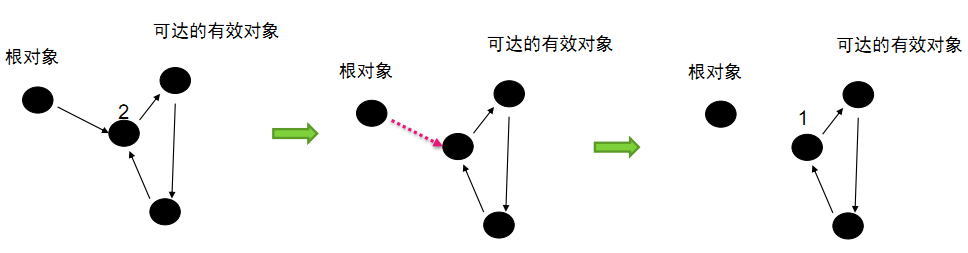

# JVM 虚拟机

## 一. JVM 虚拟机内存

### 1. JVM 虚拟机分配内存参数

``` sh
-vmargs -Xms128M -Xmx512M -XX:PermSize=64M -XX:MaxPermSize=128M

-vmargs 说明后面是VM的参数，所以后面的其实都是JVM的参数了

1) 堆内存的分配
   -Xms   JVM 初始分配的堆内存，默认是物理内存的 1/64

   -Xmx   JVM 最大允许分配的堆内存，按需分配, 默认是物理内存的 1/4

  堆内存空余堆内存大于 70% 时，JVM 会减少堆直到 -Xms 的最小限制。因此服务器一般设置-Xms、-Xmx 相等以避免在每次 GC 后调整堆的大小。


2) 新生代内存
  -Xmn  设置年轻代的大小

  -XX:NewRatio  新生代和老年代的占比

  -XX:NewSize   新生代空间

  -XX:SurvivorRatio   伊甸园空间和幸存者空间的占比


3) 非堆内存配置(永久代)
  -XX:PermSize      JVM 初始分配的非堆内存, 默认是物理内存的 1/64

  -XX:MaxPermSize   JVM 最大允许分配的非堆内存，按需分配, 默认是物理内存的 1/4


4) 为什么会内存益出
  a) 这一部分内存用于存放 Class 和 Meta 的信息，Class 在被 Load 的时候被放入 PermGen Space 区域，它和存放 Instance 的 Heap 区域不同。

  b）GC(Garbage Collection) 内存回收, 不会在主程序运行期对 PermGen Space 进行清理，所以如果你的 APP 会 LOAD 很多 CLASS 的话,就很可能出现 PermGen space 错误。
    这种错误常见在 web 服务器对 JSP 进行 pre compile 的时候。  

```


### 2. JVM 内存结构

JVM 内存区域划分

- 新生代 Young Generation 区
 - Eden Space 任何新进入运行时数据区域的实例都会存放在此
 - S0 Suvivor Space 存在时间较长，经过垃圾回收没有被清除的实例，就从Eden 搬到了S0
 - S1 Survivor Space 同理，存在时间更长的实例，就从S0 搬到了S1
- 旧生代 Old Generation/tenured 区
 - 存在时间更长的实例，对象多次回收没被清除，就从S1 搬到了tenured
- Perm 永久代存放运行时数据区的方法区


JVM 结构:


JVM 内存划分区域:

年轻代：
> 是所有新对象产生的地方。年轻代被分为3个部分——Enden区和两个Survivor区（From和to）当Eden区被对象填满时，就会执行Minor GC。并把所有存活下来的对象转移到其中一个survivor区（假设为from区）。Minor GC同样会检查存活下来的对象，并把它们转移到另一个survivor区（假设为to区）。这样在一段时间内，总会有一个空的survivor区。经过多次GC周期后，仍然存活下来的对象会被转移到年老代内存空间。通常这是在年轻代有资格提升到年老代前通过设定年龄阈值来完成的。需要注意，Survivor的两个区是对称的，没先后关系，from和to是相对的。

年老代：
> 在年轻代中经历了N次回收后仍然没有被清除的对象，就会被放到年老代中，可以说他们都是久经沙场而不亡的一代，都是生命周期较长的对象。对于年老代和永久代，就不能再采用像年轻代中那样搬移腾挪的回收算法，因为那些对于这些回收战场上的老兵来说是小儿科。通常会在老年代内存被占满时将会触发Full GC,回收整个堆内存。

持久代：
> 用于存放静态文件，比如java类、方法等。持久代对垃圾回收没有显著的影响。


---


### 3. JVM 垃圾对象的定义

heap 堆内存中垃圾对象

- Java 中那些不可达的对象就会变成垃圾。就是没有办法再引用到该对象
  - 对非线程的对象来说，所有的活动线程都不能访问该对象，那么该对象就会变为垃圾。
  - 对线程对象来说，满足上面的条件，且线程未启动或者已停止。

- JVM 中将对象的引用分为了四种类型，不同的对象引用类型会造成 GC 采用不同的方法进行回收：
  - (1) 强引用：默认情况下，对象采用的均为强引用, GC不会回收
  - (2) 软引用：软引用是 Java 中提供的一种比较适合于缓存场景的应用, 只有在内存不够用的情况下才会被GC
  - (3) 弱引用：在 GC 时一定会被 GC 回收
  - (4) 虚引用：在 GC 时一定会被 GC 回收


``` java
显示 GC
  system.gc()

(1)改变对象的引用，如置为null或者指向其他对象。
   Object x=new Object();//object1
   Object y=new Object();//object2
   x=y;//object1 变为垃圾
   x=y=null;//object2 变为垃圾

(2)超出作用域
   if(i==0){
      Object x=new Object();//object1
   }//括号结束后object1将无法被引用，变为垃圾

(3)类嵌套导致未完全释放
   class A{
      A a;
   }
   A x= new A();//分配一个空间
   x.a= new A();//又分配了一个空间
   x=null;//将会产生两个垃圾

(4)线程中的垃圾
   class A implements Runnable{   
     void run(){
       //....
     }
   }
   //main
   A x=new A();//object1
   x.start();
   x=null;//等线程执行完后object1才被认定为垃圾

```

---


## 二. GC 垃圾回收算法

> GC 是后台的守护进程。它的特别之处是它是一个低优先级进程，但是可以根据内存的使用情况动态的调整他的优先级。
因此，它是在内存中低到一定限度时才会自动运行，从而实现对内存的回收。这就是垃圾回收的时间不确定的原因。
因为GC也是进程，也要消耗CPU等资源，如果GC执行过于频繁会对java的程序的执行产生较大的影响（java解释器本来就不快），因此JVM的设计者们选着了不定期的gc。

### 1. 引用计数算法

老牌垃圾回收算法。无法处理循环引用，没有被Java采纳

概念:
> 给对象中添加一个引用计数器，每当有一个地方引用它时，计数器值就加1；当引用失效时，计数器值就减1；任何时刻计数器为0的对象就是不可能再被使用的

- 


使用场景:
> 微软公司的COM技术：Computer Object Model, 使用 ActionScript3 的 FlashPlayer, Python

算法问题:
> java虚拟机并没有选用引用计数算法来管理内存，其中最主要的原因是：它很难解决对象之间相互循环引用的问题.
引用和去引用伴随加法和减法，影响性能.
致命的缺陷：对于循环引用的对象无法进行回收.

- 


代码案例:
> 上方代码看起来有点刻意为之，但其实在实际编程过程当中，是经常出现的，比如两个一对一关系的数据库对象，各自保持着对方的引用。最后一个无限循环只是为了保持JVM不退出，没什么实际意义。


``` java
// 代码中标注了1、2、3三个数字，当位置1的语句执行完以后，两个对象的引用计数全部为1。当位置2的语句执行完以后，两个对象的引用计数就全部变成了2。当位置3的语句执行完以后，也就是将二者全部归为空值以后，二者的引用计数仍然为1。根据引用计数算法的回收规则，引用计数没有归0的时候是不会被回收的。

// 对于我们现在使用的GC来说，当thread线程运行结束后，会将objectA和objectB全部作为待回收的对象。而如果我们的GC采用上面所说的引用计数算法，则这两个对象永远不会被回收，即便我们在使用后显示的将对象归为空值也毫无作用。
public class Object {

    Object field = null;

    public static void main(String[] args) {
        Thread thread = new Thread(new Runnable() {
            public void run() {
                Object objectA = new Object();
                Object objectB = new Object();//位置1
                objectA.field = objectB;
                objectB.field = objectA;//位置2
                //to do something
                objectA = null;
                objectB = null;//位置3
            }
        });
        thread.start();
        while (true);
    }

}

```

---


### 2. 根搜索算法

概念:
> 由于引用计数算法的缺陷，所以JVM一般会采用一种新的算法，叫做根搜索算法。它的处理方式就是，设立若干种根对象，当任何一个根对象到某一个对象均不可达时，则认为这个对象是可以被回收的。

> ObjectD 和 ObjectE 是互相关联的，但是由于GC roots到这两个对象不可达，所以最终D和E还是会被当做GC的对象，上图若是采用引用计数法，则A-E五个对象都不会被回收。

- 


可达性分析:
> 设立若干种根对象，当任何一个根对象到某一个对象均不可达时，则认为这个对象是可以被回收的。我们在后面介绍标记-清理算法/标记整理算法时，也会一直强调从根节点开始，对所有可达对象做一次标记，

> 从根（GC Roots）的对象作为起始点，开始向下搜索，搜索所走过的路径称为“引用链”，当一个对象到GC Roots没有任何引用链相连（用图论的概念来讲，就是从GC Roots到这个对象不可达）时，则证明此对象是不可用的


根（GC Roots):
> GC roots（GC根），在JAVA语言中，可以当做GC roots的对象有以下几种。
第一和第四种都是指的方法的本地变量表，第二种表达的意思比较清晰，第三种主要指的是声明为final的常量值。
在根搜索算法的基础上，现代虚拟机的实现当中，垃圾搜集的算法主要有三种，分别是标记-清除算法、复制算法、标记-整理算法。这三种算法都扩充了根搜索算法，不过它们理解起来还是非常好理解的。

- a) 栈（栈帧中的本地变量表）中引用的对象。
- b) 方法区中的静态成员。
- c) 方法区中的常量引用的对象（全局变量）
- d) 本地方法栈中JNI（一般说的Native方法）引用的对象。

---


### 3. 标记-清除算法（Mark-sweep）

> 算法和名字一样，分为两个阶段：标记和清除。标记所有需要回收的对象，然后统一回收。这是最基础的算法，后续的收集算法都是基于这个算法扩展的。
不足：效率低；标记清除之后会产生大量碎片。效果图如下：

标记-清除算法的缺点：
>（1）首先，它的缺点就是效率比较低（递归与全堆对象遍历），导致stop the world的时间比较长，尤其对于交互式的应用程序来说简直是无法接受。试想一下，如果你玩一个网站，这个网站一个小时就挂五分钟，你还玩吗？
（2）第二点主要的缺点，则是这种方式清理出来的空闲内存是不连续的，这点不难理解，我们的死亡对象都是随即的出现在内存的各个角落的，现在把它们清除之后，内存的布局自然会乱七八糟。而为了应付这一点，JVM就不得不维持一个内存的空闲列表，这又是一种开销。而且在分配数组对象的时候，寻找连续的内存空间会不太好找。

- 

---


### 4. 复制算法 (Copying) （新生代的GC）

> 此算法把内存空间划为两个相等的区域，每次只使用其中一个区域。垃圾回收时，遍历当前使用区域，把正在使用中的对象复制到另外一个区域中。此算法每次只处理正在使用中的对象，因此复制成本比较小，同时复制过去以后还能进行相应的内存整理，不会出现“碎片”问题。当然，此算法的缺点也是很明显的，就是需要两倍内存空间。效果图如下

算法特性:
> (1)与标记-清除算法相比，复制算法是一种相对高效的回收方法。
(2) 不适用于存活对象较多的场合，如老年代（复制算法适合做新生代的GC）
(3) 复制算法的最大的问题是：空间的浪费


- 

---


### 5. 标记-整理（Mark-Compact）（老年代的GC）

> 此算法结合了“标记-清除”和“复制”两个算法的优点。也是分两阶段，第一阶段从根节点开始标记所有被引用对象，第二阶段遍历整个堆，把清除未标记对象并且把存活对象“压缩”到堆的其中一块，按顺序排放。此算法避免了“标记-清除”的碎片问题，同时也避免了“复制”算法的空间问题。效果图如下：

> 标记-压缩算法适合用于存活对象较多的场合，如老年代。它在标记-清除算法的基础上做了一些优化。和标记-清除算法一样，标记-压缩算法也首先需要从根节点开始，对所有可达对象做一次标记；但之后，它并不简单的清理未标记的对象，而是将所有的存活对象压缩到内存的一端；之后，清理边界外所有的空间。

- 

---


### 6. 分代收集算法 （新生代的GC+老年代的GC）

> 这是当前商业虚拟机常用的垃圾收集算法。将对象按其生命周期的不同划分成：年轻代(Young Generation)、年老代(Old Generation)、持久代(Permanent Generation)。其中持久代主要存放的是类信息，所以与java对象的回收关系不大，与回收息息相关的是年轻代和年老代。
根据对象的存活周期的不同将内存划分为几块儿。一般是把Java堆分为新生代和老年代：短命对象归为新生代，长命对象归为老年代。

- 

---


## 三. GC 垃圾回收可用参数

JVM GC 优化方向

- 将转移到老年代的对象数量降到最少
- 是减少 Full GC 的执行时间

### 1. GC 类型和场景

> 收集器，分为两块，上面为新生代收集器，下面是老年代收集器。如果两个收集器之间存在连线，就说明它们可以搭配使用。

- 

| GC 类型 | 场景(Young generation + Old(Tenured) generration + Perm) | 说明 |
| --- | --- | --- |
| Serial(串行GC) | Young | 新生代收集器，单线程执行，使用复制算法。它在进行垃圾收集时，必须暂停其他所有的工作线程(用户线程)。是 Jvm client 模式下默认的新生代收集器。对于限定单个 CPU 的环境来说，Serial 收集器由于没有线程交互的开销，专心做垃圾收集自然可以获得最高的单线程收集效率。 |
| ParNew(并行GC)| Young | ParNew 收集器其实就是 serial 收集器的多线程版本，除了使用多条线程进行垃圾收集之外，其余行为与 Serial 收集器一样。 |
| Parallel Scavenge(并行回收GC) | Young | 使用复制算法的收集器，又是并行多线程收集器。parallel Scavenge 收集器的特点是它的关注点与其他收集器不同，CMS等收集器的关注点是尽可能地缩短垃圾收集时用户线程的停顿时间，而parallel Scavenge 收集器的目标则是达到一个可控制的吞吐量。吞吐量= 程序运行时间/(程序运行时间 + 垃圾收集时间)，虚拟机总共运行了100分钟。其中垃圾收集花掉 1 分钟，那吞吐量就是 99% |
| --- | --- | --- |
| Serial Old(串行GC) | Old | Serial Old 是 Serial 收集器的老年代版本，它同样使用一个单线程执行收集，使用“标记-整理”算法。主要使用在 Client 模式下的虚拟机。Parallel Old(并行GC) 收集器|
| Parallel Old(并行GC) | Old | Parallel Old 是Parallel Scavenge 收集器的老年代版本，使用多线程和“标记-整理”算法 |
| CMS(并发GC) | Old | CMS(Concurrent Mark Sweep) 收集器是一种以获取最短回收停顿时间为目标的收集器。CMS 收集器是基于“标记-清除”算法实现的，整个收集过程大致分为4个步骤. (1)初始标记(CMS initial mark) (2)并发标记(CMS concurrenr mark) (3)重新标记(CMS remark) (4)并发清除(CMS concurrent sweep) |
| --- | --- | --- |
| G1(GC) | Young + Old | G1(Garbage First) 收集器是 JDK1.7 提供的一个新收集器，G1 收集器基于“标记-整理”算法实现，也就是说不会产生内存碎片。还有一个特点之前的收集器进行收集的范围都是整个新生代或老年代，而 G1 将整个 Java 堆(包括新生代，老年代)。 |
| --- | --- | --- |
| Full GC | Young + Old + Perm | 这个是对整个堆进行整理回收的方法，包括 Young、Tenured 和 Perm。Full GC 因为需要对整个对进行回收，所以比 Scavenge GC 要慢，因此应该尽可能减少 Full GC 的次数。在对 JVM 调优的过程中，很大一部分工作就是对于 FullGC 的调节 |

---


### 2. GC 类型和场景下的参数

- `-XX:+<option> 启用选项`
- `-XX:-<option> 不启用选项`
- `-XX:<option>=<number>`
- `-XX:<option>=<string>`

| 参数 | GC 类型 | 场景(Young + Old + Perm) | 说明 |
| --- | --- | --- | --- |
| -XX:+UseSerialGC | Serial + Serial Old | Young + Old | Jvm 运行在 -client 模式下的默认值，打开此开关后，使用 Serial + Serial Old 的收集器组合进行内存回收 |
| -XX:+UseParallelGC | Parallel Scavenge + Serial Old | Young + Old | Jvm 运行在 -server 模式下的默认值，打开此开关后，使用 Parallel Scavenge +  Serial Old 的收集器组合进行回收 |
| -XX:+UseParNewGC | ParNew + Serial Old | Young + Old | 使用 ParNew + Serial Old 的收集器进行垃圾回收 |
| -XX:+UseConcMarkSweepGC | ParNew + CMS + Serial Old | Young + Old | 使用 ParNew + CMS +  Serial Old 的收集器组合进行内存回收，Serial Old 作为 CMS 出现 “Concurrent Mode Failure” 失败后的后备收集器使用 |
| -XX:+UseParallelOldGC | Parallel Scavenge + Parallel Old | Young + Old | 使用 Parallel Scavenge + Parallel Old 的收集器组合进行回收 |
| -XX:+UnlockExperimentalVMOptions, -XX:+UseG1GC | G1 | Young + Old | 开启 G1 |
| --- | --- | --- | --- |
| -XX:SurvivorRatio | --- | Young + Old | 新生代中 Eden 区域与 Survivor 区域的容量比值，默认为8，代表 Eden:Subrvivor = 8:1 |
| -XX:PretenureSizeThreshold | --- | Old | 直接晋升到老年代对象的大小，设置这个参数后，大于这个参数的对象将直接在老年代分配 |
| -XX:MaxTenuringThreshold | --- | Old | 晋升到老年代的对象年龄，每次 Minor GC 之后，年龄就加 1，当超过这个参数的值时进入老年代 |
| -XX:UseAdaptiveSizePolicy | --- | Old | 动态调整 java 堆中各个区域的大小以及进入老年代的年龄 |
| -XX:+HandlePromotionFailure | --- | Young | 是否允许新生代收集担保，进行一次 minor gc 后, 另一块 Survivor 空间不足时，将直接会在老年代中保留 |
| --- | --- | --- | --- |
| -XX:ParallelGCThreads | --- | Young + Old | 设置并行 GC 进行内存回收的线程数 |
| -XX:GCTimeRatio | Parallel Scavenge | Young | GC时间占总时间的比列，默认值为 99，即允许 1% 的GC时间，仅在使用 Parallel Scavenge 收集器时有效 |
| -XX:MaxGCPauseMillis | Parallel Scavenge | Young | 设置 GC 的最大停顿时间，在 Parallel Scavenge 收集器下有效, -XX:MaxGCPauseMillis=50  设置垃圾回收器的暂停时间：(设置暂停时间为 50ms) |
| -XX:CMSInitiatingOccupancyFraction | CMS | Old | 设置 CMS 收集器在老年代空间被使用多少后出发垃圾收集，默认值为 68%，仅在 CMS 收集器时有效，-XX:CMSInitiatingOccupancyFraction=70 |
| -XX:+UseCMSCompactAtFullCollection | CMS | Old | 由于 CMS 收集器会产生碎片，此参数设置在垃圾收集器后是否需要一次内存碎片整理过程，仅在CMS收集器时有效 |
| -XX:+CMSFullGCBeforeCompaction | CMS | Old | 设置 CMS 收集器在进行若干次垃圾收集后再进行一次内存碎片整理过程，通常与 UseCMSCompactAtFullCollection 参数一起使用 |
| --- | --- | --- | --- |
| -XX:+UseFastAccessorMethods | --- | --- | 原始类型优化 |
| -XX:+DisableExplicitGC | --- | --- | 是否关闭手动System.gc |
| -XX:+CMSParallelRemarkEnabled | --- | --- | 降低标记停顿 |
| -XX:LargePageSizeInBytes | --- | Perm | 内存页的大小不可设置过大，会影响 Perm 的大小，-XX:LargePageSizeInBytes=128m |
| --- | --- | --- | --- |
| -XX:+PrintGCDetails | --- | --- | 显示 GC 更详细的信息 |
| -XX:+G1YoungGenSize=512m | Young | --- | 设置新生代内存为 512 兆字节 |
| -XX:GCPauseIntervalMillis=200 | Young | --- | 垃圾回收器的暂停设置一个时间间隔 |


---


### 3. Sun/oracle JDK GC 下的组合方式:

> JVM 如果不指定 -server 或 -client 选项，JVM会在启动的时候根据硬件环境判断以server模式启动还是以client模式启动

| 参数 | GC 类型 | 场景(Young + Old + Perm) | 说明 |
| --- | --- | --- | --- |
| -client | Serial(串行 GC) + Serial Old(串行 GC) | Young + Old + Perm | 默认使用, Young: Serial 串行 GC , Old + Perm: Serial Old 串行 GC |
| -server | Parallel Scavenge(并行 GC) + Parallel Old(并行 GC) | Young + Old + Perm | 默认使用, Young: Parallel Scavenge  并行回收GC , Old + Perm: Parallel Old 并行 GC |
| --- | --- | --- | --- |
| -XX:+UseSerialGC | Serial(串行GC) + Serial Old(串行GC) | Young + Old + Perm | --- |
| -XX:+UseParallelGC | Parallel Scavenge(并行 GC) + Serial Old(并行 GC) | Young + Old + Perm | --- |
| -XX:+UseConcMarkSweepGC | ParNew(并行 GC) + CMS(并发 GC) | Young + Old + Perm | 当出现 “Concurrent Mode Failure”时采用Serial Old 串行GC |
| -XX:+UseParNewGC | ParNew(并行GC) + Serial Old(串行GC) | Young + Old + Perm | --- |
| -XX:+UseParallelOldGC | Parallel Scavenge(并行GC) + Parallel Old(并行GC) | Young + Old + Perm | --- |
| -XX:+UseConcMarkSweepGC,-XX:+UseParNewGC  | Serial(串行GC) | Young + Old + Perm | CMS 并发 GC 当出现“Concurrent Mode Failure”时采用Serial Old 串行GC |

---


## 三、JVM 性能分析工具

### 1. VisualVM

```sh
java 启动的时候加入如下参数, 开启一个端口 22222, 监听数据
  -Dcom.sun.management.jmxremote -Dcom.sun.management.jmxremote.ssl=false -Dcom.sun.management.jmxremote.authenticate=false -Dcom.sun.management.jmxremote.port=22222


/usr/local/java/bin/java -cp /usr/local/hadoop/lib/hadoop-lzo.jar:/usr/local/spark/conf/:/usr/local/spark/jars/*:/usr/local/hadoop/etc/hadoop/:/usr/local/hadoop/etc/hadoop/ -Xmx1g -XX:MaxPermSize=256m -Dcom.sun.management.jmxremote -Dcom.sun.management.jmxremote.ssl=false -Dcom.sun.management.jmxremote.authenticate=false -Dcom.sun.management.jmxremote.port=22222 org.apache.spark.deploy.SparkSubmit --name UserPortrait --class com.angejia.dw.recommend.user.portrait.UserPortrait --master yarn-client --driver-cores 2 --driver-memory 4096M --executor-memory 2048M --executor-cores 2 --num-executors 2 /home/dwadmin/app/recommend/recommend-2.0/target/scala-2.11/recommend-2.0.jar --env online --kafka-topic accessLog --kafka-consumer-gid userPortrait

```

### 2. jmap  

- 输出所有内存中对象的工具，甚至可以将VM 中的heap，以二进制输出成文本。打印出某个java进程（使用pid）内存内的，所有‘对象’的情况（如：产生那些对象，及其数量）。
- jmap -heap pid
